# Infracture: una aplicación web para diseñar, ejecutar y analizar sistemas distribuidos de forma local

  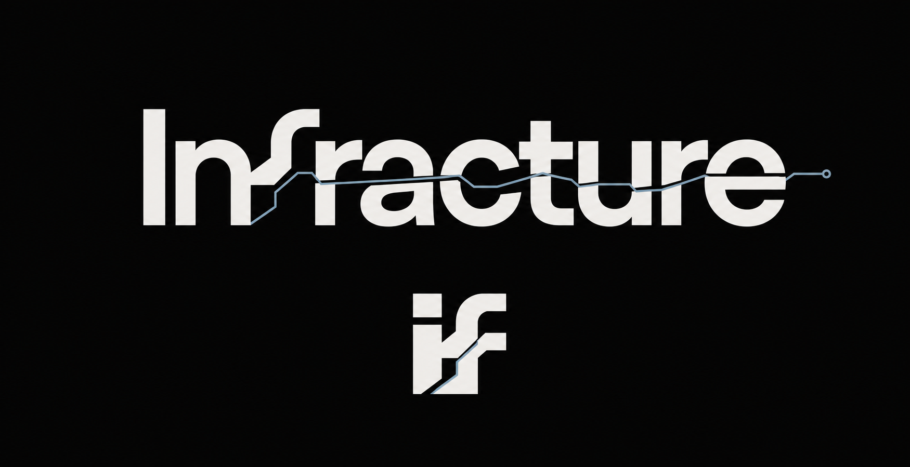

## Índice

- [1. Resumen](#1-resumen)
- [2. Estado del arte](#2-estado-del-arte)
- [3. Bocetos de pantalla](#3-bocetos-de-pantalla)
- [4. Objetivos](#4-objetivos)
  - [Objetivos funcionales](#objetivos-funcionales)
  - [Objetivos técnicos](#objetivos-técnicos)
- [5. Metodología](#5-metodología)
  - [Fases](#fases)
  - [Fechas](#fechas)
  - [Diagrama de Gantt](#diagrama-de-gantt)
- [6. Funcionalidades detalladas](#6-funcionalidades-detalladas)
  - [Funcionalidad básica](#funcionalidad-básica)
  - [Funcionalidad intermedia](#funcionalidad-intermedia)
  - [Funcionalidad avanzada](#funcionalidad-avanzada)
- [7. Análisis](#7-análisis)
  - [Pantallas y navegación](#pantallas-y-navegación)
  - [Entidades](#entidades)
  - [Permisos de los usuarios](#permisos-de-los-usuarios)
  - [Imágenes](#imágenes)
  - [Gráficos](#gráficos)
  - [Tecnología complementaria](#tecnología-complementaria)
  - [Algoritmo o consulta avanzada](#algoritmo-o-consulta-avanzada)
- [8. Seguimiento](#8-seguimiento)
- [9. Autor](#9-autor)
- [10. Uso de herramientas de IA](#10-uso-de-herramientas-de-ia)

## 1. Resumen

Infracture será una aplicación web para diseñar visualmente arquitecturas de sistemas distribuidos, ejecutarlas de forma controlada sobre Docker en el equipo local, introducir fallos reproducibles y analizar sus efectos mediante estados, eventos, logs, métricas y gráficos. El usuario podrá crear proyectos y escenarios a partir de un catálogo seguro de componentes, observar cómo se comporta la arquitectura y utilizar laboratorios guiados para relacionar la práctica con conceptos como disponibilidad, dependencias, cachés, colas y recuperación. La aplicación estará dirigida principalmente a estudiantes, aunque también podrá ser utilizada por desarrolladores que quieran experimentar con infraestructura local.

> **Estado actual:** solo se han definido los objetivos funcionales y técnicos, las funcionalidades, el análisis, la navegación y los bocetos. **No se ha comenzado la implementación de la aplicación**; las capturas son únicamente material de diseño.

## 2. Estado del arte

Para definir el alcance y detectar posibles mejoras se han estudiado aplicaciones con funcionalidades similares. El análisis preliminar incluye cuatro referencias:

| Aplicación o familia | Qué ofrece | Mejora que se estudiará en Infracture |
| --- | --- | --- |
| [Docker Desktop](https://docs.docker.com/desktop/) y [Portainer](https://docs.portainer.io/) | Gestión visual de contenedores, redes, logs y recursos. | Orientar la interfaz a experimentos reproducibles y al análisis de fallos, no solo a la administración de contenedores. |
| [GNS3](https://docs.gns3.com/docs) | Diseño y ejecución visual de topologías de red. | Aplicar una interacción basada en nodos y conexiones a servicios de software ejecutados en Docker. |
| [Killercoda](https://killercoda.com/about) y [Play with Docker](https://training.play-with-docker.com/) | Laboratorios guiados y entornos temporales para aprender. | Combinar retos guiados con la posibilidad de crear y guardar escenarios propios. |
| [Chaos Mesh](https://chaos-mesh.org/docs/) y [LitmusChaos](https://docs.litmuschaos.io/) | Inyección de fallos y experimentos de resiliencia, principalmente en Kubernetes. | Ofrecer una primera experiencia local, segura y comprensible sobre un catálogo acotado de contenedores. |

El estudio muestra que las herramientas de administración, los laboratorios educativos y las plataformas de *chaos engineering* suelen resolver problemas distintos. Infracture propone unir sus ideas principales en un flujo local: **diseñar, ejecutar, romper y entender**. La diferenciación estará en conectar el canvas visual, los fallos controlados, las evidencias de ejecución y el aprendizaje guiado dentro de la misma aplicación.

## 3. Bocetos de pantalla

Los siguientes bocetos de alta fidelidad representan los tres flujos principales. Se han preparado para validar la interacción antes de comenzar la maquetación y el desarrollo; no constituyen todavía la implementación definitiva.

### Landing — entrada al producto

  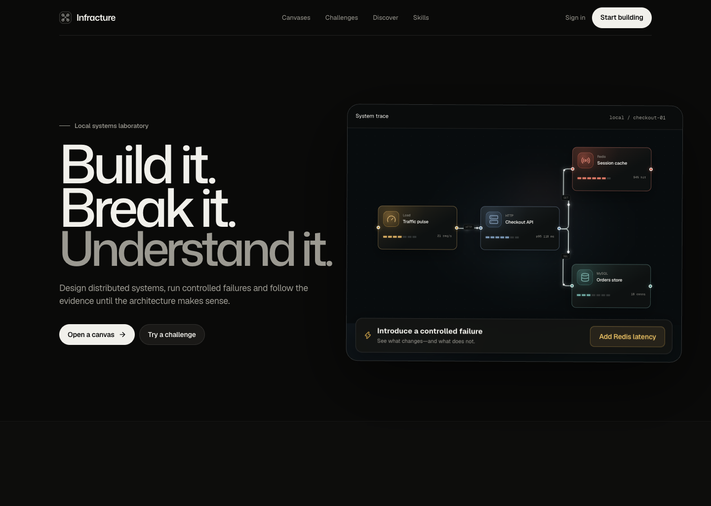

<em>Entrada al producto con el ciclo “Build it. Break it. Understand it.”</em>

### Free Canvas — diseño del escenario

  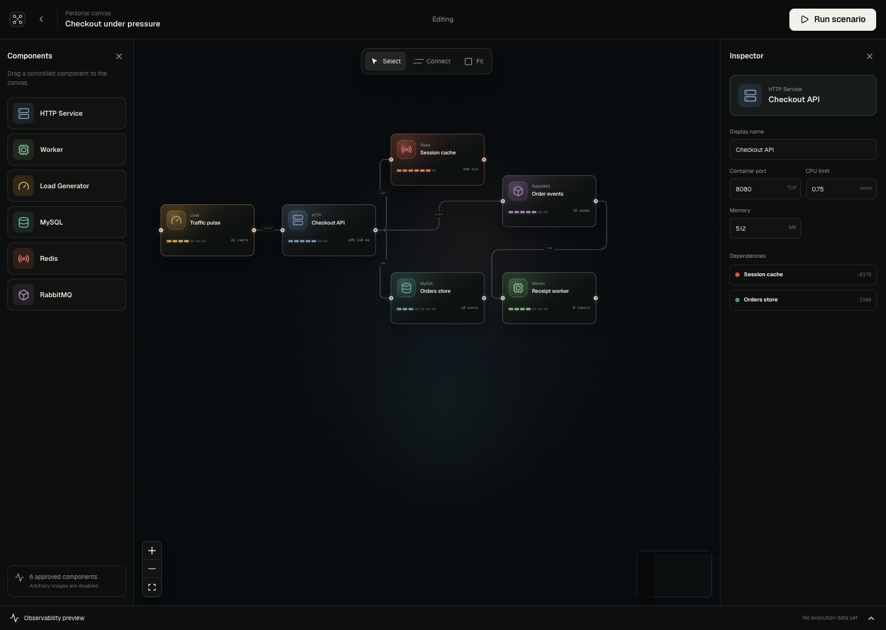

<em>Canvas visual con el catálogo controlado, nodos, conexiones, inspector y validación del escenario.</em>

### Challenge Workspace — laboratorio guiado

  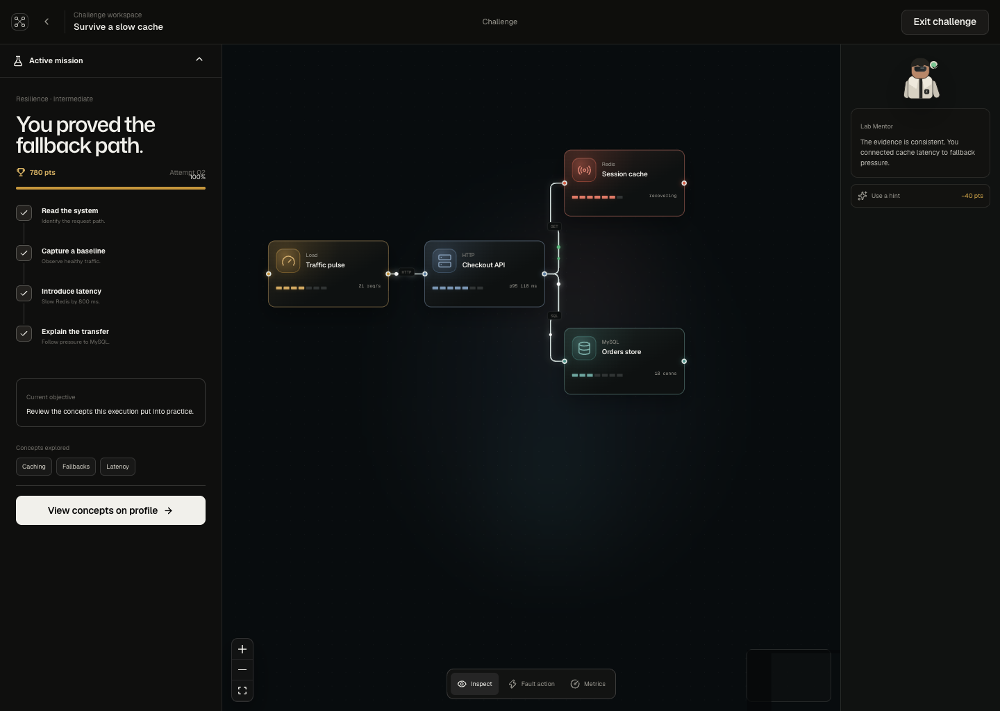

<em>Espacio de resolución de un reto con misión, objetivos, evidencias y apoyo del Lab Mentor.</em>

## 4. Objetivos

### Objetivos funcionales

El objetivo funcional es ofrecer un laboratorio web local que permita pasar de una arquitectura declarativa a una ejecución observable y repetible, aplicar fallos controlados y relacionar el resultado con las dependencias del sistema.

- Permitir consultar contenido público y registrarse o iniciar sesión con una cuenta propia.
- Permitir que los usuarios registrados creen proyectos privados, publiquen voluntariamente sus proyectos y consulten proyectos públicos.
- Permitir diseñar escenarios conectando componentes de un catálogo controlado.
- Validar y ejecutar los escenarios en Docker dentro del equipo local.
- Permitir detener, reiniciar, pausar, reanudar e introducir latencia controlada en los componentes compatibles.
- Mostrar estados, eventos, logs, métricas, gráficos e historial de ejecuciones.
- Permitir subir avatares y portadas, y conservar los resultados asociados al usuario y al proyecto.
- Ofrecer una comunidad de proyectos públicos con perfiles de usuario, estrellas, seguimiento y clonación privada.
- Ofrecer laboratorios guiados, objetivos, intentos, puntuación y un profesor de IA consultivo.
- Mostrar los conceptos explorados al completar un laboratorio y reunirlos, sin duplicados, en el perfil del usuario.

### Objetivos técnicos

El objetivo técnico es construir una aplicación web mantenible y reproducible, con una interfaz visual específica, una API REST y un motor de ejecución local seguro.

- Desarrollar la interfaz como una SPA con React, TypeScript, Vite y React Router, utilizando Tailwind CSS, shadcn/ui, React Flow, Motion for React y Lucide React. La librería para representar los gráficos queda pendiente de selección, con Recharts como candidato inicial.
- Implementar con Java y Spring Boot una API REST versionada y una arquitectura de monolito modular.
- Persistir las entidades de dominio en MySQL mediante Spring Data JPA y versionar el esquema con migraciones de Flyway.
- Ejecutar la plataforma localmente con Docker Compose, controlar Docker Engine desde el backend mediante docker-java encapsulado detrás de una interfaz propia, implementar el Load Generator sobre Grafana k6 y gestionar la latencia reproducible con Toxiproxy a través de su API HTTP.
- Utilizar un catálogo cerrado de imágenes y configuraciones para evitar que el usuario introduzca comandos o imágenes arbitrarias.
- Utilizar MinIO localmente para almacenar avatares, portadas e iconos de las plantillas del catálogo.
- Utilizar Spring Security y JWT para autenticación y autorización, incluyendo control por roles y propiedad de los recursos.
- Utilizar Server-Sent Events (SSE) para actualizar estados, eventos y logs resumidos durante una ejecución.
- Integrar el profesor de IA mediante una API externa detrás de una interfaz independiente del proveedor; la API y el proveedor concretos quedan pendientes de selección.
- Aplicar una estrategia de pruebas con JUnit, Spring Boot Test, Mockito, REST Assured y Testcontainers en el backend; Vitest y React Testing Library en el frontend; y Playwright para las pruebas de sistema. Automatizar mediante GitHub Actions la integración y la entrega continuas, la cobertura mínima exigida, la construcción y la publicación de imágenes Docker y paquetes versionados. La herramienta de análisis estático queda pendiente de selección, con SonarQube y SonarQube Cloud como candidatos.

## 5. Metodología

El trabajo se desarrollará con una metodología iterativa e incremental. Cada iteración incluirá la definición de tareas, el desarrollo, las pruebas, la revisión y la documentación. Se utilizarán ramas de trabajo y revisiones mediante *pull requests* para mantener `main` en un estado estable.

La Fase 1 corresponde a este documento: define la funcionalidad general y detallada, el estado del arte, las pantallas y el análisis. La Fase 2 configurará las tecnologías, las herramientas de desarrollo y los controles de calidad periódicos. Las Fases 3, 4 y 5 desarrollarán la aplicación de forma incremental y publicarán una versión al final de cada fase. La Fase 6 se dedicará a la memoria y la Fase 7 a la preparación de la presentación.

### Fases

| Fase | Descripción | Resultado previsto |
| --- | --- | --- |
| 1 | Definición de funcionalidades | Funcionalidades, estado del arte, pantallas, análisis y este README. |
| 2 | Configuración de tecnologías y herramientas | Repositorio preparado, pruebas iniciales y controles de calidad periódicos. |
| 3 | Desarrollo iterativo e incremental | Publicación de la versión 0.1 con la funcionalidad básica. |
| 4 | Desarrollo iterativo e incremental | Publicación de la versión 0.2 con la funcionalidad intermedia. |
| 5 | Desarrollo iterativo e incremental | Publicación de la versión 1.0 con la funcionalidad avanzada y cierre de Infracture Local. |
| 6 | Escritura de la memoria | Memoria final del TFG. |
| 7 | Preparación de la presentación | Presentación y defensa del trabajo. |

### Fechas

Las fechas son provisionales y se revisarán con el tutor. El cierre funcional de Infracture Local está previsto para enero, con el fin de poder continuar posteriormente con el segundo TFG.

| Fase | Inicio propuesto | Fin propuesto |
| --- | --- | --- |
| Fase 1 | 01/08/2026 | 15/09/2026 |
| Fase 2 | 16/09/2026 | 15/10/2026 |
| Fase 3 | 16/10/2026 | 30/11/2026 |
| Fase 4 | 01/12/2026 | 31/12/2026 |
| Fase 5 | 01/01/2027 | 31/01/2027 |
| Fase 6 | 01/02/2027 | 15/05/2027 |
| Fase 7 | 16/05/2027 | 15/06/2027 |

### Diagrama de Gantt

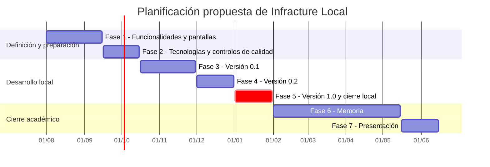

## 6. Funcionalidades detalladas

Las funcionalidades se agrupan en tres niveles de prioridad. En cada tabla se indica el tipo de usuario al que va dirigida cada una. La funcionalidad avanzada se describe con menor detalle y podrá concretarse durante la investigación y el desarrollo.

### Funcionalidad básica

| Funcionalidad | Tipo de usuario | Descripción |
| --- | --- | --- |
| Consulta pública | Anónimo, registrado y administrador | Consultar la información pública, proyectos publicados, perfiles públicos y retos disponibles. |
| Registro, acceso y perfil | Registrado y administrador | Crear una cuenta, iniciar sesión con correo y contraseña, cerrar sesión, editar el perfil y subir un avatar. |
| Gestión de proyectos | Registrado y administrador | Crear, consultar, editar y eliminar proyectos propios. Serán privados por defecto y podrán publicarse voluntariamente. |
| Escenarios y canvas | Registrado y administrador | Crear escenarios dentro de un proyecto y guardar su definición antes de ejecutar. |
| Catálogo de componentes | Registrado y administrador | Utilizar exclusivamente seis plantillas controladas: HTTP Service, Worker, Load Generator, MySQL, Redis y RabbitMQ. |
| Conexiones y validación | Registrado y administrador | Conectar componentes compatibles y detectar configuraciones incompletas o inválidas. |
| Ejecución local | Registrado y administrador | Ejecutar un escenario validado sobre Docker en una red aislada y detenerlo con limpieza de recursos. Solo habrá una ejecución activa en la instancia local. |
| Observación e historial | Registrado y administrador | Consultar estados, logs resumidos, eventos, métricas y el historial de las ejecuciones propias. |
| Administración | Administrador | Gestionar usuarios, plantillas del catálogo y contenido de los laboratorios. |

### Funcionalidad intermedia

| Funcionalidad | Tipo de usuario | Descripción |
| --- | --- | --- |
| Parada y reinicio | Registrado y administrador | Detener un componente de una ejecución y volver a iniciarlo conservando el contexto. |
| Pausa y reanudación | Registrado y administrador | Pausar temporalmente un componente compatible y reanudarlo sin crear otra ejecución. |
| Latencia controlada | Registrado y administrador | Introducir y retirar latencia en una conexión compatible y registrar la acción. |
| Análisis de ejecución | Registrado y administrador | Comparar el estado esperado y el observado, consultar eventos y representar métricas con gráficos. |
| Comunidad de proyectos | Registrado y administrador | Seguir perfiles, marcar proyectos públicos con estrellas y clonar un proyecto público como copia privada. |
| Gestión de imágenes | Registrado y administrador | Subir avatares, portadas e iconos de las plantillas mediante almacenamiento local. |

### Funcionalidad avanzada

| Funcionalidad | Tipo de usuario | Descripción |
| --- | --- | --- |
| Laboratorios guiados | Anónimo, registrado y administrador | Consultar, realizar y administrar retos sobre escenarios preparados. Se proponen **Single Point of Failure**, **Cache Failure** y **Worker Recovery**. |
| Gamificación educativa | Registrado y administrador | Registrar objetivos, intentos y una puntuación sencilla. No se incluirá un ranking global. |
| Conceptos explorados | Registrado y administrador | Mostrar, al finalizar cada laboratorio, los conceptos asociados y reunir en el perfil, sin duplicados, los correspondientes a los intentos completados. |
| Profesor de IA (Lab Mentor) | Registrado y administrador | Explicar resultados, logs, dependencias y conceptos de la ejecución mediante una API externa consultiva. La IA no controlará Docker. |
| Control avanzado de recursos | Registrado y administrador | Estudiar límites dinámicos de CPU y memoria y otras mejoras de experimentación si el tiempo y la investigación lo permiten. |

## 7. Análisis

### Pantallas y navegación

La navegación se organizará alrededor de la exploración de proyectos, el diseño libre, la ejecución y los retos guiados.

  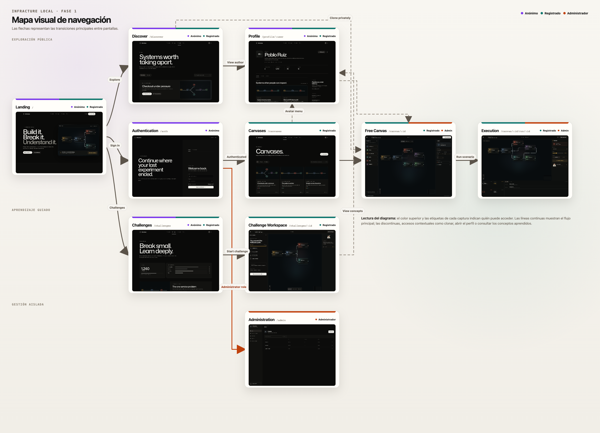

<em>Mapa de las transiciones principales. Los colores y las etiquetas de cada pantalla identifican el tipo de usuario que puede acceder.</em>

| Pantalla | Usuario | Descripción | Páginas accesibles |
| --- | --- | --- | --- |
| Landing | Anónimo, registrado | Presenta Infracture y el ciclo Build / Break / Understand. | Discover, Canvases, Challenges y Authentication. |
| Discover | Anónimo, registrado | Explora proyectos públicos y plantillas. | Vista previa, perfil del autor y clonación privada tras autenticarse. |
| Canvases | Registrado | Muestra los proyectos propios y permite crear o abrir uno. | Free Canvas, Execution e historial. |
| Free Canvas | Registrado, administrador | Permite construir una topología con el catálogo controlado. | Inspector, validación y Execution. |
| Execution | Registrado, administrador | Muestra estados, eventos, logs, métricas y acciones de fallo. | Lab Mentor, recuperación e historial. |
| Challenges | Anónimo, registrado | Lista los laboratorios guiados y sus conceptos. | Challenge Workspace. |
| Challenge Workspace | Registrado | Permite resolver un reto sobre una topología preparada y muestra los conceptos explorados al completarlo. | Perfil, evidencia y Lab Mentor. |
| Authentication | Anónimo | Permite el registro y el inicio de sesión local. | Canvases y perfil tras autenticarse. |
| Profile | Anónimo, registrado | Muestra datos públicos, proyectos publicados, seguimiento y conceptos explorados en laboratorios completados. | Discover, proyectos y Challenges. |
| Administration | Administrador | Gestiona usuarios, catálogo y retos. | Secciones internas de administración. |

### Entidades

El modelo se divide en cuatro diagramas de clases para conservar la legibilidad de los atributos y las cardinalidades. La flecha parte de la entidad que conserva la referencia y apunta hacia la entidad referenciada. Los tipos terminados en `Role`, `Visibility`, `Status` o `Type` se implementarán como enumeraciones, mientras que `JSON` representa una estructura controlada y validada por el backend.

#### Usuario y relaciones principales

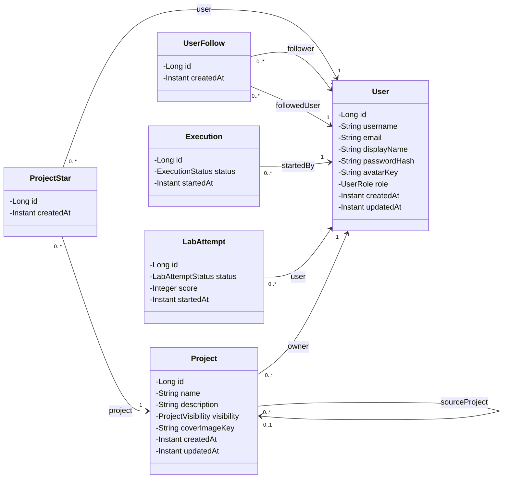

Un usuario puede poseer varios proyectos, iniciar varias ejecuciones, realizar varios intentos de laboratorio, marcar proyectos y seguir a otros usuarios.

Cada proyecto es privado por defecto. Un proyecto clonado conserva una referencia opcional a su proyecto de origen. `ProjectStar` impide que un usuario marque dos veces el mismo proyecto mediante una restricción única sobre usuario y proyecto. `UserFollow` impide seguimientos duplicados y que un usuario se siga a sí mismo. Los conceptos explorados tampoco se almacenan directamente en `User`: se obtienen a partir de sus intentos completados y de los conceptos asociados a esos laboratorios.

#### Proyectos, escenarios y catálogo controlado

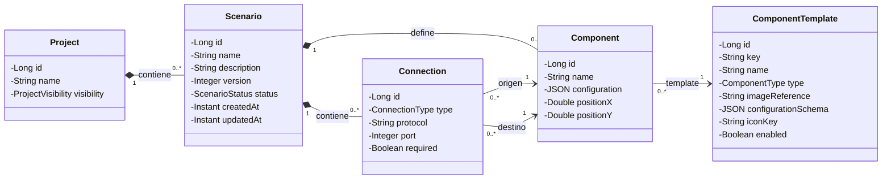

Un escenario puede guardarse vacío o incompleto, por lo que admite cero componentes y conexiones. Antes de ejecutarlo deberá superar la validación y contener al menos un componente. Las coordenadas pertenecen al componente porque conservan su posición en el canvas. La topología actual se obtiene de `Component` y `Connection`.

Las seis opciones iniciales son tipos de plantilla reutilizables, no un máximo de seis nodos. Un mismo `ComponentTemplate` puede originar varias instancias de `Component` dentro de un escenario, siempre dentro de los límites locales configurados.

#### Contratos iniciales del catálogo controlado

Cada plantilla define un contrato funcional conocido por el backend: comportamiento, configuración segura, conexiones compatibles, comprobación de salud y datos observables. El usuario arrastrará componentes ya preparados y solo modificará parámetros expuestos mediante formularios validados; no introducirá imágenes, comandos, puertos, credenciales ni variables de entorno arbitrarias.

La propuesta técnica completa del catálogo, los perfiles, la validación, la generación de carga y el ciclo de vida de las ejecuciones se desarrolla en [`docs/EXECUTION_ARCHITECTURE.md`](docs/EXECUTION_ARCHITECTURE.md).

| Plantilla | Comportamiento previsto | Configuración permitida al usuario | Conexiones compatibles | Evidencias principales |
| --- | --- | --- | --- | --- |
| HTTP Service | Recibir peticiones HTTP y ejecutar un comportamiento reproducible que pueda utilizar caché, base de datos o mensajería. | Nombre, perfil de comportamiento y parámetros acotados del perfil. | Recibe tráfico de Load Generator u otro HTTP Service; puede depender de HTTP Service, MySQL, Redis y RabbitMQ. | Estado de salud, peticiones, errores, latencia de respuesta y consumo del contenedor. |
| Worker | Consumir tareas de una cola y procesarlas con un comportamiento controlado. | Nombre, cola seleccionada, perfil de procesamiento y política de reintento acotada. | Consume de RabbitMQ y puede utilizar MySQL o Redis. | Estado, tareas procesadas o fallidas, tiempo de procesamiento y consumo del contenedor. |
| Load Generator | Generar carga HTTP limitada y reproducible contra un servicio del escenario. | Destino, peticiones por segundo, duración y concurrencia dentro de límites globales. | Se conecta únicamente a un HTTP Service compatible. | Peticiones enviadas y completadas, errores y distribución de latencia. |
| MySQL | Proporcionar persistencia relacional a los servicios del escenario. | Nombre lógico y conjunto de datos inicial elegido entre perfiles permitidos. | Acepta conexiones de HTTP Service y Worker. | Disponibilidad, conexiones activas y consumo del contenedor. |
| Redis | Proporcionar caché o almacenamiento temporal de clave-valor. | Nombre lógico y política elegida entre configuraciones seguras. | Acepta conexiones de HTTP Service y Worker. | Disponibilidad, memoria, claves y aciertos o fallos de caché cuando estén disponibles. |
| RabbitMQ | Gestionar la publicación, acumulación y consumo de tareas. | Nombre lógico y topología de cola elegida entre perfiles controlados. | Recibe mensajes de HTTP Service y entrega trabajo a Worker. | Disponibilidad, mensajes en cola y tasas de publicación y consumo. |

##### Perfiles, capacidades y validación

No se programará cada escenario de forma independiente. Las plantillas ofrecerán perfiles reutilizables. Por ejemplo, un HTTP Service podrá responder sin dependencias, utilizar MySQL, aplicar el patrón de caché `cache-aside`, publicar tareas en RabbitMQ o invocar otro servicio. Cada perfil declarará las dependencias que necesita y las capacidades públicas que ofrece.

El Load Generator solo generará peticiones contra una capacidad HTTP compatible; no conocerá Redis, MySQL, RabbitMQ ni Worker. Por ejemplo, un perfil de lecturas repetidas podrá apuntar a un HTTP Service configurado con `CACHE_ASIDE`. El servicio, y no el generador, consultará Redis y recurrirá a MySQL cuando sea necesario.

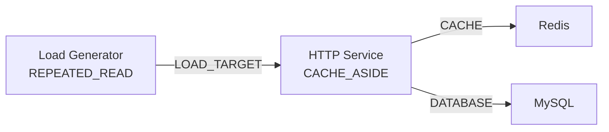

Antes de permitir la ejecución mediante `Run`, `ScenarioValidator` comprobará la compatibilidad de los tipos de conexión, los requisitos del perfil, sus cardinalidades y las capacidades requeridas por la carga. Un escenario podrá guardarse incompleto, pero los errores bloquearán la ejecución. Las situaciones deliberadamente experimentales que sigan siendo ejecutables producirán advertencias; por ejemplo, RabbitMQ con productores pero sin Worker podrá acumular mensajes en un canvas libre.

La validación estática no garantiza que los procesos arranquen correctamente. Tras crear los contenedores, el motor esperará sus comprobaciones de salud antes de iniciar la carga. El validador previo a la ejecución y el algoritmo de impacto de fallos utilizarán el mismo grafo, pero tendrán responsabilidades distintas: el primero decidirá si el escenario cumple sus contratos y el segundo calculará los dependientes potencialmente afectados.

El generador repetirá operaciones permitidas —fijas, ponderadas o encadenadas— hasta alcanzar su duración, recibir una orden de parada o llegar al límite máximo de seguridad.

Después de validar, el backend traducirá el grafo a nombres de red, variables y credenciales generadas internamente, creará una red Docker aislada y configurará Toxiproxy cuando una conexión admita latencia controlada. La carga se detendrá antes de desmontar los demás componentes y la limpieza eliminará los contenedores, los proxies y la red.

El administrador podrá mantener los metadatos, formularios y disponibilidad de las plantillas. La incorporación de un nuevo perfil ejecutable deberá respetar el contrato controlado y ser validada por el backend; nunca se traducirá texto libre del usuario en comandos Docker. Estos contratos se comprobarán al comienzo de la Fase 2 mediante un prototipo vertical antes de desarrollar el motor completo.

#### Ejecución y observabilidad

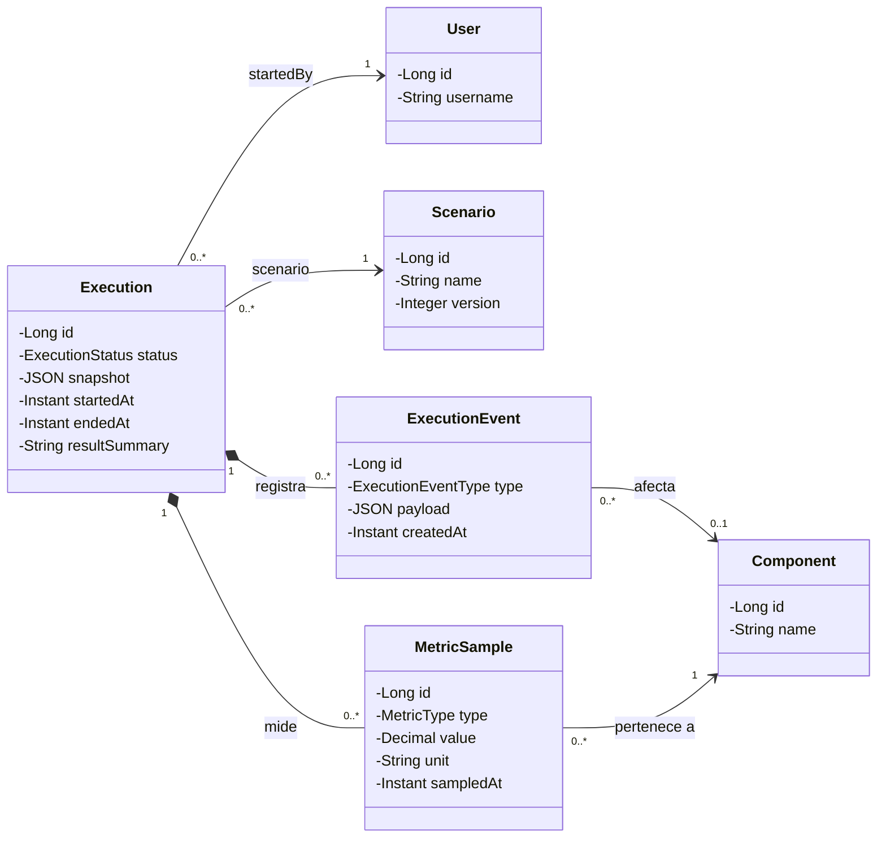

Cada ejecución guarda un `snapshot` inmutable de la topología y de la configuración utilizada. Así, editar posteriormente el escenario no altera el historial. Un evento puede referirse a un componente concreto o a la ejecución completa; una muestra de métricas pertenece a un componente del escenario ejecutado. Los eventos conservan cambios de estado, fallos aplicados y logs resumidos, mientras que `MetricSample` contiene los valores temporales utilizados por las gráficas.

#### Laboratorios, intentos y conceptos

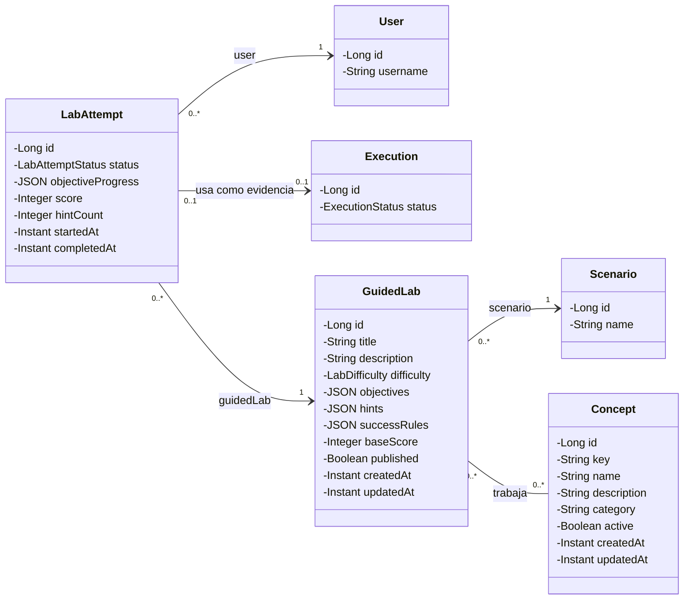

Cada laboratorio utiliza un escenario controlado y puede asociarse con varios conceptos. Los conceptos visibles en el perfil se calculan reuniendo, sin duplicados, los asociados a los intentos completados. Un intento puede existir brevemente sin ejecución mientras se prepara el entorno, pero, para completarse, debe disponer de exactamente una ejecución como evidencia.

`ProjectStar` y `UserFollow` se modelarán como entidades asociativas explícitas con identificador y fecha de creación. Esta decisión permite expresar restricciones únicas, conservar cuándo se creó cada relación y ampliar sus metadatos sin modificar posteriormente una relación `@ManyToMany` directa.

### Permisos de los usuarios

| Acción | Usuario anónimo | Usuario registrado | Administrador |
| --- | :---: | :---: | :---: |
| Consultar información y proyectos públicos | Sí | Sí | Sí |
| Registrarse e iniciar sesión | Sí | — | — |
| Crear y modificar proyectos propios | No | Sí | Sí |
| Consultar o modificar proyectos privados ajenos | No | No | Sí |
| Ejecutar escenarios propios | No | Sí | Sí |
| Aplicar fallos a ejecuciones propias | No | Sí | Sí |
| Consultar historial propio | No | Sí | Sí |
| Seguir perfiles y marcar proyectos públicos | No | Sí | Sí |
| Realizar laboratorios y guardar el progreso | No | Sí | Sí |
| Gestionar usuarios, catálogo, laboratorios y conceptos | No | No | Sí |

### Imágenes

Se permitirá subir imágenes desde el navegador para:

- el avatar de un usuario;
- la portada de un proyecto;
- el icono de una plantilla de componente administrada.

Las imágenes se almacenarán en MinIO ejecutado localmente. La base de datos guardará la clave del objeto y se validarán el tipo y el tamaño antes de aceptarlo.

### Gráficos

La pantalla de ejecución utilizará gráficos para mostrar información producida por el escenario:

- una gráfica de líneas para CPU y memoria a lo largo del tiempo;
- una línea temporal de estados, eventos y fallos aplicados;
- una gráfica de barras para comparar los componentes afectados por un fallo.

### Tecnología complementaria

La tecnología complementaria principal será **Server-Sent Events (SSE)**. El backend enviará al navegador cambios de estado, eventos y logs resumidos mientras una ejecución esté activa, evitando que el frontend tenga que consultar continuamente el estado. Las acciones de creación, ejecución y control de fallos seguirán realizándose mediante la API REST.

También se utilizará **React Flow** para el canvas de nodos y conexiones, y una API externa detrás de una interfaz propia para el profesor de IA.

### Algoritmo o consulta avanzada

Se implementará un análisis del impacto de un fallo sobre el grafo de dependencias:

1. Cada componente se representará como un vértice y cada conexión dirigida como una relación de dependencia.
2. Al fallar un componente, se recorrerá el grafo en sentido inverso para encontrar sus dependientes directos y transitivos.
3. Se mostrará la distancia al componente afectado, los elementos potencialmente aislados y una estimación del porcentaje del escenario afectado.
4. El resultado esperado se comparará con los eventos observados durante la ejecución.

La primera versión utilizará una búsqueda en anchura (*Breadth-First Search*) con un conjunto de visitados, con complejidad `O(V + E)`. Se probará con grafos lineales, ramificados, cíclicos y desconectados. Esta funcionalidad relaciona la topología con la evidencia de ejecución y no se limita a operaciones CRUD.

## 8. Seguimiento

El seguimiento se realizará mediante un **GitHub Project** con tareas organizadas por fases y estados. Se utilizarán *issues* para describir el trabajo, *pull requests* para integrar cambios y etiquetas para distinguir funcionalidad, documentación, pruebas y errores.

Además:

- se mantendrá un `CHANGELOG.md` en la raíz con los cambios relevantes de cada versión, ordenados cronológicamente;
- se registrarán las decisiones y el progreso de cada fase en el repositorio;
- se podrá mantener un blog o diario de desarrollo con anuncios y avances del proyecto.

## 9. Autor

El desarrollo de Infracture se realiza en el contexto del Trabajo de Fin de Grado del **Doble Grado en Ingeniería Informática e Ingeniería del Software (GII + GIS)** en la Escuela Técnica Superior de Ingeniería Informática de la Universidad Rey Juan Carlos.

- **Alumno:** Pablo Ruiz.
- **Tutor:** Óscar Soto Sánchez.

Este documento define exclusivamente **Infracture Local**. La posible evolución en la nube se documentará por separado en el segundo TFG.

## 10. Uso de herramientas de IA

Durante la fase de definición se ha utilizado OpenAI Codex como apoyo para investigar la temática, estudiar referencias del estado del arte, proponer y revisar funcionalidades, organizar la navegación y redactar esta documentación. La selección final de objetivos, alcance y decisiones corresponde al alumno.

El registro detallado del uso de IA se encuentra en [`AI_USAGE.md`](AI_USAGE.md).
