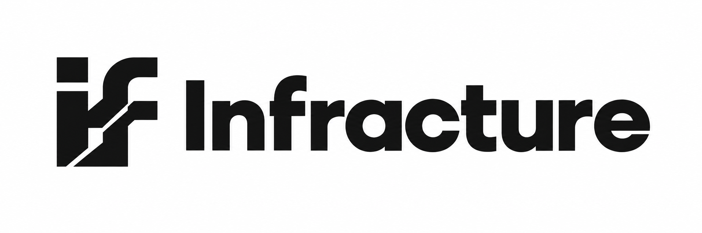
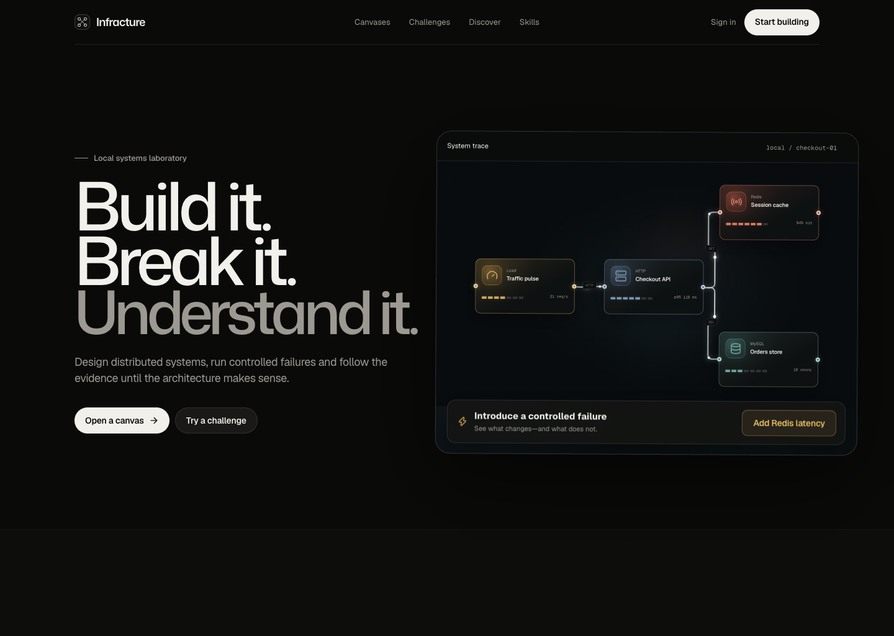
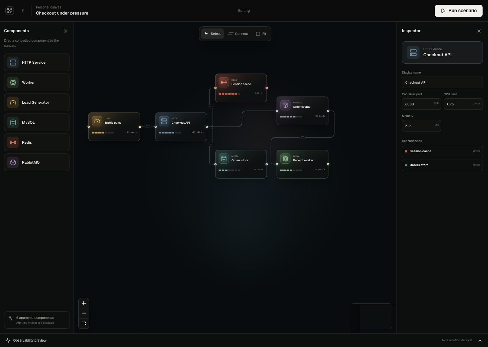
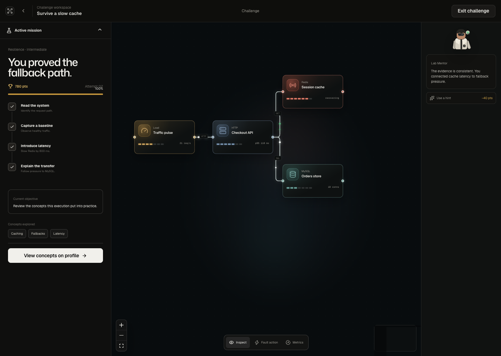
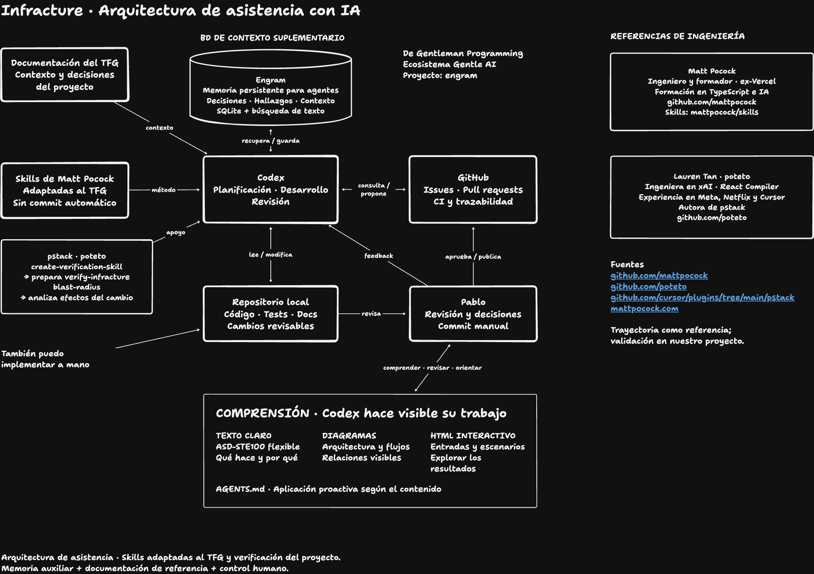
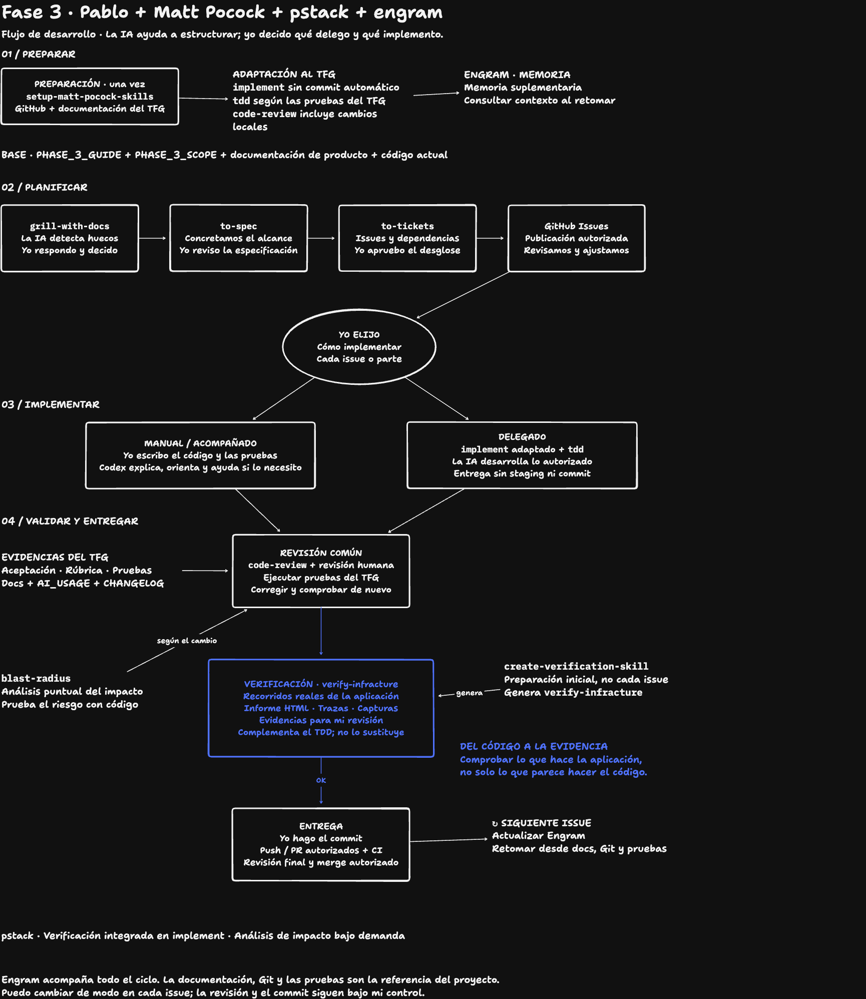

# Infracture: una aplicación web para diseñar, ejecutar y analizar sistemas distribuidos de forma local

  

Infracture será una aplicación web para diseñar visualmente arquitecturas de sistemas distribuidos, ejecutarlas de forma controlada sobre Docker en el equipo local, introducir fallos reproducibles y analizar sus efectos mediante estados, eventos, logs, métricas y gráficos. El usuario podrá crear proyectos y escenarios a partir de un catálogo seguro de componentes, observar cómo se comporta la arquitectura y utilizar laboratorios guiados para relacionar la práctica con conceptos como disponibilidad, dependencias, cachés, colas y recuperación. La aplicación estará dirigida principalmente a estudiantes, aunque también podrá ser utilizada por desarrolladores que quieran experimentar con infraestructura local.

> **Estado actual:** Solo se han definido los objetivos funcionales y los objetivos técnicos de la aplicación y se ha iniciado el desarrollo, pero la implementación no es funcional todavía.

## Bocetos de pantalla

Los siguientes bocetos de alta fidelidad representan los tres flujos principales. Se prepararon para validar la interacción antes de la maquetación; no son capturas de la aplicación implementada.

### Landing — entrada al producto

  

<em>Entrada al producto con el ciclo “Build it. Break it. Understand it.”</em>

### Free Canvas — diseño del escenario

  

<em>Canvas visual con el catálogo controlado, nodos, conexiones, inspector y validación del escenario.</em>

### Challenge Workspace — laboratorio guiado

  

<em>Espacio de resolución de un reto con misión, objetivos, evidencias y apoyo del Lab Mentor.</em>

## Documentación

- [Estado del arte](docs/state-of-the-art.md)
- [Objetivos](docs/objectives.md)
- [Metodología](docs/methodology.md)
- [Funcionalidades detalladas](docs/detailed-features.md)
- [Análisis](docs/analysis.md)
- [Seguimiento](docs/tracking.md)
- [Autores](docs/authors.md)
- [Guía de desarrollo](docs/development-guide.md)
- [Uso de herramientas de IA](#uso-de-herramientas-de-ia)
- [Changelog](CHANGELOG.md)

## Uso de herramientas de IA

Durante la Fase 1 se utilizó OpenAI Codex para investigar la temática, comparar referencias y ayudar a definir funcionalidades, pantallas y documentación. En la Fase 2 se ha utilizado como apoyo para explicar tecnologías, preparar la primera vertical técnica, desarrollar pruebas y configurar controles de calidad. El alumno revisa las propuestas y toma las decisiones finales. El detalle de cada uso relevante se conserva en [AI_USAGE.md](docs/AI_USAGE.md).

Para la Fase 3 se ha preparado un workflow híbrido: el alumno elige por issue o fragmento si implementa manualmente, con acompañamiento o delegando tareas concretas. Las skills locales adaptadas de Matt Pocock estructuran planificación, TDD y revisión; la verificación basada en pstack aporta evidencias de recorridos reales. Engram sirve de memoria suplementaria. La documentación, el código y las pruebas siguen siendo la referencia, y el alumno conserva la revisión y el commit.

### Arquitectura de asistencia con IA

### Flujo híbrido de desarrollo

El siguiente diagrama describe el procedimiento de trabajo acordado, desde la planificación hasta la entrega; no indica que los issues de Fase 3 ya estén implementados. Los nombres abreviados de implementación, TDD y revisión corresponden a las variantes locales `infracture-*`.

Las imágenes se pueden abrir para ampliar. [Whiteboard editable y referencias de las herramientas](https://www.tldraw.com/f/r_lZFRh_DcUIS4ObgfbN1).
