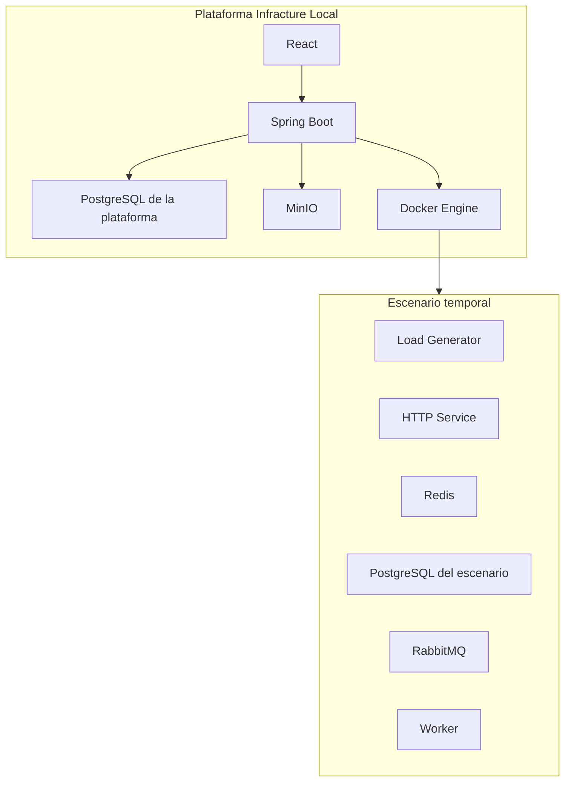
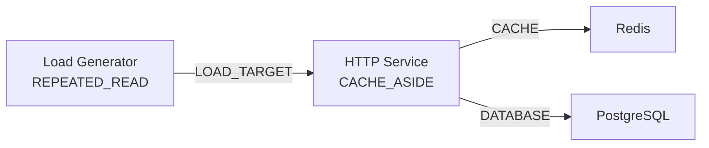
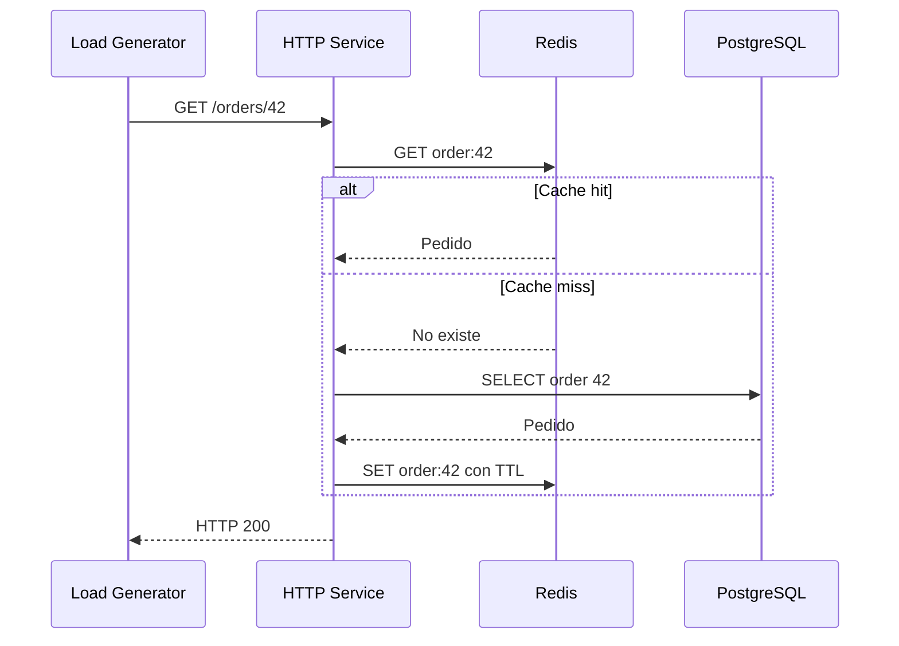
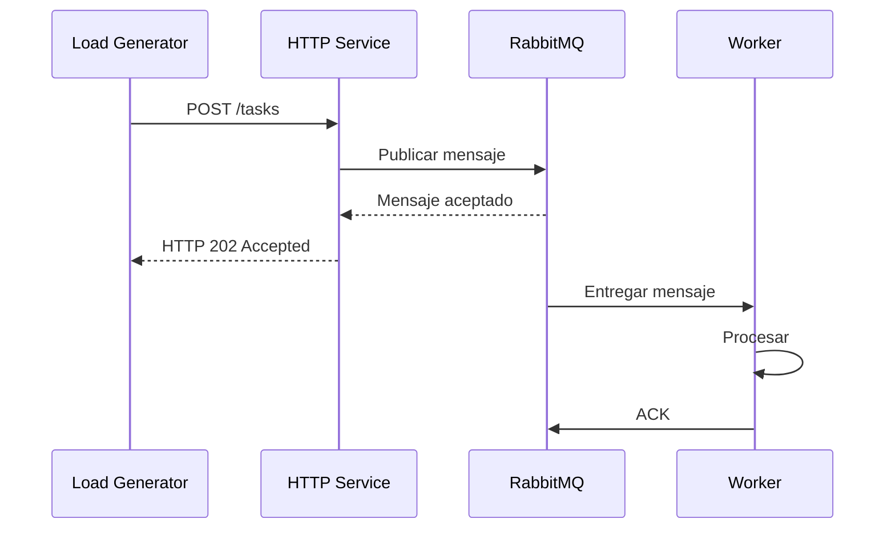

# Modelo de componentes, conexiones y ejecución de Infracture Local

[Volver al README principal](../README.md)

Este documento amplía la definición funcional de Infracture Local para explicar cómo se traducirá un escenario visual a un experimento ejecutable sobre Docker. Su finalidad es servir como material de apoyo para revisar con el tutor la viabilidad del catálogo controlado, los perfiles de comportamiento, la generación de carga, la validación del grafo y el ciclo de vida de una ejecución.

El contenido describe una propuesta de diseño de la Fase 1. Todavía no constituye una implementación ni una especificación cerrada de clases o *endpoints*.

## Índice

- [1. Idea principal](#1-idea-principal)
- [2. Plataforma y escenarios](#2-plataforma-y-escenarios)
- [3. Plantillas e instancias](#3-plantillas-e-instancias)
- [4. Catálogo inicial](#4-catálogo-inicial)
- [5. Perfiles y capacidades](#5-perfiles-y-capacidades)
- [6. Conexiones y significado de las flechas](#6-conexiones-y-significado-de-las-flechas)
- [7. Validación previa a la ejecución](#7-validación-previa-a-la-ejecución)
- [8. Compilación y arranque](#8-compilación-y-arranque)
- [9. Generación continua de carga](#9-generación-continua-de-carga)
- [10. Flujos principales](#10-flujos-principales)
- [11. Fallos controlados](#11-fallos-controlados)
- [12. Salud, métricas y evidencias](#12-salud-métricas-y-evidencias)
- [13. Duración, parada y limpieza](#13-duración-parada-y-limpieza)
- [14. Aplicación a los laboratorios](#14-aplicación-a-los-laboratorios)
- [15. Responsabilidades del backend](#15-responsabilidades-del-backend)
- [16. Prototipo vertical recomendado](#16-prototipo-vertical-recomendado)
- [17. Aspectos que se expondrán al tutor](#17-aspectos-que-se-expondrán-al-tutor)
- [18. Referencias para el aprendizaje](#18-referencias-para-el-aprendizaje)

## 1. Idea principal

Infracture no permitirá que un usuario ejecute cualquier imagen o comando. Ofrecerá un catálogo de componentes cuyo comportamiento es conocido por la aplicación.

Cada plantilla actuará como un contrato que define:

- el comportamiento que puede ejecutar;
- los parámetros que el usuario puede modificar;
- las conexiones de entrada y salida admitidas;
- las dependencias requeridas por cada perfil;
- la comprobación de salud;
- las métricas y eventos observables;
- los fallos que Infracture puede aplicar;
- la forma de traducir el componente a recursos Docker.

El usuario compondrá escenarios combinando estos contratos. La variedad no procederá de permitir código arbitrario, sino de combinar tipos de componentes, perfiles, números de nodos, conexiones, cargas y fallos.

## 2. Plataforma y escenarios

Debe diferenciarse la infraestructura permanente de Infracture de los recursos temporales creados para un escenario.



El PostgreSQL de la plataforma almacena usuarios, proyectos, escenarios y ejecuciones. Una instancia de PostgreSQL arrastrada al canvas será otro contenedor, creado únicamente para el experimento. Ambos utilizan la misma tecnología para reducir la variedad operativa, pero sus datos, credenciales, redes y ciclos de vida permanecen completamente separados. MinIO pertenece a la plataforma y no aparece como componente del escenario. Toxiproxy también será infraestructura interna del motor de ejecución, aunque sus efectos se controlen desde el canvas.

Durante una ejecución existen dos planos:

- **Plano de control:** Spring Boot crea recursos, aplica fallos, recopila datos y actualiza la interfaz.
- **Plano de datos:** Load Generator, HTTP Service, Redis, PostgreSQL, RabbitMQ y Worker intercambian peticiones y mensajes.

El backend de Infracture no realiza las operaciones de negocio del escenario; las organiza y observa.

## 3. Plantillas e instancias

`ComponentTemplate` representa una definición reutilizable. `Component` representa una instancia concreta dentro de un escenario.

Por ejemplo, una sola plantilla `HTTP_SERVICE` puede originar:

```text
users-api
orders-api
payments-api
```

Los tres componentes comparten el contrato de HTTP Service, pero poseen nombre, posición, perfil y configuración propios.

`Scenario` mantiene la coherencia del grafo editable. Las claves de sus componentes y conexiones son estables y únicas dentro del escenario. Toda conexión une componentes de ese mismo escenario; eliminar un componente elimina sus conexiones en la misma operación. Cada guardado incrementa una revisión utilizada para detectar ediciones concurrentes y para asegurar que se ejecuta exactamente el contenido validado.

El usuario solo manejará opciones de dominio mediante formularios controlados. Infracture generará internamente:

- nombres de contenedor y red;
- alias DNS;
- puertos internos;
- credenciales temporales;
- variables de entorno;
- comprobaciones de salud;
- rutas a través de Toxiproxy;
- etiquetas para identificar y limpiar los recursos.

## 4. Catálogo inicial

| Plantilla | Responsabilidad | Configuración visible | Dependencias y conexiones | Evidencias principales |
| --- | --- | --- | --- | --- |
| HTTP Service | Recibir peticiones HTTP y ejecutar comportamientos reproducibles. | Nombre, perfil y parámetros acotados. | Puede depender de HTTP Service, PostgreSQL, Redis o RabbitMQ. | Salud, peticiones, errores, latencia y contadores del comportamiento. |
| Worker | Consumir tareas y procesarlas en segundo plano. | Cola, perfil de procesamiento y reintentos acotados. | Depende de RabbitMQ y puede utilizar PostgreSQL o Redis. | Tareas procesadas o fallidas, tiempo de procesamiento y estado. |
| Load Generator | Producir tráfico HTTP controlado y reproducible. | Objetivo, perfil de carga, frecuencia, concurrencia, datos y semilla. | Solo apunta a un HTTP Service que exponga capacidades compatibles. | Peticiones, errores, latencia y rendimiento. |
| PostgreSQL | Proporcionar persistencia relacional durante el experimento. | Nombre lógico y conjunto inicial de datos. | Acepta conexiones de HTTP Service y Worker. | Salud, conexiones y consumo del contenedor. |
| Redis | Proporcionar caché o almacenamiento temporal de clave-valor. | Nombre lógico y política segura. | Acepta conexiones de HTTP Service y Worker. | Salud, memoria, claves y datos de caché disponibles. |
| RabbitMQ | Almacenar y distribuir tareas entre productores y consumidores. | Nombre lógico y topología de cola controlada. | Recibe publicaciones de HTTP Service y es consumido por Worker. | Mensajes preparados, no confirmados, publicados y consumidos. |

Las seis plantillas son tipos reutilizables, no un máximo de seis nodos. Un escenario puede contener varias instancias de un mismo tipo dentro de los límites locales.

## 5. Perfiles y capacidades

No se programará cada escenario por separado. Se programarán perfiles reutilizables que declaren requisitos y capacidades.

### 5.1 Perfiles del HTTP Service

| Perfil | Comportamiento | Dependencias requeridas | Capacidades expuestas |
| --- | --- | --- | --- |
| `STATELESS` | Responder sin consultar otra dependencia. | Ninguna. | Petición HTTP básica. |
| `DATABASE_CRUD` | Consultar y modificar información persistente. | Una conexión `DATABASE` con PostgreSQL. | Lectura, creación y actualización de recursos. |
| `CACHE_ASIDE` | Consultar Redis y recurrir a PostgreSQL cuando no exista una copia válida. | Una conexión `CACHE` con Redis y una conexión `DATABASE` con PostgreSQL. | Lectura y modificación de recursos con caché. |
| `QUEUE_PRODUCER` | Convertir peticiones HTTP en tareas asíncronas. | Una conexión `PUBLISHES_TO` con RabbitMQ. | Creación de tareas. |
| `DOWNSTREAM_HTTP` | Invocar otro servicio HTTP. | Una conexión `HTTP_CALL` con otro HTTP Service. | Operación HTTP compuesta. |

La implementación podrá utilizar una imagen controlada como `infracture-demo-service`, capaz de activar diferentes comportamientos mediante una configuración generada por el backend.

### 5.2 Perfiles del Worker

El Worker inicial actuará como consumidor de tareas. Su contrato requerirá una conexión `CONSUMES_FROM` con RabbitMQ y podrá admitir conexiones opcionales `DATABASE` o `CACHE` para guardar resultados.

Los parámetros controlados podrán incluir:

- perfil de procesamiento;
- duración simulada de una tarea;
- política acotada de reintento;
- dependencia en la que guardar el resultado.

### 5.3 Perfiles del Load Generator

El Load Generator no necesita saber si el HTTP Service utiliza Redis, PostgreSQL o RabbitMQ. Solo conoce la API pública y las capacidades que expone su objetivo.

| Perfil | Comportamiento de carga | Capacidad requerida en el objetivo |
| --- | --- | --- |
| `CONSTANT_HTTP` | Repetir una petición HTTP a una frecuencia constante. | Petición HTTP básica. |
| `REPEATED_READ` | Leer repetidamente un conjunto reducido de identificadores. | Lectura de recursos. |
| `WEIGHTED_CRUD` | Combinar lecturas, creaciones y actualizaciones con pesos. | Operaciones CRUD compatibles. |
| `TASK_PRODUCER` | Crear tareas continuamente mediante peticiones HTTP. | Creación de tareas. |

Por ejemplo, `REPEATED_READ` puede utilizarse con `CACHE_ASIDE` porque el primero requiere lectura y el segundo expone esa capacidad. `TASK_PRODUCER` solo será compatible con un servicio configurado como `QUEUE_PRODUCER`.

### 5.4 Contrato conceptual

```text
HTTP profile CACHE_ASIDE
  requires:
    CACHE -> REDIS
    DATABASE -> POSTGRESQL
  exposes:
    RESOURCE_READ
    RESOURCE_CREATE
    RESOURCE_UPDATE

Workload REPEATED_READ
  requires target capability:
    RESOURCE_READ
```

Los perfiles podrán formar parte del catálogo controlado y de su esquema de configuración, definidos mediante reglas tipadas en el backend. No es necesario introducir una entidad independiente para cada perfil en la primera propuesta.

`TemplateContractRegistry` resolverá una versión concreta del contrato de cada plantilla. El resultado reunirá la configuración admitida, capacidades, dependencias y cardinalidades, conectores, comprobación de salud y fallos compatibles. Al crear un componente, este conservará `templateKey` y `contractVersion`; los metadatos actuales del catálogo podrán cambiar, mientras que una ejecución conservará la versión de contrato resuelta en su snapshot.

Los documentos persistidos como `jsonb` tendrán tipos de dominio y validadores explícitos, por ejemplo `ComponentConfiguration`, `ExecutionSnapshot`, `LabObjective` y `SuccessRule`. La persistencia serializa esos valores; los casos de uso no intercambian mapas o cadenas sin validar. Protocolo, puerto y obligatoriedad se obtendrán del conector resuelto y no serán propiedades libres de una conexión dibujada por el usuario.

## 6. Conexiones y significado de las flechas

En el modelo de dependencias, una flecha `A -> B` significa que A depende de B para ejecutar alguna parte de su comportamiento.

| Origen | Destino permitido | Tipo de conexión | Significado |
| --- | --- | --- | --- |
| Load Generator | HTTP Service | `LOAD_TARGET` | Genera peticiones contra la API. |
| HTTP Service | HTTP Service | `HTTP_CALL` | Invoca otro servicio. |
| HTTP Service | PostgreSQL | `DATABASE` | Consulta o modifica datos persistentes. |
| HTTP Service | Redis | `CACHE` | Consulta o actualiza la caché. |
| HTTP Service | RabbitMQ | `PUBLISHES_TO` | Publica tareas. |
| Worker | RabbitMQ | `CONSUMES_FROM` | Consume tareas. |
| Worker | PostgreSQL | `DATABASE` | Guarda resultados persistentes. |
| Worker | Redis | `CACHE` | Consulta o guarda información temporal. |

Esta dirección representa dependencia y no siempre coincide con el recorrido visual de los datos. En mensajería:

```text
Flujo del mensaje:
HTTP Service -> RabbitMQ -> Worker

Grafo de dependencias:
HTTP Service -> RabbitMQ <- Worker
```

La interfaz deberá etiquetar las conexiones —por ejemplo, `Publishes to` o `Consumes from`— para evitar ambigüedad.

## 7. Validación previa a la ejecución

Un escenario podrá guardarse vacío o incompleto, pero solo podrá ejecutarse cuando no contenga errores bloqueantes.

El `ScenarioValidator` comprobará:

1. que cada conexión une tipos compatibles;
2. que la dirección y el tipo de conexión son correctos;
3. que cada perfil tiene sus dependencias obligatorias;
4. que se cumplen las cardinalidades mínimas y máximas;
5. que el Load Generator solicita capacidades expuestas por su objetivo;
6. que no existen parámetros fuera de los límites permitidos;
7. que el escenario respeta los límites globales de la instancia local.

Ejemplo válido:



Resultado:

```text
HTTP Service orders-api
  OK: perfil CACHE_ASIDE reconocido
  OK: conexión CACHE con Redis
  OK: conexión DATABASE con PostgreSQL
  OK: capacidad de lectura compatible con REPEATED_READ

Scenario ready to run
```

Si falta Redis, la acción `Run` se bloqueará. Si existe RabbitMQ con productores pero sin Worker, el canvas libre podrá mostrar una advertencia y permitir la ejecución, porque acumular mensajes puede ser el objetivo del experimento. Un laboratorio de recuperación de Worker sí exigirá un consumidor.

### 7.1 Errores y advertencias

- **Error:** impide construir un plan ejecutable, por ejemplo `CACHE_ASIDE` sin Redis.
- **Advertencia:** permite ejecutar, pero comunica un comportamiento probable, por ejemplo una cola sin consumidores.

### 7.2 Dos algoritmos diferentes

La validación previa y el análisis de impacto comparten el grafo, pero tienen responsabilidades distintas:

| Momento | Componente lógico | Pregunta |
| --- | --- | --- |
| Antes de la ejecución | `ScenarioValidator` | ¿La arquitectura cumple los contratos y puede intentarse su ejecución? |
| Durante un fallo | `DependencyImpactAnalyzer` | ¿Qué componentes pueden verse afectados por el fallo? |

Una topología estáticamente válida no garantiza que todos los procesos arranquen. A continuación, será necesaria una validación dinámica mediante comprobaciones de salud.

## 8. Compilación y arranque

Una vez validado el escenario, el backend lo traducirá a un `ExecutionPlan`. El proceso propuesto será el siguiente:

1. capturar y validar una revisión exacta del escenario;
2. crear un snapshot inmutable y sus identidades `ExecutedComponent` y `ExecutedConnection`;
3. crear una red Docker aislada;
4. generar nombres, alias, credenciales y etiquetas;
5. crear los proxies necesarios para las conexiones compatibles con latencia;
6. iniciar las instancias de PostgreSQL, Redis y RabbitMQ;
7. esperar a que las dependencias superen sus comprobaciones de salud;
8. iniciar las instancias de HTTP Service y Worker;
9. esperar a que los servicios superen sus comprobaciones de salud;
10. iniciar la instancia de Load Generator, si existe;
11. comenzar la recopilación de métricas, eventos y logs resumidos;
12. habilitar las acciones de fallo;
13. limpiar todos los recursos al finalizar.

La plataforma Infracture se iniciará con Docker Compose. Los recursos variables de cada escenario se crearán mediante `docker-java` sobre Docker Engine.

### 8.1 Configuración generada

Para un escenario con `CACHE_ASIDE`, el backend podría generar:

```text
HTTP Service
  APP_MODE=CACHE_ASIDE
  REDIS_URL=redis-proxy:6379
  DATABASE_URL=postgresql-proxy:5432
  CACHE_TTL=60

Load Generator
  TARGET_URL=http://orders-api:8080
  WORKLOAD=REPEATED_READ
  REQUESTS_PER_SECOND=10
  RANDOM_SEED=48372
```

El Load Generator no recibe direcciones de Redis ni de PostgreSQL. El HTTP Service no inspecciona el grafo en tiempo de ejecución: utiliza la configuración que Infracture ha generado después de validarlo.

## 9. Generación continua de carga

El Load Generator se implementará inicialmente mediante **Grafana k6**, ejecutado dentro de una imagen controlada por Infracture. El backend generará el perfil de carga y sus parámetros a partir de la configuración validada del escenario; el usuario no podrá introducir scripts arbitrarios. Spring Boot controlará el ciclo de vida del generador y recopilará sus resultados agregados, pero no enviará individualmente cada petición.

El bucle conceptual será:

```text
while execution is active:
    select a permitted operation
    generate its data
    send the HTTP request
    record status and latency
    wait according to the configured frequency
```

### 9.1 Operación repetida

```text
GET /orders/42
GET /orders/42
GET /orders/42
...
```

Es apropiada para calentar una caché y comparar aciertos y fallos.

### 9.2 Selección ponderada

```text
80 % GET
10 % POST
10 % PUT
```

Cada iteración elige una operación respetando aproximadamente los pesos configurados.

### 9.3 Flujo con estado

Cuando una petición depende de otra, cada usuario virtual puede repetir una secuencia:

```text
POST /orders
guardar el identificador devuelto
GET /orders/{id}
PUT /orders/{id}
GET /orders/{id}
```

### 9.4 Fases de carga

Un perfil puede dividirse en calentamiento, carga estable, ráfaga o recuperación. En un laboratorio, la carga puede continuar antes, durante y después de un fallo para comparar las métricas.

### 9.5 Reproducibilidad

Una semilla pseudoaleatoria formará parte de la configuración y del snapshot. Con el mismo escenario, plan y semilla podrán compararse ejecuciones con una secuencia equivalente de decisiones.

### 9.6 Escenarios sin Load Generator

El canvas libre podrá ejecutar un escenario sin Load Generator para observar la salud y el consumo, aunque mostrará una advertencia de que no se producirá tráfico funcional. Los laboratorios que necesiten evidencias de comportamiento incluirán obligatoriamente una fuente de carga compatible.

## 10. Flujos principales

### 10.1 Caché mediante `CACHE_ASIDE`

Redis no se conecta directamente a PostgreSQL. El HTTP Service coordina ambos:



Para modificar un dato, la primera estrategia será actualizar PostgreSQL y eliminar la entrada de Redis. La siguiente lectura volverá a poblar la caché.

El servicio expondrá contadores como `cache_hits`, `cache_misses` y `database_queries`. El Load Generator únicamente conocerá el código HTTP y la latencia de la respuesta.

### 10.2 Tareas mediante RabbitMQ



El Load Generator no envía tareas directamente al Worker. El HTTP Service publica, RabbitMQ conserva y distribuye, y el Worker procesa y confirma.

Sin Worker, las tareas permanecen preparadas en la cola. Durante el procesamiento, un mensaje estará sin confirmar. Tras el `ACK`, RabbitMQ lo elimina. Si el consumidor desaparece antes de confirmar y la conexión se cierra, el mensaje podrá volver a la cola.

### 10.3 Llamadas entre servicios

```text
Load Generator -> HTTP Service A -> HTTP Service B -> PostgreSQL
```

El generador solo conoce A. El servicio A conoce a B mediante la configuración generada, y B conoce PostgreSQL. Esto permite estudiar propagación de latencia y fallos en cadena.

## 11. Fallos controlados

Las acciones iniciales serán:

- detener y reiniciar un componente;
- pausar y reanudar un componente;
- introducir y retirar latencia en una conexión compatible.

Cada petición se guardará como `FaultAction`, incluyendo quién la solicitó, su objetivo, sus parámetros y si terminó aplicada o fallida. Las acciones sobre procesos apuntarán a `ExecutedComponent`; las acciones de latencia apuntarán a `ExecutedConnection`.

La parada y la pausa se aplicarán al contenedor mediante Docker Engine. La latencia se introducirá interponiendo Toxiproxy en la conexión:

```text
HTTP Service -> Toxiproxy -> Redis
```

El servicio se conectará al proxy, y Spring Boot utilizará la API HTTP de Toxiproxy para añadir o retirar el retraso.

En el caso de un Worker, pausar el contenedor congela el proceso mientras continúan llegando mensajes. Las tareas ya entregadas pueden permanecer sin confirmar y el comportamiento exacto dependerá de la conexión y de sus latidos (*heartbeats*). Para un laboratorio determinista de recuperación se preferirá detener y reiniciar el Worker; la pausa seguirá disponible como acción general de experimentación.

## 12. Salud, métricas y evidencias

Debe distinguirse entre un contenedor en ejecución y un servicio preparado:

- **Running:** el proceso del contenedor continúa activo.
- **Healthy:** la comprobación específica del servicio responde correctamente.

| Componente | Comprobación prevista |
| --- | --- |
| HTTP Service | Endpoint de salud. |
| Worker | Endpoint o señal de salud controlada. |
| PostgreSQL | Comprobación de disponibilidad del servidor. |
| Redis | Comando `PING`. |
| RabbitMQ | Diagnóstico del broker. |
| Load Generator | Estado y progreso de la carga. |

Las evidencias procederán de dos niveles:

- **Docker:** estado, CPU, memoria y eventos de contenedor.
- **Aplicación:** peticiones, errores, aciertos de caché, consultas, mensajes y tareas.

No se persistirá una entidad por cada petición. El generador y los componentes agregarán los resultados por intervalos, que se convertirán en `MetricSample`. Los cambios de estado, los fallos y las acciones significativas serán `ExecutionEvent`.

Las métricas y eventos se vincularán a las identidades inmutables `ExecutedComponent` y `ExecutedConnection`, no a los elementos editables del escenario. Así, el historial permanece válido aunque el usuario cambie después el canvas.

Ejemplo de muestra agregada:

```json
{
  "requestCount": 100,
  "successfulRequests": 97,
  "failedRequests": 3,
  "averageLatencyMs": 42,
  "p95LatencyMs": 81
}
```

## 13. Duración, parada y limpieza

Una ejecución libre podrá permanecer activa hasta que el usuario pulse `Stop`, pero tendrá límites de seguridad configurables. No se permitirán recursos abandonados indefinidamente.

Una ejecución finalizará cuando:

- termine la duración configurada;
- el usuario solicite la parada;
- se alcance el límite máximo de seguridad;
- se produzca un error irrecuperable;
- el motor detecte una situación que exija limpieza.

Secuencia de parada:

1. cambiar `Execution` a `STOPPING`;
2. detener el Load Generator para no crear más trabajo;
3. recoger las últimas métricas;
4. detener los componentes restantes;
5. eliminar contenedores y proxies;
6. eliminar la red aislada;
7. guardar el resultado final;
8. cambiar `Execution` a `COMPLETED` o `FAILED`.

La instancia local permitirá una sola ejecución activa, lo que simplifica el control de recursos y la recuperación después de errores.

## 14. Aplicación a los laboratorios

Cada publicación de un laboratorio conservará una revisión inmutable con su escenario inicial, objetivos, pistas, reglas, puntuación y conceptos. Un intento quedará vinculado a esa revisión y utilizará una única ejecución como evidencia al completarse. Así, una edición posterior del laboratorio no cambia el resultado ni los conceptos acreditados por intentos anteriores.

### 14.1 Single Point of Failure

```text
Load Generator -> HTTP Service
```

La carga permanece activa y el usuario detiene el único servicio. Aumentan las peticiones fallidas y cae la disponibilidad observada. Sin un balanceador, el laboratorio demuestra el problema, no una conmutación automática (*failover*) entre réplicas. Un *Gateway* o *Load Balancer* será una ampliación natural del catálogo.

### 14.2 Cache Failure

```text
Load Generator -> HTTP Service -> Redis
                              -> PostgreSQL
```

El perfil de carga repite lecturas sobre un conjunto de datos frecuentes. Antes del fallo aumentan los aciertos de caché. Al detener Redis, el servicio recurre a PostgreSQL si su comportamiento de recuperación es correcto; aumentan las consultas y la latencia. Después de reiniciar Redis, la caché vuelve a poblarse.

### 14.3 Worker Recovery

```text
Load Generator -> HTTP Service -> RabbitMQ <- Worker
                                          Worker -> PostgreSQL
```

El generador crea tareas continuamente. Al detener el Worker, crece la cola. Al reiniciarlo, el número de mensajes pendientes disminuye hasta que se recupera el ritmo normal.

## 15. Responsabilidades del backend

La implementación podrá organizarse en torno a responsabilidades como las siguientes:

| Responsabilidad | Función |
| --- | --- |
| `TemplateContractRegistry` | Proporcionar perfiles, capacidades, requisitos y conectores permitidos. |
| `ScenarioValidator` | Detectar errores y advertencias antes de ejecutar. |
| `ExecutionPlanCompiler` | Traducir el snapshot a una configuración ejecutable. |
| `DockerRuntimeAdapter` | Crear, iniciar, pausar, detener y eliminar recursos mediante `docker-java`. |
| `WorkloadController` | Preparar y controlar el Load Generator. |
| `TelemetryCollector` | Recoger salud, métricas y logs resumidos. |
| `FaultInjectionService` | Aplicar acciones Docker y latencia mediante Toxiproxy. |
| `DependencyImpactAnalyzer` | Calcular dependientes directos y transitivos ante un fallo. |
| `ExecutionEventService` | Persistir cambios y acciones significativas. |
| `CleanupService` | Garantizar la eliminación idempotente de recursos. |

Estos nombres son conceptuales. Podrán cambiar al diseñar los módulos y clases reales.

## 16. Prototipo vertical recomendado

Antes de desarrollar todo el catálogo se validará el recorrido de extremo a extremo con:

```text
Load Generator
    -> HTTP Service con CACHE_ASIDE
        -> Toxiproxy -> Redis
        -> PostgreSQL
```

El prototipo deberá demostrar:

1. validación del grafo;
2. generación del plan de ejecución;
3. creación de red y contenedores;
4. espera mediante comprobaciones de salud;
5. peticiones continuas;
6. aciertos y fallos de caché;
7. métricas y eventos en la interfaz;
8. introducción de latencia;
9. parada y reinicio de Redis;
10. recuperación y limpieza completa.

Este recorrido valida la mayoría de los riesgos del motor. RabbitMQ y Worker se añadirán después reutilizando el mismo ciclo de validación, ejecución, observabilidad y limpieza.

## 17. Aspectos que se expondrán al tutor

La propuesta se incorporará completa al repositorio y se utilizarán estos puntos para recoger posteriormente las observaciones del tutor:

- adecuación académica del catálogo de perfiles controlados;
- suficiencia de la validación del grafo como algoritmo avanzado adicional;
- separación entre `ScenarioValidator` y `DependencyImpactAnalyzer`;
- conveniencia de permitir escenarios libres sin carga, mostrando una advertencia;
- obligatoriedad del Load Generator en los laboratorios con objetivos observables;
- uso de imágenes demostrativas propias para HTTP Service y Worker;
- ejecución interactiva hasta `Stop` con un límite máximo de seguridad;
- preferencia de `Stop` y `Restart` para el laboratorio de Worker, y mantenimiento de `Pause` y `Resume` como acciones generales;
- alcance del primer prototipo vertical antes de ampliar el catálogo.

Estos elementos no impiden presentar la Fase 1; son decisiones técnicas razonadas sobre las que el tutor podrá proponer ajustes.

## 18. Referencias para el aprendizaje

- [Docker: taller inicial](https://docs.docker.com/get-started/workshop/)
- [Docker: redes de contenedores](https://docs.docker.com/engine/network/)
- [Docker Compose: servicios y comprobaciones de salud](https://docs.docker.com/reference/compose-file/services/)
- [Spring: construcción de un servicio REST](https://spring.io/guides/gs/rest-service/)
- [Spring Boot Actuator: salud y métricas](https://docs.spring.io/spring-boot/reference/actuator/endpoints.html)
- [Spring Data JPA: acceso a datos relacionales](https://spring.io/guides/gs/accessing-data-jpa/)
- [PostgreSQL: tutorial oficial](https://www.postgresql.org/docs/current/tutorial.html)
- [Redis: tipos de datos](https://redis.io/docs/latest/develop/data-types/)
- [Spring: uso de caché](https://spring.io/guides/gs/caching/)
- [RabbitMQ: Work Queues con Java](https://www.rabbitmq.com/tutorials/tutorial-two-java)
- [Spring: mensajería con RabbitMQ](https://spring.io/guides/gs/messaging-rabbitmq/)
- [Toxiproxy: simulación de condiciones de red](https://github.com/Shopify/toxiproxy)
- [Grafana k6: fundamentos de generación de carga](https://grafana.com/docs/k6/latest/get-started/running-k6/)
- [Google SRE: monitorización de sistemas distribuidos](https://sre.google/sre-book/monitoring-distributed-systems/)
- [MIT 6.5840: Distributed Systems](https://pdos.csail.mit.edu/6.824/index.html)
