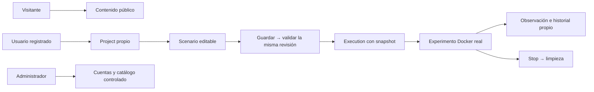

# Spec: Fase 3 — Infracture 0.1.0, funcionalidad básica y distribución local

**Fecha:** 4 de octubre de 2026. **Tipo:** especificación integral de alcance y aceptación, sintetizada mediante `to-spec` desde el grill aceptado. **Estado del producto:** pendiente de implementación y aceptación; existe la vertical inicial de lectura del catálogo. **Pruebas:** puntos principales confirmados por el alumno: navegador y API pública, con PostgreSQL, MinIO y Docker reales en un entorno aislado, manteniendo las seis categorías académicas por funcionalidad.

**Revisión — 4 y 6 de octubre de 2026:** la guía fija las versiones y sustituye el aplazamiento anterior por instrucción del alumno.

**Idiomas — 5 de octubre de 2026:** esta copia permanente se conserva en español por petición del alumno; la [issue #60](https://github.com/codeurjc-students/2026-INFRACTURE/issues/60) contiene su traducción al inglés. Ambas versiones mantienen el mismo alcance y los identificadores US/ID/TD/C. La sincronización es de contenido, no de igualdad textual o de huella; los cambios acordados deben reflejarse en ambos idiomas.

Esta spec cubre toda la Fase 3. Los detalles expresamente aplazados siguen identificados por bloque en Further Notes. Su etiqueta `ready-for-agent` permite preparar trabajo concreto; no autoriza delegación, implementación, commits, releases ni cierre automático de la fase.

## Problem Statement

Una persona que aprende sistemas distribuidos necesita pasar de un diseño visual a un experimento local real y conservar evidencias de su comportamiento. Actualmente Infracture permite consultar un catálogo inicial, pero no completar ese recorrido: faltan cuentas, proyectos persistentes, escenarios editables, ejecución Docker, observación e historial.

El alumno necesita entregar una primera versión útil y reproducible. Una web que solo dibuja arquitecturas, un motor que solo funciona desde el entorno de desarrollo o una publicación sin pruebas y documentación no satisface la Fase 3. La entrega debe unir funcionalidad básica, permisos, calidad, distribución local y evidencias académicas.

## Solution

Entregar Infracture 0.1.0 como una aplicación web local instalable desde un Compose publicado como artefacto OCI. Spring servirá React y la API por HTTPS en el puerto 443. PostgreSQL conservará los datos de plataforma; MinIO conservará las imágenes, conforme al ADR aceptado con el tutor.

El visitante consultará proyectos y perfiles públicos. El usuario registrado diseñará proyectos privados, podrá publicarlos voluntariamente y gestionará escenarios con componentes controlados. Run guardará, validará y ejecutará exactamente la misma revisión del Scenario. Docker ejecutará el experimento en recursos temporales identificados, con una sola Execution activa en la instancia, límites, comprobaciones de salud y Stop global con limpieza.

La observación mostrará datos reales y conservará estados, eventos, logs resumidos, métricas, snapshot e identidades históricas. El administrador gestionará cuentas y fichas de catálogo dentro de los permisos acordados. Se incluirán los seis ComponentType y todos los perfiles documentados, avatares, iconos administrables, portadas automáticas y gráfica temporal de CPU y memoria por componente.

La entrega estará respaldada por seis categorías de pruebas por funcionalidad, cobertura mínima del 70 % en backend y frontend, CI y análisis correctos, publicación de imagen y Compose, instalación verificada en los sistemas acordados y documentación del comportamiento real.

El diagrama representa la solución prevista para 0.1.0, no funcionalidades ya implementadas.

## User Stories

Las historias utilizan el formato «Como actor, quiero función, para beneficio». La numeración US permite trazar aceptación y futuras tareas sin convertir cada historia en un ticket independiente.

### Consulta pública — F01

1. Como visitante, quiero conocer la finalidad y el estado de Infracture desde la Landing, para entender qué ofrece la versión entregada. (US001)
2. Como visitante, quiero explorar proyectos publicados, para descubrir arquitecturas que otros usuarios han compartido. (US002)
3. Como visitante, quiero consultar nombre, descripción y autor de un proyecto público, para comprender su contexto. (US003)
4. Como visitante, quiero abrir todos los escenarios y consultar su grafo y configuración de dominio en modo lectura, para estudiar el diseño sin modificarlo. (US004)
5. Como visitante, quiero navegar, hacer zoom y abrir el inspector de un escenario público, para entender cada componente y conexión. (US005)
6. Como visitante, quiero consultar nombre de usuario, nombre visible, avatar y proyectos publicados de una cuenta activa, para identificar a su autor. (US006)
7. Como propietario, quiero que el acceso público excluya correo, credenciales, secretos internos e historial de ejecuciones, para compartir el diseño sin exponer mis datos privados. (US007)
8. Como visitante, quiero cargar más resultados después de los diez iniciales y aplicar los filtros definidos, para explorar contenido sin descargarlo entero. (US008)
9. Como propietario, quiero que retirar una publicación o desactivar mi cuenta oculte el contenido también mediante URL y API directas, para que la privacidad sea efectiva. (US009)
10. Como propietario, quiero que publicar no permita a terceros editar, guardar, ejecutar ni detener mis escenarios, para conservar su control. (US010)

### Cuenta, sesión, perfil e imágenes — F02

11. Como visitante, quiero registrarme con los datos de cuenta admitidos, para disponer de un espacio propio. (US011)
12. Como visitante, quiero recibir errores claros ante datos inválidos o correo o nombre de usuario duplicados, para corregir el registro. (US012)
13. Como usuario, quiero iniciar sesión con correo y contraseña, para acceder a mis recursos según mi rol. (US013)
14. Como usuario, quiero que las credenciales incorrectas y el acceso sin sesión se rechacen, para proteger mi cuenta y la de otros usuarios. (US014)
15. Como usuario, quiero consultar y modificar mis datos de perfil permitidos, para mantener actualizada mi identidad. (US015)
16. Como propietario de la cuenta, quiero gestionar mi correo, contraseña y nombre de usuario mediante los mecanismos propios de cuenta, para conservar el control de mis credenciales. (US016)
17. Como usuario, quiero subir y reemplazar mi avatar desde el navegador, para personalizar mi perfil. (US017)
18. Como usuario, quiero recibir una validación clara de formato, contenido y límites de mi imagen, para saber por qué se rechaza una subida. (US018)
19. Como usuario, quiero conservar el avatar previo cuando una sustitución falle y ver el guardado tras reiniciar, para evitar pérdidas de datos. (US019)
20. Como usuario, quiero cerrar la sesión conforme a una política de invalidación documentada y comprobable, para finalizar mi acceso de forma efectiva. (US020)
21. Como usuario, quiero que la caducidad de sesión tenga un estado comprensible y conserve cuando sea posible mi borrador local, para continuar sin perder trabajo. (US021)
22. Como usuario, quiero que otras cuentas no puedan consultar mis recursos privados ni cambiar mi perfil o avatar por API directa, para que los permisos se cumplan fuera de la interfaz. (US022)
23. Como alumno, quiero que el registro público siempre asigne el rol ordinario y exista un único administrador inicial independiente de los ejemplos, para evitar elevaciones de privilegio e inicializaciones destructivas. (US023)

### Proyectos y portadas — F03

24. Como usuario, quiero crear un proyecto privado con nombre y descripción, para organizar mis experimentos. (US024)
25. Como usuario, quiero listar, consultar y modificar mis proyectos con paginación real, para gestionarlos aunque tenga más de diez. (US025)
26. Como propietario, quiero publicar y volver a hacer privado un proyecto, para decidir cuándo compartirlo. (US026)
27. Como propietario, quiero que el servidor obtenga la propiedad desde mi sesión, para que nadie pueda atribuirse recursos mediante datos enviados manualmente. (US027)
28. Como propietario, quiero ver una portada automática del primer escenario por defecto, para reconocer el proyecto mediante su diseño. (US028)
29. Como propietario, quiero elegir otro escenario con «Usar como portada», para representar el experimento que prefiera. (US029)
30. Como propietario, quiero que la miniatura se actualice solo al guardar correctamente el escenario elegido, para mostrar el grafo persistido. (US030)
31. Como propietario, quiero que un fallo de generación de miniatura no invalide el guardado y conserve la portada anterior cuando sea válida, para no perder mi trabajo. (US031)
32. Como propietario, quiero que al borrar el escenario de portada se elija el restante más antiguo, con desempate estable, para tener una sustitución predecible. (US032)
33. Como usuario, quiero ver el logo adaptado cuando no haya escenarios, el elegido esté vacío o la sustitución de una portada borrada esté pendiente o falle, para no ver contenido eliminado. (US033)
34. Como propietario, quiero confirmar el borrado definitivo de mi proyecto con aviso de pérdida de escenarios e historial, para comprender la consecuencia antes de solicitarlo. (US034)
35. Como propietario, quiero que ese borrado detenga y limpie sus ejecuciones antes de completarse, elimine sus datos e imágenes y conserve otros proyectos, para retirar solo mis recursos afectados. (US035)

### Escenarios y canvas — F04

36. Como propietario, quiero crear, consultar y editar escenarios dentro de mi proyecto, para preparar experimentos distintos. (US036)
37. Como propietario, quiero añadir varias instancias de los tipos admitidos, nombrarlas, moverlas y cambiar sus parámetros desde un inspector, para diseñar el grafo. (US037)
38. Como propietario, quiero crear y retirar conexiones dirigidas con su significado visible, para declarar las dependencias del experimento. (US038)
39. Como propietario, quiero que borrar un nodo retire sus conexiones en la misma operación, para conservar referencias coherentes. (US039)
40. Como propietario, quiero guardar un escenario vacío o un borrador incompleto con referencias coherentes, para construirlo de forma progresiva. (US040)
41. Como propietario, quiero reabrir el diseño con sus nombres, coordenadas, parámetros y conexiones, para continuar donde lo dejé. (US041)
42. Como propietario, quiero diferenciar cambios locales, estado guardado y validación, para saber qué revisión estoy utilizando. (US042)
43. Como propietario, quiero que dos pestañas detecten un conflicto de revisión y permitan recargar o resolverlo, para evitar sobrescribir cambios silenciosamente. (US043)
44. Como propietario, quiero conservar el borrador ante un fallo de guardado y recibir el motivo, para poder reintentar sin un falso mensaje de éxito. (US044)
45. Como propietario, quiero que Run guarde, valide y ejecute exactamente la misma revisión, para que el experimento corresponda al diseño que veo. (US045)
46. Como propietario, quiero que un fallo de guardado, conflicto o error de validación impida Run, para no ejecutar otra revisión o un diseño inválido. (US046)
47. Como propietario, quiero consultar el escenario en modo lectura desde la reserva hasta terminar la limpieza, para evitar que cambie durante su ejecución. (US047)
48. Como propietario, quiero seguir editando otros escenarios y recuperar la edición del ejecutado tras la limpieza, para continuar trabajando. (US048)
49. Como propietario, quiero borrar un escenario y su historial con parada y limpieza previas, para retirarlo conservando el proyecto y sus otros escenarios. (US049)
50. Como usuario de móvil o teclado, quiero acceder al catálogo, inspector y acciones Guardar, Validar, Run y Stop, para completar el recorrido desde las pantallas admitidas. (US050)

### Catálogo y perfiles ejecutables — F05

51. Como usuario, quiero consultar fichas de HTTP Service, Worker, Load Generator, PostgreSQL, Redis y RabbitMQ, para elegir los seis tipos controlados. (US051)
52. Como usuario, quiero que cada ficha muestre nombre, icono y opciones reconocidas de configuración, para entender qué puedo instanciar. (US052)
53. Como usuario, quiero recibir los valores iniciales de una ficha y cambiar perfil y parámetros dentro del mismo tipo y contrato permitido, para adaptar el nodo. (US053)
54. Como usuario, quiero que los cambios administrativos de valores iniciales afecten solo a nodos nuevos, para conservar mi configuración existente. (US054)
55. Como usuario, quiero ejecutar HTTP Service con `STATELESS`, para observar respuestas sin dependencias. (US055)
56. Como usuario, quiero ejecutar `DATABASE_CRUD` con PostgreSQL, para observar lecturas, creaciones y actualizaciones reales. (US056)
57. Como usuario, quiero ejecutar `CACHE_ASIDE` con Redis y PostgreSQL, para observar aciertos, fallos y acceso al origen persistente. (US057)
58. Como usuario, quiero ejecutar `QUEUE_PRODUCER` con RabbitMQ, para convertir peticiones HTTP en tareas. (US058)
59. Como usuario, quiero ejecutar `DOWNSTREAM_HTTP` con otro HTTP Service, para observar una operación compuesta en una cadena sin ciclos. (US059)
60. Como usuario, quiero ejecutar un Worker que consuma, procese y confirme tareas de RabbitMQ con reintentos acotados, para observar procesamiento en segundo plano. (US060)
61. Como usuario, quiero que el Worker pueda guardar resultados en un único destino opcional PostgreSQL o Redis, para observar su persistencia permitida. (US061)
62. Como usuario, quiero generar carga `CONSTANT_HTTP`, `REPEATED_READ`, `WEIGHTED_CRUD` y `TASK_PRODUCER` contra capacidades compatibles, para ensayar todos los perfiles incluidos. (US062)
63. Como usuario, quiero configurar frecuencia, concurrencia, duración, datos y semilla dentro de límites, para producir carga acotada y repetible. (US063)
64. Como usuario, quiero disponer de PostgreSQL, Redis y RabbitMQ temporales con configuración y datos controlados, para experimentar sin usar los datos permanentes de la plataforma. (US064)
65. Como usuario, quiero conservar conexiones al cambiar de perfil y ver las incompatibles señaladas, para decidir cómo corregir mi diseño. (US065)
66. Como usuario, quiero consultar escenarios antiguos con fichas deshabilitadas y ejecutarlos si su contrato sigue permitido, para conservar el trabajo anterior. (US066)
67. Como usuario, quiero recibir el rechazo de un nuevo Run cuando su contrato esté bloqueado y permitir que una ejecución ya reservada termine con su snapshot, para entender la disponibilidad sin alterar el pasado. (US067)

### Conexiones y validación — F06

68. Como usuario, quiero que una flecha indique que el origen depende del destino, para interpretar el grafo de forma consistente. (US068)
69. Como usuario, quiero ver las relaciones de publicación y consumo apuntando a RabbitMQ con etiquetas claras, para distinguir dependencia de recorrido del mensaje. (US069)
70. Como usuario, quiero validar tipos, dirección, perfil, capacidades, parámetros, cardinalidades y cuotas, para conocer si se puede intentar Run. (US070)
71. Como usuario, quiero que cada generador tenga un destino HTTP compatible y cada perfil HTTP sus dependencias requeridas, para evitar conexiones sin comportamiento reconocido. (US071)
72. Como usuario, quiero que cada Worker tenga un RabbitMQ y como máximo un destino opcional PostgreSQL o Redis, para respetar el contrato inicial. (US072)
73. Como usuario, quiero compartir una dependencia entre varios componentes cuando el contrato lo permita, para representar topologías útiles. (US073)
74. Como usuario, quiero que ciclos HTTP, llamadas a sí mismo, duplicados, referencias externas y conexiones no admitidas se señalen y bloqueen Run, para corregir errores del grafo. (US074)
75. Como usuario, quiero ver incidencias sobre el nodo o conexión afectado con motivo y severidad, para saber qué cambiar. (US075)
76. Como usuario, quiero distinguir errores bloqueantes de advertencias, para ejecutar situaciones válidas como ausencia de carga o productor sin Worker con conocimiento de su efecto. (US076)
77. Como usuario, quiero que el backend repita la validación sobre la revisión reservada, para que una comprobación previa o un cliente manipulado no evite las reglas. (US077)

### Ejecución y recuperación — F07

78. Como propietario, quiero iniciar una Execution desde una revisión guardada y válida, para ejecutar mi arquitectura real en Docker. (US078)
79. Como usuario, quiero que la instancia permita una sola Execution reservada, arrancando, activa o limpiándose, para evitar experimentos simultáneos. (US079)
80. Como usuario, quiero que doble clic y reintentos de Run no dupliquen ejecuciones ni recursos, para poder recuperarme de un fallo de red. (US080)
81. Como propietario, quiero que la Execution conserve snapshot, contratos e identidades históricas, para explicar exactamente qué se ejecutó. (US081)
82. Como propietario, quiero ver progreso de preparación y arranque mientras el backend espera la salud real de las dependencias y servicios, para distinguir una petición aceptada de un experimento preparado. (US082)
83. Como propietario, quiero que la carga comience después de que sus servicios estén preparados, para obtener resultados interpretables. (US083)
84. Como propietario, quiero solicitar Stop durante arranque o ejecución y repetirlo sin crear efectos duplicados, para controlar el experimento. (US084)
85. Como propietario, quiero que Stop detenga primero la carga, recoja las evidencias disponibles y retire contenedores, red y volúmenes temporales propios, para finalizar sin abandonar recursos. (US085)
86. Como propietario, quiero conocer fallos de Docker, descarga, arranque, salud o limpieza y su resultado real, para evitar interpretar un fallo como éxito. (US086)
87. Como usuario, quiero que una limpieza pendiente mantenga bloqueado Run y pueda reintentarse, para recuperar una instancia coherente. (US087)
88. Como propietario, quiero que el backend aplique un máximo inicial configurable de 30 minutos aunque cierre el navegador, para limitar recursos abandonados. (US088)
89. Como propietario, quiero que cerrar o desconectar el navegador no actúe como Stop, para consultar el experimento después. (US089)
90. Como propietario, quiero que tras una caída del backend mi Execution se registre como interrumpida, preserve evidencias y se limpie sin reanudarse automáticamente, para conocer lo ocurrido. (US090)
91. Como usuario, quiero que la recuperación conserve recursos ajenos y continúe los borrados ya solicitados, para completar la operación prevista sin pérdidas externas. (US091)
92. Como usuario, quiero que imágenes, comandos, puertos, credenciales y montajes del experimento se resuelvan internamente y se apliquen límites medidos, para ejecutar solo contratos controlados. (US092)
93. Como usuario de la distribución, quiero que el backend contenedorizado pueda iniciar, observar y limpiar experimentos, para usar el producto sin ejecutar Java en el host. (US093)

### Observación e historial — F08

94. Como propietario, quiero ver el estado global y de cada componente distinguiendo proceso activo y servicio sano, para entender el avance de la Execution. (US094)
95. Como propietario, quiero recibir eventos y logs resumidos mediante SSE autorizado, para observar novedades desde el navegador. (US095)
96. Como propietario, quiero consultar métricas reales con fecha y unidad, para interpretar el comportamiento del experimento. (US096)
97. Como propietario, quiero ver CPU y memoria por componente a lo largo del tiempo, para relacionar su consumo con la ejecución. (US097)
98. Como propietario, quiero ver muestras ausentes como ausentes y resultados incompletos como incompletos, para no confundir falta de evidencia con cero o éxito. (US098)
99. Como propietario, quiero volver a la pantalla y reconectar SSE sin perder el estado ni duplicar eventos, para recuperarme de cortes de red. (US099)
100. Como propietario, quiero consultar un historial paginado y el detalle de cada Execution tras Stop y reinicio, para revisar resultados anteriores. (US100)
101. Como propietario, quiero que editar el canvas o el catálogo no altere el snapshot, nombres, conexiones o evidencias históricas, para conservar su significado. (US101)
102. Como propietario, quiero que el historial aplique logs de 7 días y métricas y eventos de 30 días, con plazos configurables, para limitar almacenamiento. (US102)
103. Como propietario, quiero conservar resumen y snapshot hasta borrar su Scenario, Project o cuenta y ver cuándo otras evidencias caducaron, para distinguir retención de ausencia de recogida. (US103)
104. Como propietario, quiero que la observación e historial ajenos sigan protegidos aunque un proyecto se publique, para mantener la privacidad. (US104)
105. Como usuario, quiero que los datos visibles omitan tokens, contraseñas y cadenas de conexión, para consultar evidencias sin filtrar secretos. (US105)

### Administración — F09

106. Como administrador, quiero consultar cuentas con paginación y editar nombre visible o retirar avatar, para gestionar los datos permitidos. (US106)
107. Como propietario de la cuenta, quiero que el panel administrativo no cambie mi correo, contraseña, nombre de usuario o rol, para conservar las facultades acordadas. (US107)
108. Como administrador, quiero desactivar y reactivar cuentas conservando sus proyectos, historial y visibilidad previa, para restringir acceso de forma reversible. (US108)
109. Como administrador, quiero que desactivar invalide todas las sesiones y conexiones en directo, impida login y oculte contenido público, para hacer efectiva la restricción. (US109)
110. Como usuario reactivado, quiero iniciar una sesión nueva y recuperar únicamente los proyectos que estaban publicados, para evitar revalidar tokens antiguos o publicar recursos privados. (US110)
111. Como administrador, quiero que desactivar solicite Stop de una Execution activa o arrancando con motivo y evidencias conservados, para liberar recursos de la cuenta bloqueada. (US111)
112. Como administrador, quiero eliminar definitivamente una cuenta y todos sus datos propios mediante una operación confirmada y recuperable, para completar el borrado entre base de datos, imágenes y Docker. (US112)
113. Como administrador, quiero que el borrado conserve catálogo compartido y datos de otras cuentas, para limitarlo a su propietario. (US113)
114. Como único administrador, quiero que mi desactivación y eliminación se rechacen en interfaz y API, para mantener la administración disponible. (US114)
115. Como administrador, quiero consultar o modificar proyectos privados ajenos según la matriz de permisos, para gestionarlos sin concederme implícitamente ejecución o historial ajenos. (US115)
116. Como administrador, quiero crear varias ComponentTemplate de cada uno de los seis tipos con nombre, icono y valores iniciales permitidos, para ofrecer variantes útiles. (US116)
117. Como administrador, quiero editar metadatos y sustituir iconos manteniendo fijo el tipo, para conservar la identidad de la ficha. (US117)
118. Como administrador, quiero deshabilitar una ficha para nuevas incorporaciones y bloquear por separado una versión de contrato para nuevos Run, para distinguir los dos efectos. (US118)
119. Como administrador, quiero que mis formularios y la API rechacen imágenes Docker, comandos o versiones ejecutables arbitrarias, para mantener el catálogo controlado. (US119)
120. Como usuario ordinario o visitante, quiero que el acceso administrativo se rechace también por API directa, para que los roles sean efectivos. (US120)

### Distribución, calidad y entrega académica

121. Como usuario, quiero instalar imagen conjunta y dependencias desde el Compose OCI publicado, para ejecutar Infracture sin checkout ni Java o Node instalados. (US121)
122. Como usuario, quiero acceder a React y API mediante HTTPS en el puerto 443 y refrescar rutas profundas, para utilizar la distribución como una web completa. (US122)
123. Como usuario, quiero conservar datos e imágenes en volúmenes de plataforma tras reiniciar, para no perder mi trabajo. (US123)
124. Como usuario, quiero arrancar con ejemplos representativos activados o desactivados mediante configuración, para aprender con la demostración o conservar mis datos sin alteraciones. (US124)
125. Como usuario, quiero que los ejemplos incluyan imágenes, proyectos públicos y privados, escenarios utilizables y listas de más de diez elementos sin lanzar experimentos automáticamente, para probar el recorrido de forma controlada. (US125)
126. Como usuario de Windows, macOS o Linux, quiero instrucciones y resultados de instalación para la plataforma acordada, para saber qué combinación se ha verificado realmente. (US126)
127. Como usuario, quiero disponer de versión fija 0.1.0, canal estable `latest` y canal de desarrollo `dev`, para elegir una distribución identificable. (US127)
128. Como desarrollador, quiero que un merge en main publique imagen y Compose OCI `dev` correspondientes al commit integrado, para distribuir el desarrollo comprobado. (US128)
129. Como desarrollador, quiero preparar las versiones, publicar imagen/OCI y latest del commit de release y actualizar main después conforme a §5.5, para conservar una entrega reproducible y el estado posterior exigido. (US129)
130. Como desarrollador, quiero generar una build manual desde cualquier rama y un commit válido elegido, para probarla con el tag rama-fecha-hora-commit. (US130)
131. Como desarrollador, quiero compartir la lógica de construcción y publicación y comprobar el código que se distribuye, para evitar duplicación y artefactos inconsistentes. (US131)
132. Como alumno, quiero que cada funcionalidad tenga seis categorías de pruebas, cobertura mínima del 70 % en cada lado y controles correctos, para acreditar calidad antes de marcarla terminada. (US132)
133. Como usuario, quiero formularios y listas responsive, estados de carga, vacío y error, páginas de error coherentes y «Más resultados», para completar tareas y recuperarme de fallos. (US133)
134. Como alumno, quiero README, capturas reales y un vídeo de un minuto con voz en off por tipo de usuario, para mostrar lo entregado. (US134)
135. Como alumno, quiero documentar instalación, configuración, datos de ejemplo, API, dominio, arquitectura, pruebas y publicación, para que otra persona pueda usar y mantener la versión. (US135)
136. Como alumno, quiero conservar las fuentes iniciales y distinguir funcionalidad implementada de pendiente, para mantener la trazabilidad del proyecto. (US136)
137. Como alumno, quiero vincular historias, criterios de rúbrica, futuras tareas y evidencias del commit entregado, para justificar el cierre de Fase 3. (US137)
138. Como alumno, quiero registrar trabajo real, changelog, usos materiales de IA y seguimiento, para revisar decisiones y progreso. (US138)
139. Como alumno, quiero escoger trabajo manual, acompañado o delegado por issue o fragmento y hacer el commit después de revisar, para conservar el control del desarrollo. (US139)
140. Como alumno, quiero que las optativas figuren como «No aplica» y las fases futuras con sus propias decisiones, para mantener el alcance acordado. (US140)

## Implementation Decisions

Estas decisiones sintetizan requisitos académicos, arquitectura del proyecto y acuerdos del alumno. No fijan las propuestas técnicas que siguen abiertas. Los nombres indican responsabilidades y entidades; no obligan a crear una interfaz, clase o módulo separado por cada operación.

### Arquitectura y vocabulario

- **ID01.** Mantener Java 25 LTS, Spring Boot como monolito modular, PostgreSQL/JPA/Flyway y capas `api`, `application`, `domain`, `persistence`: controlador → servicio → repositorio, DTO y mapper. Encapsular Docker/S3; reutilizar catálogo y cliente HTTP, sin infraestructura genérica especulativa.
- **ID02.** React, TypeScript y React Router, con componentes separados de servicios HTTP/contratos. Tailwind/shadcn/ui para interfaz, React Flow para canvas y Recharts para CPU/memoria. Son elecciones documentadas; no todas están integradas.
- **ID03.** Usar el glosario único: Project organiza Scenario; Component/Connection son editables; Execution conserva revisión exacta mediante Execution snapshot, ExecutedComponent y ExecutedConnection. ComponentType es familia, ComponentTemplate ficha y Template contract definición versionada permitida.
- **ID04.** Responsabilidades: identidad, proyectos/escenarios, catálogo/contratos, ejecución, observación e imágenes. Observación puede comenzar en ejecución. Persistir progresivamente User, Project, Scenario, Component, Connection, ComponentTemplate, Execution, ExecutedComponent, ExecutedConnection, ExecutionEvent y MetricSample. Proteger propiedad, claves e integridad; `jsonb` no sustituye tipos/validación.

### Permisos, cuenta e imágenes

- **ID05.** Spring Security/JWT; actores anónimo, registrado y único administrador; hash seguro de contraseñas. Registro asigna rol ordinario. Admin inicial independiente de ejemplos, sin restablecer contraseña por arranque. Transporte/duración/mecanismos de sesión se concretan en P02 con logout y revocación efectivos.
- **ID06.** Autorizar por rol/recurso en servidor; propiedad desde sesión. Consulta pública de cuentas activas: diseño completo en lectura, sin correo, secretos, historial ni control ajenos. Admin consulta/modifica proyectos privados ajenos según matriz; no concede implícitamente Run, Stop o historial ajenos.
- **ID07.** Propietario gestiona su cuenta. Admin solo cambia nombre visible/retira avatar en gestión de usuarios, sin correo/contraseña/username/promoción de rol; rechazar campos fraudulentos. Único admin protegido de desactivación/borrado en UI/API, con edición de su perfil permitida.
- **ID08.** Desactivación reversible conserva datos/visibilidad, revoca sesiones/SSE, impide login y oculta contenido público también por acceso directo. Solicita Stop de su ejecución con motivo/evidencia. Reactivación requiere login nuevo, sin revivir tokens ni publicar privados.
- **ID09.** ADR aceptado: MinIO local, AWS S3 SDK y claves en PostgreSQL para avatar/iconos/miniaturas. Backend genera claves y valida contenido/límites, con autorización por recurso y sin rutas arbitrarias. Reemplazo fallido conserva imagen anterior; concretar compensación y limpieza de huérfanos.
- **ID10.** Portada del primer Scenario por defecto; propietario puede elegir otro. Actualizar al guardar el elegido desde grafo persistido, sin UI del editor. Fallo mantiene guardado/portada válida anterior. Sin grafo: logo adaptado. Al borrar elegido, retirar miniatura y escoger restante más antiguo por creación/id; mostrar logo mientras se genera o falla. Borrar otro no cambia elección. Respetar privacidad; sin fotos subidas.

### Grafo, catálogo y contratos

- **ID11.** Project privado inicialmente y publicable de forma reversible. Scenario vacío/incompleto guardable con referencias coherentes, claves estables y extremos propios. Borrar nodo elimina conexiones. Guardado atómico del agregado, revisión esperada e incremento; conflicto nunca sobrescribe silenciosamente.
- **ID12.** Run guarda, valida y ejecuta la misma revisión: fallos/conflictos/errores bloquean; advertencias permiten. Revalidar al reservar/snapshot. Scenario solo lectura desde reserva hasta fin de limpieza en UI/API, admin y otras pestañas incluidos; otros escenarios editables. Coordinar reserva/guardado concurrentes.
- **ID13.** Seis ComponentType: HTTP Service, Worker, Load Generator, PostgreSQL, Redis y RabbitMQ. Varias fichas por tipo y nodos por ficha dentro de cuotas. Nombre/icono/defaults reconocidos; tipo inmutable. Migración aditiva elimina unicidad actual por tipo conservando clave única y migraciones aplicadas.
- **ID14.** Component conserva tipo, contrato concreto, perfil y parámetros. Defaults de ficha editables en nodo dentro del mismo tipo/contrato; cambios administrativos solo afectan nodos nuevos. Cambiar perfil conserva conexiones, señala incompatibles y permite borrador coherente, pero bloquea Run hasta corregir.
- **ID15.** Deshabilitar ficha bloquea nuevas incorporaciones; existentes consultables/ejecutables si contrato permitido. Acción separada bloquea versión de contrato para nuevos Run, potencialmente varias fichas; no para reservas/arranques/ejecuciones previas. Orden concurrente bloqueo/reserva comprobable. Panel no crea código/versiones ejecutables.
- **ID16.** Contrato versionado único para canvas/validación/compilación: configuración tipada, campos/límites, requisitos/capacidades, cardinalidades, conectores, imagen/salud/evidencia. Backend deriva protocolo/puertos/credenciales/variables/imágenes/comandos; sin texto libre. Matriz concreta previa en P05/P07.

| Componente/perfil incluido | Comportamiento que debe demostrarse | Dependencia obligatoria |
| --- | --- | --- |
| HTTP `STATELESS` | Respuesta HTTP básica sin otra dependencia. | Ninguna. |
| HTTP `DATABASE_CRUD` | Lectura, creación y actualización persistentes. | Una PostgreSQL mediante `DATABASE`. |
| HTTP `CACHE_ASIDE` | Redis primero; si no hay copia, PostgreSQL y poblar caché; al modificar, actualizar origen e invalidar caché. | Una Redis `CACHE` y una PostgreSQL `DATABASE`. |
| HTTP `QUEUE_PRODUCER` | Recibir petición HTTP, publicar tarea y responder según contrato. | Una RabbitMQ `PUBLISHES_TO`. |
| HTTP `DOWNSTREAM_HTTP` | Invocar otro HTTP Service mediante una cadena sin ciclos. | Un HTTP Service `HTTP_CALL`. |
| Worker | Consumir, procesar, confirmar y aplicar reintentos acotados. | Una RabbitMQ `CONSUMES_FROM`; opcionalmente un único destino PostgreSQL `DATABASE` o Redis `CACHE`. |
| Load `CONSTANT_HTTP` | Repetir una petición a frecuencia controlada. | Un HTTP con capacidad básica compatible. |
| Load `REPEATED_READ` | Lecturas repetidas de un conjunto reducido. | Un HTTP con lectura compatible. |
| Load `WEIGHTED_CRUD` | Lecturas, creaciones y actualizaciones ponderadas; secuencias con estado admitidas por el contrato. | Un HTTP con operaciones CRUD compatibles. |
| Load `TASK_PRODUCER` | Producir tareas mediante peticiones HTTP. | Un HTTP `QUEUE_PRODUCER`. |
| PostgreSQL | Persistencia temporal y datos iniciales controlados. | Consumida por servicios/Worker; separada de la plataforma. |
| Redis | Caché o clave-valor temporal y evidencia disponible de uso. | Consumida por servicios/Worker; no conecta directamente a PostgreSQL. |
| RabbitMQ | Cola controlada, publicación, entrega y confirmación, mensajes preparados y no confirmados. | Relaciones permitidas de productores y consumidores. |

- **ID17.** Todos los perfiles de la tabla incluidos en 0.1.0. HTTP/Worker con código/imágenes distribuibles, salud/evidencia. k6 recibe perfiles generados y parámetros/semilla acotados, conservados en snapshot; sin scripts libres. Generador solo llama HTTP. Spring coordina/observa, no genera cada petición ni ejecuta el negocio demostrativo.
- **ID18.** `A → B` expresa dependencia. Admitir Load→HTTP LOAD_TARGET; HTTP→HTTP HTTP_CALL, →PostgreSQL DATABASE, →Redis CACHE, →RabbitMQ PUBLISHES_TO; Worker→RabbitMQ CONSUMES_FROM, →PostgreSQL DATABASE o →Redis CACHE. Etiquetar, especialmente mensajería; compatibilidad por perfil/capacidad.
- **ID19.** Run rechaza ciclos HTTP/autollamadas, duplicados, incompatibilidad, cardinalidades incorrectas, incoherencia, contratos bloqueados y cuotas excedidas. Generador: un HTTP; HTTP: una conexión por requisito; Worker: un RabbitMQ y hasta un destino PostgreSQL o Redis, nunca ambos. Dependencias compartibles. Errores de ejecución guardables en borrador estructuralmente coherente.
- **ID20.** Run requiere al menos un nodo. Sin generador advierte falta de tráfico; productor sin Worker puede advertir acumulación sin bloquear. Incidencias con severidad/motivo/objetivo. Validez estática permite intentar arranque; no garantiza salud real.

### Ejecución, observación y eliminación

- **ID21.** Reserva global atómica incluye arranque/limpieza; segundo Run rechazado incluso de otro usuario. Reintentos equivalentes no duplican recursos. Snapshot/identidades corresponden a revisión autorizada e independencia histórica. Concretar mecanismo de idempotencia en P06.
- **ID22.** Compilar plan interno con nombres/alias/credenciales/red/dependencias/límites. Adaptador docker-java crea recursos etiquetados por instancia/Execution, inicia dependencias/servicios, espera salud con timeout y después carga. Persistir progreso recuperable, sin transacción SQL abierta esperando Docker.
- **ID23.** Separar plataforma permanente y experimento temporal: credenciales/volúmenes/ciclo de vida. Sin privilegios/montajes/puertos elegidos por usuario; experimentos sin motor/secretos de plataforma. Limpiar solo propiedad etiquetada, no nombres parecidos. Concretar red/telemetría desde backend contenedorizado y acceso protegido al motor.
- **ID24.** Stop global asíncrono/idempotente: parada → cancelar carga → recoger evidencia → detener componentes → retirar contenedores/red/volúmenes temporales. Liberar reserva/desbloquear tras reconciliar recursos. Fallo registrado/reintentable, nunca éxito por limpiar. Cerrar pestaña/SSE no detiene.
- **ID25.** Máximo inicial configurable/revisable 30 minutos, aplicado por backend incluso sin navegador. Registrar fin por duración, parar/limpiar. Concretar inicio del reloj y timeouts independientes. Limpieza fallida mantiene Run bloqueado; probar con límite reducido.
- **ID26.** Tras caída, reconciliar registro/recursos antes de Run. Marcar interrumpida, conservar snapshot/evidencia disponible y limpiar sin reanudación automática. Docker ausente/recursos pendientes: diagnóstico, bloqueo y reintento idempotente. Continuar borrados previos: preservar una interrupción no anula eliminación solicitada.
- **ID27.** Estados/salud/eventos/logs/métricas reales de Docker/servicios/k6, agregados por intervalo, no fila por petición. Muestras sobre ExecutedComponent y eventos sobre Execution/identidades ejecutadas. Distinguir running/healthy, ausencia/cero e incompleto/éxito. Recharts CPU/memoria con unidad/fecha y contadores documentados por tipo/contrato.
- **ID28.** REST controla/consulta; SSE transmite novedades autorizadas. Sesión/revocación también en SSE/imágenes. Reconexión recupera estado/novedades sin duplicar; concretar cursor o equivalente, expiración y límites en P02/P08. Desconectar observador no detiene.
- **ID29.** Historial propio paginado: fecha/Scenario/resultado/duración y snapshot/evidencia. Logs 7 días; métricas/eventos 30, configurables/revisables. Resumen/snapshot hasta borrado Scenario/Project/cuenta. Indicar caducado frente a nunca recogido. Concretar reloj/purga y frecuencia/volumen de captura.
- **ID30.** Borrado definitivo Project: escenarios/grafo/portada/historia; Scenario: su grafo/historia conservando proyecto/otros y sustituyendo portada; cuenta por admin: perfil/sesiones y todos sus proyectos/historia/imágenes. Confirmar pérdida de datos/historial. Sin autoeliminación no acordada.
- **ID31.** Desde solicitud de borrado, ocultar/bloquear recurso e impedir cambios/Run. Parar/limpiar antes de completar; progreso idempotente/recuperable entre SQL/MinIO/Docker y referencias para reintentar. Sin atomicidad ficticia ni éxito con pendientes. Conservar recursos ajenos/compartidos/predeterminados/plataforma; revocación de cuenta inmediata.

### API y experiencia de uso

- **ID32.** API `/api/v1`, recursos ingleses/plurales, métodos/estados apropiados, Location en creación, filtros/búsqueda por query y listados paginados. Filtrar/ordenar en BD. DTO/error/paginación/asincronía se concretan conjuntamente en P01 y OpenAPI por recorrido.
- **ID33.** Cambiar array de catálogo coordinando API/cliente/OpenAPI/tests y conservando habilitados/orden por nombre, con desempate a concretar. Contrato común para todas las listas; UI diez iniciales y Más resultados cuando crezcan, conservando páginas previas ante fallo.
- **ID34.** Pantallas Landing, Authentication, Discover, Canvases/proyectos, Free Canvas, Execution/historial, Profile, Administration. Navegación por rol; carga/vacío/error/validación/conflicto, confirmación destructiva y doble envío prevenido. Responsive, teclado/foco/etiquetas y canvas accesible. Servidor garantiza restricciones.
- **ID35.** Errores de URL/servidor con estilo Infracture y recuperación. Rutas profundas SPA refrescables desde Spring; API inexistente no devuelve React. Confirmar éxito solo tras respuesta real; simulaciones no acreditan ejecución.

### Criterios comunes de aceptación

Se aplican durante cada vertical según las operaciones y pantallas que introduce. Los issues conservan criterios y pruebas concretas; #124 audita su cumplimiento sin aplazar estas obligaciones al final.

- **REST:** `/api/v1`, recursos plurales en inglés, métodos y estados apropiados. Location legible por el actor autorizado cuando se crea un recurso; filtros por query y paginación/orden en BD. C01 concreta los contratos.
- **Capas y persistencia:** controller→service→repository, sin acceso directo controller/repository; React separa componentes y servicios HTTP. Migraciones aditivas y conservación de datos; cambios de contrato coordinados con DTO/OpenAPI/cliente.
- **UI:** componentes de alto nivel cuando proceda, escritorio/móvil y estilo de errores coherente. Diez elementos y Más resultados en listas que puedan superar diez; grafos, series temporales y SSE conservan sus propios contratos.
- **Código:** estilo coherente, inglés salvo textos UI, nombres descriptivos, reutilización y longitud/complejidad razonables, responsabilidades separadas. Filtrar en BD y depurar con logging Java.
- **Pruebas:** seis categorías implementadas y correctas por funcionalidad antes de Done, sin seis archivos por endpoint. Cobertura de líneas independiente ≥70 % en backend/frontend. Corregir pruebas/CI/análisis antes de continuar.
- **Verificación:** entorno aislado con PostgreSQL/MinIO/Docker reales cuando los efectos dependan de ellos; limpieza y evidencia sin secretos. Declarar pruebas no acredita resultados.
- **Documentación y evidencia:** actualizar documentación y recorridos afectados con el comportamiento real y la revisión/commit probado, indicando cambios locales; informes/capturas/trazas sin secretos.

### Distribución, ejemplos y entrega

- **ID36.** Imagen conjunta React estático/Spring, HTTPS/443. Compose estable/desarrollo en carpeta de distribución exigida, separado del PostgreSQL para programar. PostgreSQL oficial/MinIO permanentes con volúmenes, healthcheck/espera y variables. El ejemplo MySQL no cambia la alternativa adoptada.
- **ID37.** P06 prueba backend contenedorizado controlando/observando/limpiando Docker. Distribuir imágenes demostrativas compatibles y dependencias/k6. OCI resuelve todos los recursos fuera del checkout, TLS/configuración incluidos, sin Vite/Java/Node en usuario. Localhost del contenedor no presupone el host.
- **ID38.** Verificar Windows/macOS con Docker Desktop y Linux con Engine/Compose: sistema/arquitectura/versiones, OCI, HTTPS, reinicio y recorrido completo. No declarar combinaciones sin pruebas.
- **ID39.** Ejemplos/imágenes representativos activables, repetibles y no destructivos. Separar Flyway/catálogo/admin/ejemplos. Proyectos públicos/privados, escenarios seis tipos/todos perfiles y listas >10. Sin Run automático al cargar. Configuración local documentada; secretos reales fuera de código/imagen/OCI/logs/respuestas.
- **ID40.** Actions publica imagen y Compose OCI en DockerHub del alumno: main integrado→dev; release→tags exigidos/latest; manual→rama/commit válido, tag rama-fecha-hora-commit. Lógica compartida y procedencia por SHA/digest. Repositorios/concurrencia se cierran P11; las versiones de entrega se fijan en ID41.
- **ID41.** Guía de Fase 3 como autoridad de versiones por indicación posterior del alumno. PR anterior: backend/frontend 0.1.0 y docker/docker-compose.yml con imagen 0.1. Release/tag Git 0.1; imagen 0.1.0 y alias 0.1 del mismo digest; OCI 0.1 y latest de ambos. PR posterior: main con backend 0.2.0-SNAPSHOT, frontend 0.2.0 y Compose 0.2, sin mover tag ni artefactos estables. Se adopta el estado final de §5.5 frente a su mención previa 0.2.0; conservar diferencia con rúbrica 0.1.0. Este procedimiento no se aplaza ni añade funcionalidades futuras.
- **ID42.** GitHub Flow: mantener main estable, integrar mediante PR revisada y evitar commits directos. Cada issue se completa por su resultado verificado; un padre requiere el resultado integrado de sus subissues. Los controles de trabajo y entrega del repositorio se mantienen.
- **ID43.** Documentar implementación real y conservar fuentes iniciales, changelog de cambios incorporados y usos IA agrupados. Alcance/spec no sustituyen capturas/vídeo/pruebas/instalación/rúbrica.

## Testing Decisions

La guía fija seis categorías por funcionalidad; la pregunta confirmó cómo acceder a la aplicación y qué recursos usar. Navegador/API prueban recorridos completos; Docker/MinIO reales demuestran sus efectos en un entorno aislado. Se mantienen las unitarias y de integración. Declarar pruebas aquí no acredita haberlas ejecutado.

### Puntos de prueba confirmados y criterio de calidad

- **TD01.** Confirmados navegador/API pública. Reutilizar Playwright, React/Spring aislados, PostgreSQL Testcontainers/Flyway, REST Assured, cliente HTTP real, JUnit/Mockito/AssertJ y Vitest/RTL. Añadir MinIO/experimentos Docker reales y aceptación HTTPS del paquete. Probar contratos de producto, no rutas internas especiales.
- **TD02.** Test bueno: prepara condiciones, actúa por contrato y comprueba permiso/representación/persistencia/efecto/limpieza observable. No sustituir comportamiento por detalles privados o llamadas internas. Preferir punto más alto útil, conservando unitarias de reglas y persistencia requeridas.
- **TD03.** F01–F09 exige E2E API/UI, integración servidor–BD/cliente–API real y unitaria servidor/cliente. Ampliar negativos/críticos; una prueba feliz no cubre todo. No exigir seis archivos por operación ni duplicar tests para completar un número.
- **TD04.** Fetch simulado demuestra estados de cliente, no API real/E2E. Dobles Docker/MinIO prueban reglas/fallos aislables; motor/aislamiento/persistencia/limpieza requieren reales. Tests actuales de catálogo son antecedentes, no evidencia de funciones nuevas.

### Matriz mínima por funcionalidad

| Función | Unitaria servidor | Servidor–BD | E2E API | Unitaria cliente | Cliente–API real | E2E UI |
| --- | --- | --- | --- | --- | --- | --- |
| F01 Pública | Exposición por visibilidad/estado de cuenta. | Consulta filtrada y paginada. | Privado y secretos excluidos por ID y lista. | Lectura y más resultados. | Proyección pública, filtros y siguiente página. | Discover, perfil y grafo público sin edición. |
| F02 Cuenta/perfil | Registro, rol, revocación y permisos. | Unicidad normalizada y perfil persistido. | Login/logout, caducidad, edición propia/ajena. | Formularios, errores y sesión expirada. | Contratos reales de sesión/perfil/avatar. | Registro→login→edición/avatar→logout. |
| F03 Proyectos | Propiedad, publicación, portada y borrado. | Visibilidad, relaciones e integridad. | CRUD/Location y acceso autorizado. | Formularios, confirmación y portada. | Filtros, cambios y conflictos reales. | Crear→publicar→consultar→retirar/borrar. |
| F04 Canvas | Coherencia del agregado y bloqueo. | Guardado atómico, revisión y eliminación de conexiones. | Conflicto, referencia externa y mutación durante Run. | Edición, borrador y errores. | Serialización completa del grafo/revisión. | Guardar/reabrir, dos pestañas, bloqueo y desbloqueo. |
| F05 Catálogo | Contratos, perfiles y disponibilidad. | Variantes por tipo y referencias históricas. | Configuración controlada, paginación y entradas arbitrarias rechazadas. | Inspector y cambio de perfil. | Formularios/contrato y errores reales. | Crear nodos y demostrar todos los tipos/perfiles con motor real. |
| F06 Validación | Ciclos, requisitos, cardinalidades y capacidades. | Revisión/contratos leídos de forma coherente. | Errores impiden Run; advertencias permiten. | Incidencias por objetivo/severidad. | Resultado real de validación. | Corregir grafo y ejecutar revisión validada. |
| F07 Ejecución | Plan, transiciones, idempotencia y fallos. | Reserva competitiva y snapshot exacto. | Run/Stop/reintento/segundo Run. | Estados y doble envío. | Aceptación asíncrona y errores reales. | Docker real desde backend contenedorizado, Stop y recursos reconciliados. |
| F08 Observación | Agregación, ausencia y retención. | Identidades históricas, purga y snapshot conservado. | Datos propios, rechazo ajeno y consultas acotadas. | Unidades, eventos y sin datos. | SSE autorizado/reconexión y recuperación. | Observar→Stop→historial tras reinicio/cambio del canvas. |
| F09 Administración | Facultades, único admin y efectos de catálogo/cuenta. | Cambios, visibilidad y borrados delimitados. | Roles, campos extra rechazados y revocación. | Formularios y confirmaciones. | Cambios autorizados y errores reales. | Variantes, bloqueo, desactivación/reactivación y borrado con efectos públicos. |

### Casos críticos que deben quedar demostrados

- **TD05. Seguridad:** actores/propiedad, campos/roles fraudulentos, privados/historial ajenos, logout/desactivación en API/SSE/imágenes y reactivación sin revivir tokens. Protección del único admin sin impedir operaciones propias.
- **TD06. Grafo/catálogo:** vacío, incoherencia externa rechazada, borrador con errores ejecutables, ciclos/autollamada/duplicados/cardinalidades, dependencias compartidas, Worker con ambos destinos rechazado, perfiles/capacidades/límites y disponibilidad. Defaults solo nuevos nodos, conexiones conservadas tras perfil e historia inmutable.
- **TD07. Concurrencia:** guardados competitivos, Run con cambios, revisión entre validación/reserva, guardado contra reserva, Run de dos usuarios, respuesta perdida/doble envío y bloqueo de contrato contra reserva. Orden coherente sin duplicación ni mutación durante limpieza.
- **TD08. Motor real:** Docker/pull/arranque/salud fallidos, Stop durante arranque/repetido/por tiempo, limpieza parcial y caída en cada fase. Inspeccionar etiquetas/recursos, bloqueo/reintento/resultados y recursos ajenos/plataforma; assertions sin limpieza no cierran.
- **TD09. Imágenes/borrados:** MinIO real, límites/permisos/reemplazo, fallos SQL/S3 sin perder imagen anterior y limpieza de huérfanos. Portada elegida/otro/vacío/sin escenarios/borrado/fallo; borrados de cuenta/proyecto/escenario en reposo/ejecución con fallo/reinicio/reintento, sin pendientes propios ni pérdidas ajenas.
- **TD10. Observación:** datos/unidades/comportamiento real por perfil, ausencia frente a cero, secretos excluidos, SSE recuperación/deduplicación/revocación/límites, historia tras reinicio/edición. Retención con reloj/plazos controlados, conservando resumen/snapshot y distinguiendo caducidad/ausencia.
- **TD11. Listas/interfaz:** >10, filtros/orden/página final/error/reintento; carga/vacío/error, 404/500, rutas profundas/API inexistente sin HTML, escritorio/móvil, canvas/inspector/teclado/foco/etiquetas.

### Entorno, controles y evidencia de entrega

- **TD12.** Entorno propio desechable, sin datos de desarrollo/experimentos personales ni servidores desconocidos reutilizados. Limpiar recursos identificados incluso tras fallo; conservar informes/trazas/capturas/respuestas sin secretos, distinguiendo simulado/real/fallido/pendiente.
- **TD13.** Mantener ≥70 % de líneas independiente backend/frontend y SonarQube Cloud; corregir CI/análisis antes de otra función. Ampliar selección cerrada de unitarias CI. Revisar capas, estilo, inglés en código/comentarios salvo UI, eficiencia, complejidad y logging.
- **TD14.** Mantener mapa de verificación conforme se implementa. verify-infracture demuestra UI/API final en workflow local; complementa seis categorías y no acredita plataformas/publicaciones no probadas ni cierre académico.
- **TD15.** Instalar OCI sin checkout/Java/Node: HTTPS, ejemplos activos/desactivados, persistencia, rutas profundas, tipos/perfiles completos, fallos/concurrencia/Stop/recuperación/recursos ajenos. Comprobar imagen 0.1.0/0.1/latest, OCI 0.1/latest/dev e imágenes experimentales compatibles.
- **TD16.** Tres publicaciones correspondientes al commit: ramas/commits manuales válidos/inválidos, tags/metadatos/versiones/lógica común/secretos. Descargar/ejecutar el resultado, no solo workflow verde. Spec no autoriza publicar releases/artefactos.
- **TD17.** Windows/macOS/Linux: registrar sistema/arquitectura/Docker/Compose y recorrido real; un equipo no cubre los otros. Evidencia ligada al commit final, indicando cambios locales.

## Out of Scope

- Inyección de fallos por componente o conexión: parada/reinicio individual, pausa/reanudación, latencia y Toxiproxy. Stop global, errores reales, recuperación y limpieza sí pertenecen a Fase 3.
- Comparación de ejecuciones, comparación esperado/observado, análisis de impacto de fallos mediante BFS y sus gráficos avanzados. La validación y CPU/memoria temporal están incluidas; no se declara el validador sustituto académico del algoritmo de impacto.
- Estrellas, seguimiento y clonación privada de proyectos públicos.
- Todos los laboratorios: consulta, administración, edición/publicación, realización, revisiones, objetivos, intentos, puntuación, conceptos acreditados y Lab Mentor. No añadir sus entidades, migraciones, endpoints o pantallas para cerrar esta fase.
- Nuevos tipos de componente como gateway/balanceador, imágenes/comandos Docker o scripts k6 libres, puertos/montajes/variables arbitrarios y nuevas versiones ejecutables creadas desde el panel administrativo.
- Subir fotografías como portada; edición del Scenario ejecutado mediante una revisión paralela; reanudación automática tras caída; múltiples ejecuciones simultáneas; autoeliminación de cuenta no acordada.
- Proveedores externos de autenticación, recuperación por correo y otros flujos de identidad no definidos.
- Controles dinámicos avanzados de recursos, despliegue cloud del segundo TFG, despliegue/automatización de despliegue de fases posteriores. La documentación sobre situación del despliegue externo se mantiene como condición académica de P12.
- Optativas O1–O3: «No aplica» en esta Fase 3. No exigir mutation score del 50 %, división del backend en microservicios ni acreditación optativa de SSE. SSE sigue incluido y probado como función básica.
- Desarrollar funciones, publicar otra release o fijar normas adicionales de fases posteriores. Sí incluye las dos PR y las versiones de preparación exigidas por §5.5, conforme a la instrucción posterior del alumno.
- Ejecución automática de implementación, creación de tickets hijos, staging, commits, push, PR, release, publicación de imágenes/OCI o cierre de issues por haber creado esta spec o aplicado `ready-for-agent`.

## Further Notes

### Fuentes, estado comprobado y contradicciones preservadas

- Conservar esta copia española en `docs/PHASE_3_SPEC.md` y su traducción inglesa en la issue #60, con alcance e identificadores equivalentes. Tareas y evidencias deben referenciar sus historias/criterios. Registrar los cambios acordados en ambas versiones y conservar el historial Git local; sus textos y huellas difieren por el idioma.
- Fuentes: GUIDE (capítulo 5, TFG v4), rúbrica aportada trazada en Scope §23, Scope/grill aceptado, documentación del README, GLOSSARY, arquitectura y ADR MinIO. GUIDE/SCOPE y registro del grill son locales ignorados; esta publicación no publica esos archivos ni memoria personal. GUIDE permanece intacto.
- Estado estático revalidado: GET component-templates devuelve array de seis habilitadas ordenadas por nombre, key/name/type y unicidad por tipo; UI inicial y seis categorías de tests. Compose solo PostgreSQL, backend 0.0.1-SNAPSHOT, frontend sin version y CI básico selecciona solo test de servicio. Cuentas, proyectos, canvas, motor, SSE, MinIO integrado y paquete HTTPS pendientes. No se ejecutaron suites/servicios en esta redacción.
- Fuente mezcla 0.1/0.1.0, cierre «Fase 4» y backend posterior 0.2.0/0.2.0-SNAPSHOT. La instrucción posterior del alumno aplica la guía ahora: correspondencia ID41 y estado final backend 0.2.0-SNAPSHOT; conservar diferencias literales con rúbrica, sin afirmar que coinciden. MinIO local se justifica por ADR/tutor y PostgreSQL es alternativa adoptada. No reintroducir fotos de portada, fallos o laboratorios.
- Cobertura documental no acredita implementación: todas las evidencias y casillas de aceptación siguen pendientes.

### Condiciones técnicas pendientes por bloque

Pendientes aplazados, no funciones omitidas. Resolver el contrato antes de programar la parte dependiente; avanzar en independientes. No adoptar propuestas ni reabrir acuerdos del grill por inferencia. Impiden ejecutar toda la fase autónomamente sin intervención adicional.

| Condición/bloque | Concreción requerida dentro de las decisiones anteriores |
| --- | --- |
| C01 / P01 | DTO/error/paginación, orden/desempate/límites y códigos/asíncronía. Superficie REST de Scope §17.2 sigue propuesta; cerrar OpenAPI/cliente conjuntamente. |
| C02 / P02, P08 | Transporte/duración/revocación JWT, expiración/renovación si procede, protección de peticiones/SSE/imágenes, normalización/unicidad y campos de cuenta. Duración y bootstrap admin expresamente aplazados a P02. |
| C03 / P03, P04 | Formatos/dimensiones/tamaño, lectura autorizada, reemplazo/huérfanos y generación/almacenamiento de miniaturas. |
| C04 / P05, P07, P09 | Matriz versionada de campos/defaults/límites, capacidades/conectores, API demostrativa, procesamiento/cola/reintentos/datos. Aplazar un perfil requiere acuerdo del alumno y actualización de alcance/tareas. |
| C05 / P06, P09 | Reserva/idempotencia, orden concurrente, estados/transiciones y progreso de reconciliación. STOPPING/COMPLETED/FAILED son términos existentes; interrupción nunca implica éxito. |
| C06 / P04–P09 | Seguimiento asíncrono de borrado, cascadas, progreso/compensaciones SQL/S3/Docker y continuación tras caída. |
| C07 / P06–P08 | Relojes/purga/captura, límites CPU/memoria/carga/evidencias/SSE, timeouts/reintentos. Máximo de componentes según consumo medido de seis tipos; no fijar número ahora. |
| C08 / P06, P08, P10 | Motor protegido por plataforma, redes/telemetría/salud y TLS/configuración instalable desde OCI; combinaciones realmente probadas. |
| C09 / P08 | Cursor o equivalente, estado recuperable/eventos caducados, clientes lentos/límites, revocación y ausencia de muestras. |
| C10 / P11, P12 | Repositorios DockerHub, imágenes compatibles, digests, rama/commit normalizados y concurrencia. Aplicar versiones y dos PR ya fijadas en ID41; no volver a aplazarlas ni inferir una release 0.2. |
| C11 / P12 | Calendario concreto (guía: 15 de diciembre sin año) y tratamiento documental de despliegue externo en seguimiento académico; sin añadir cloud a la implementación. |

### Bloques de trabajo y dependencias

No son tickets creados ni calendario estimado. El posterior desglose debe producir fragmentos revisables y ejecutables manualmente, con criterios, permisos, errores, migración y sus seis evidencias de pruebas.

| Bloque | Resultado | Dependencias principales |
| --- | --- | --- |
| P00 | Trazabilidad del alcance, decisiones y rúbrica. | Grill aceptado y esta spec. |
| P01 | Contratos comunes y CI ampliado, catálogo actualizado de forma conjunta. | C01. |
| P02 | Cuenta, sesión, perfil y único administrador. | P01, C02. |
| P03 | Avatar/MinIO y ejemplos no destructivos; ampliar ejemplos al crecer recorridos. | P02, C03. |
| P04 | Proyectos privados/públicos, perfil público, portadas y borrado. | P02; imágenes con P03; C03/C06. |
| P05 | Scenario/canvas/contratos y validación F04–F06. | P04, C04/C05 para revisión y bloqueo. |
| P06 | Primera ejecución real HTTP + carga desde backend contenedorizado, observación básica/Stop/limpieza. | P05, C05–C08. |
| P07 | Completar seis tipos y todos los perfiles, datos, caché y mensajería. | P06, C04/C07. |
| P08 | SSE, métricas, gráfica e historial completo con retención. | Comienza con P06; completa con P07 y C02/C07/C09. |
| P09 | Gestión protegida de cuentas y catálogo con efectos completos. | P02/P05 e integración de ejecución/borrados P06–P08. |
| P10 | Distribución HTTPS con motor, datos e imágenes persistentes. | Ensayo con P06; cierre P03/P07/P08/P09, C08. |
| P11 | Imagen y Compose OCI: dev/release/manual. | P10, C10. |
| P12 | Verificación de versión, documentación, vídeo, seguimiento, rúbrica y release autorizada. | Todos, C11. |

P06 es un hito intermedio, no cierre de F05/F07: todos los perfiles y tipos siguen dentro de 0.1.0. Calidad y documentación acompañan cada bloque, no se posponen a P12.

### Documentación y evidencia académica requerida

| Entregable | Contenido de cierre |
| --- | --- |
| README | Nombre/función, resumen de 0.1.0, capturas reales, desarrollo en curso, vídeo de un minuto con voz en off por anónimo/registrado/admin, resumen funcional futuro sin fijar sus versiones e índice. |
| Funcionalidades | Funciones de la versión mostradas en vídeo con capturas/descripción; lista detallada actualizada con implementado/pendiente y comportamiento real. |
| Ejecución | OCI desde DockerHub, requisitos/enlaces Windows/macOS/Linux, HTTPS/certificado, credenciales locales y ejemplos, valores por defecto, ejemplos activos/desactivados, datos conservados, última versión y versión concreta. Estado del despliegue externo según C11. |
| Desarrollo | Tecnologías/herramientas/versiones reales, dominio persistente con atributos/relaciones, API/OpenAPI y ejemplos/colección, arquitectura servidor por capas sin atributos/métodos en sus clases, arquitectura cliente por componentes/servicios. |
| Calidad/distribución | Seis categorías, cobertura, análisis y procedimiento reproducible, imagen conjunta, coordinación Compose, acceso al motor y URL de artefacto DockerHub. |
| Proceso | Tareas, Git/GitHub Flow, CI/CD, procedimiento de release, fechas/funcionalidades de versiones realmente publicadas, ejecución/edición del código. |
| Historia y seguimiento | Mantener objetivos, metodología, análisis, funcionalidades iniciales y autores; tablero/horas/fechas reales, rúbrica y notas de seguimiento conforme al proceso académico. |
| Changelog/IA | Cambios incorporados, registro agrupado de usos materiales de IA y resumen README; no presentar planes como implementados. |

### Trazabilidad de las 31 comprobaciones obligatorias

Referencias de rúbrica conservadas desde Scope §23.1; «1.i.i» es la pregunta anidada de ejemplos. Las evidencias son condiciones de aceptación pendientes, no resultados actuales.

| Criterio | Cobertura en esta spec | Evidencia de cierre |
| --- | --- | --- |
| 1.a Seguridad Spring | ID05–ID08; F01–F09; P02. | API/UI de roles, propiedad y revocación. |
| 1.b HTTPS/443 | ID36–ID38; P10. | Web y API del paquete real. |
| 1.c Imágenes BD/MinIO/S3 | ID09–ID10; P03/P10. | ADR aceptado, subida/lectura/reinicio reales. |
| 1.d Capas Spring | ID01/ID04; todos los bloques funcionales. | Revisión y diagrama del código real. |
| 1.e Prefijo API | ID32; P01 y cada API. | OpenAPI y pruebas HTTP. |
| 1.f Recursos/métodos/estados/Location | ID32; C01. | Contratos y casos HTTP positivos/negativos. |
| 1.g Query params | ID32–ID33. | Filtros y búsquedas reales. |
| 1.h Listados paginados | ID32–ID33; F01/F03/F05/F08/F09. | Límites/orden/páginas, catálogo incluido. |
| 1.i Ejemplos representativos | ID39; P03/P10. | Datos/imágenes/escenarios utilizables. |
| 1.i.i Activar/desactivar ejemplos | ID39. | Ambos modos y reinicio no destructivo. |
| 2.a Componentes de alto nivel | ID02/ID34. | Interfaz implementada con elecciones del proyecto. |
| 2.b Responsive | ID34; TD11/TD17. | Escritorio/móvil y canvas/inspector. |
| 2.c Capas cliente | ID02/ID34. | Componentes y servicios HTTP separados. |
| 2.d Páginas de error | ID35; TD11/TD15. | URL inexistente y fallo servidor con estilo común. |
| 2.e Diez y más resultados | ID33; TD11. | Listas de más de diez, fin/error/reintento. |
| 3.a Seis categorías | TD01–TD04 y matriz F01–F09. | Evidencia enlazada de cada categoría/funcionalidad. |
| 3.b 70 % | TD13. | Informes backend/frontend del código entregado. |
| 3.c Calidad | ID01/ID32; TD13. | CI, análisis y revisión de estilo/eficiencia/logs. |
| 4.a Dockerfile | ID36–ID37; P10. | Construcción/arranque de imagen conjunta. |
| 4.b Compose estable 0.1.0 | ID36/ID41. | Texto de rúbrica conservado; guía exige imagen 0.1, alias del mismo digest que 0.1.0. Diferencia literal visible. |
| 4.c Compose dev | ID36/ID40. | Distribución publicada de desarrollo. |
| 4.d Registry/healthcheck/env | ID36–ID39. | Arranque/configuración y dependencias sanas. |
| 5.a Main→imagen/OCI dev | ID40; TD16. | Workflow/artefactos del commit integrado. |
| 5.b Release→imagen/OCI versión | ID40–ID41. | Artefactos de la release real. |
| 5.c Build manual | ID40; C10; TD16. | Rama/commit elegido y tag/metadatos correspondientes. |
| 5.d Sin lógica duplicada | ID40. | Construcción/publicación compartida revisada. |
| 5.e Release 0.1.0 | ID41; P12. | Texto de rúbrica conservado; guía exige release/tag 0.1 del SHA comprobado. Diferencia literal visible. |
| 5.f Imagen 0.1.0/latest | ID40–ID41; TD15–TD16. | Tags publicados y código correspondiente. |
| 5.g Compose OCI 0.1.0 | ID36–ID41; TD15. | Texto de rúbrica conservado; guía exige OCI 0.1, descargable fuera del checkout. Diferencia literal visible. |
| 6 Versiones de proyecto | ID41; C10. | Backend/frontend/Compose/release coherentes. |
| 7 Documentación completa | ID43 y tabla de entregables. | Todas las secciones requeridas con contenido real. |

O1, O2 y O3 se registran como **No aplica** por decisión del alumno. SSE permanece en F08. No se omiten requisitos de documentación porque la rúbrica los agrupe en una sola fila.

### Definición de terminado

- [ ] F01–F09/US001–US140 con permisos, errores y evidencia; seis tipos/todos perfiles o ajuste explícito aprobado y trazado.
- [ ] C01–C11 resueltas y documentadas antes de su bloque; ninguna propuesta presentada como acuerdo.
- [ ] Revisión exacta/reserva única/snapshot/aislamiento/salud/límites/Stop/recuperación/borrado/limpieza reales comprobados.
- [ ] Imágenes/portadas/listas/responsive/SSE/gráfica/historial cumplen contratos sin simulaciones como sustituto.
- [ ] Seis categorías por función, cobertura por lado, CI/análisis y verificación correctos para código distribuido.
- [ ] OCI HTTPS instalable, datos persistentes y Windows/macOS/Linux verificados con límites de soporte.
- [ ] Tres disparadores, versiones y dos PR de ID41 conforme a la guía: entrega y main posterior verificados por separado, con diferencias respecto a rúbrica documentadas y publicación autorizada.
- [ ] Documentación/capturas/vídeo/seguimiento/IA/changelog actuales; 31 criterios con evidencia, O1–O3 N/A.
- [ ] Revisión del alumno y entregas autorizadas; completar un fragmento no cierra la fase.

Crear/publicar esta spec deja las casillas abiertas. El alumno aprobó y autorizó el 5 de octubre de 2026 la publicación de 12 padres y 60 subissues, con 107 bloqueos nativos. Las tareas y sus relaciones se consultan en GitHub desde la [issue #60](https://github.com/codeurjc-students/2026-INFRACTURE/issues/60); el orden global también se conserva al final de esta spec. Publicar los tickets no autoriza implementación, entrega Git, release ni cierre de la fase.

### Orden recomendado de implementación

Recorrer las subissues a través de sus padres funcionales. Es una ruta secuencial válida, no nuevos bloqueos. Puede iniciarse trabajo independiente cuando estén resueltos sus bloqueos nativos y decisiones técnicas. Los padres reflejan el resultado funcional integrado; no son una secuencia de ejecución. El primer experimento real sigue #73 → #74 → #77 → #78 → #79 → #80 → #81 → #86.

| Orden | Issue | Bloqueos nativos |
| --- | --- | --- |
| 1 | [#73](https://github.com/codeurjc-students/2026-INFRACTURE/issues/73) | Ninguno |
| 2 | [#74](https://github.com/codeurjc-students/2026-INFRACTURE/issues/74) | [#73](https://github.com/codeurjc-students/2026-INFRACTURE/issues/73) |
| 3 | [#77](https://github.com/codeurjc-students/2026-INFRACTURE/issues/77) | [#74](https://github.com/codeurjc-students/2026-INFRACTURE/issues/74) |
| 4 | [#78](https://github.com/codeurjc-students/2026-INFRACTURE/issues/78) | [#77](https://github.com/codeurjc-students/2026-INFRACTURE/issues/77) |
| 5 | [#79](https://github.com/codeurjc-students/2026-INFRACTURE/issues/79) | [#78](https://github.com/codeurjc-students/2026-INFRACTURE/issues/78) |
| 6 | [#80](https://github.com/codeurjc-students/2026-INFRACTURE/issues/80) | [#79](https://github.com/codeurjc-students/2026-INFRACTURE/issues/79) |
| 7 | [#81](https://github.com/codeurjc-students/2026-INFRACTURE/issues/81) | [#80](https://github.com/codeurjc-students/2026-INFRACTURE/issues/80) |
| 8 | [#86](https://github.com/codeurjc-students/2026-INFRACTURE/issues/86) | [#81](https://github.com/codeurjc-students/2026-INFRACTURE/issues/81) |
| 9 | [#87](https://github.com/codeurjc-students/2026-INFRACTURE/issues/87) | [#86](https://github.com/codeurjc-students/2026-INFRACTURE/issues/86) |
| 10 | [#88](https://github.com/codeurjc-students/2026-INFRACTURE/issues/88) | [#87](https://github.com/codeurjc-students/2026-INFRACTURE/issues/87) |
| 11 | [#89](https://github.com/codeurjc-students/2026-INFRACTURE/issues/89) | [#88](https://github.com/codeurjc-students/2026-INFRACTURE/issues/88) |
| 12 | [#90](https://github.com/codeurjc-students/2026-INFRACTURE/issues/90) | [#88](https://github.com/codeurjc-students/2026-INFRACTURE/issues/88) |
| 13 | [#91](https://github.com/codeurjc-students/2026-INFRACTURE/issues/91) | [#88](https://github.com/codeurjc-students/2026-INFRACTURE/issues/88) |
| 14 | [#92](https://github.com/codeurjc-students/2026-INFRACTURE/issues/92) | [#86](https://github.com/codeurjc-students/2026-INFRACTURE/issues/86) |
| 15 | [#93](https://github.com/codeurjc-students/2026-INFRACTURE/issues/93) | [#86](https://github.com/codeurjc-students/2026-INFRACTURE/issues/86) |
| 16 | [#94](https://github.com/codeurjc-students/2026-INFRACTURE/issues/94) | [#93](https://github.com/codeurjc-students/2026-INFRACTURE/issues/93), [#92](https://github.com/codeurjc-students/2026-INFRACTURE/issues/92) |
| 17 | [#95](https://github.com/codeurjc-students/2026-INFRACTURE/issues/95) | [#93](https://github.com/codeurjc-students/2026-INFRACTURE/issues/93), [#92](https://github.com/codeurjc-students/2026-INFRACTURE/issues/92), [#90](https://github.com/codeurjc-students/2026-INFRACTURE/issues/90) |
| 18 | [#96](https://github.com/codeurjc-students/2026-INFRACTURE/issues/96) | [#94](https://github.com/codeurjc-students/2026-INFRACTURE/issues/94), [#95](https://github.com/codeurjc-students/2026-INFRACTURE/issues/95) |
| 19 | [#75](https://github.com/codeurjc-students/2026-INFRACTURE/issues/75) | [#74](https://github.com/codeurjc-students/2026-INFRACTURE/issues/74) |
| 20 | [#76](https://github.com/codeurjc-students/2026-INFRACTURE/issues/76) | [#75](https://github.com/codeurjc-students/2026-INFRACTURE/issues/75) |
| 21 | [#82](https://github.com/codeurjc-students/2026-INFRACTURE/issues/82) | [#77](https://github.com/codeurjc-students/2026-INFRACTURE/issues/77) |
| 22 | [#83](https://github.com/codeurjc-students/2026-INFRACTURE/issues/83) | [#80](https://github.com/codeurjc-students/2026-INFRACTURE/issues/80), [#82](https://github.com/codeurjc-students/2026-INFRACTURE/issues/82) |
| 23 | [#84](https://github.com/codeurjc-students/2026-INFRACTURE/issues/84) | [#82](https://github.com/codeurjc-students/2026-INFRACTURE/issues/82), [#76](https://github.com/codeurjc-students/2026-INFRACTURE/issues/76) |
| 24 | [#85](https://github.com/codeurjc-students/2026-INFRACTURE/issues/85) | [#82](https://github.com/codeurjc-students/2026-INFRACTURE/issues/82), [#76](https://github.com/codeurjc-students/2026-INFRACTURE/issues/76), [#79](https://github.com/codeurjc-students/2026-INFRACTURE/issues/79) |
| 25 | [#108](https://github.com/codeurjc-students/2026-INFRACTURE/issues/108) | [#79](https://github.com/codeurjc-students/2026-INFRACTURE/issues/79) |
| 26 | [#109](https://github.com/codeurjc-students/2026-INFRACTURE/issues/109) | [#76](https://github.com/codeurjc-students/2026-INFRACTURE/issues/76), [#108](https://github.com/codeurjc-students/2026-INFRACTURE/issues/108) |
| 27 | [#110](https://github.com/codeurjc-students/2026-INFRACTURE/issues/110) | [#108](https://github.com/codeurjc-students/2026-INFRACTURE/issues/108), [#86](https://github.com/codeurjc-students/2026-INFRACTURE/issues/86) |
| 28 | [#111](https://github.com/codeurjc-students/2026-INFRACTURE/issues/111) | [#108](https://github.com/codeurjc-students/2026-INFRACTURE/issues/108), [#91](https://github.com/codeurjc-students/2026-INFRACTURE/issues/91) |
| 29 | [#97](https://github.com/codeurjc-students/2026-INFRACTURE/issues/97) | [#93](https://github.com/codeurjc-students/2026-INFRACTURE/issues/93) |
| 30 | [#98](https://github.com/codeurjc-students/2026-INFRACTURE/issues/98) | [#87](https://github.com/codeurjc-students/2026-INFRACTURE/issues/87), [#97](https://github.com/codeurjc-students/2026-INFRACTURE/issues/97) |
| 31 | [#99](https://github.com/codeurjc-students/2026-INFRACTURE/issues/99) | [#97](https://github.com/codeurjc-students/2026-INFRACTURE/issues/97), [#87](https://github.com/codeurjc-students/2026-INFRACTURE/issues/87) |
| 32 | [#100](https://github.com/codeurjc-students/2026-INFRACTURE/issues/100) | [#98](https://github.com/codeurjc-students/2026-INFRACTURE/issues/98) |
| 33 | [#101](https://github.com/codeurjc-students/2026-INFRACTURE/issues/101) | [#93](https://github.com/codeurjc-students/2026-INFRACTURE/issues/93) |
| 34 | [#102](https://github.com/codeurjc-students/2026-INFRACTURE/issues/102) | [#101](https://github.com/codeurjc-students/2026-INFRACTURE/issues/101), [#87](https://github.com/codeurjc-students/2026-INFRACTURE/issues/87) |
| 35 | [#103](https://github.com/codeurjc-students/2026-INFRACTURE/issues/103) | [#102](https://github.com/codeurjc-students/2026-INFRACTURE/issues/102) |
| 36 | [#104](https://github.com/codeurjc-students/2026-INFRACTURE/issues/104) | [#103](https://github.com/codeurjc-students/2026-INFRACTURE/issues/103), [#97](https://github.com/codeurjc-students/2026-INFRACTURE/issues/97) |
| 37 | [#105](https://github.com/codeurjc-students/2026-INFRACTURE/issues/105) | [#103](https://github.com/codeurjc-students/2026-INFRACTURE/issues/103), [#100](https://github.com/codeurjc-students/2026-INFRACTURE/issues/100) |
| 38 | [#106](https://github.com/codeurjc-students/2026-INFRACTURE/issues/106) | [#87](https://github.com/codeurjc-students/2026-INFRACTURE/issues/87), [#93](https://github.com/codeurjc-students/2026-INFRACTURE/issues/93) |
| 39 | [#107](https://github.com/codeurjc-students/2026-INFRACTURE/issues/107) | [#94](https://github.com/codeurjc-students/2026-INFRACTURE/issues/94), [#105](https://github.com/codeurjc-students/2026-INFRACTURE/issues/105), [#106](https://github.com/codeurjc-students/2026-INFRACTURE/issues/106), [#99](https://github.com/codeurjc-students/2026-INFRACTURE/issues/99), [#104](https://github.com/codeurjc-students/2026-INFRACTURE/issues/104) |
| 40 | [#112](https://github.com/codeurjc-students/2026-INFRACTURE/issues/112) | [#76](https://github.com/codeurjc-students/2026-INFRACTURE/issues/76) |
| 41 | [#113](https://github.com/codeurjc-students/2026-INFRACTURE/issues/113) | [#94](https://github.com/codeurjc-students/2026-INFRACTURE/issues/94), [#83](https://github.com/codeurjc-students/2026-INFRACTURE/issues/83), [#112](https://github.com/codeurjc-students/2026-INFRACTURE/issues/112), [#84](https://github.com/codeurjc-students/2026-INFRACTURE/issues/84), [#95](https://github.com/codeurjc-students/2026-INFRACTURE/issues/95) |
| 42 | [#114](https://github.com/codeurjc-students/2026-INFRACTURE/issues/114) | [#91](https://github.com/codeurjc-students/2026-INFRACTURE/issues/91) |
| 43 | [#115](https://github.com/codeurjc-students/2026-INFRACTURE/issues/115) | [#95](https://github.com/codeurjc-students/2026-INFRACTURE/issues/95), [#85](https://github.com/codeurjc-students/2026-INFRACTURE/issues/85) |
| 44 | [#116](https://github.com/codeurjc-students/2026-INFRACTURE/issues/116) | [#115](https://github.com/codeurjc-students/2026-INFRACTURE/issues/115) |
| 45 | [#117](https://github.com/codeurjc-students/2026-INFRACTURE/issues/117) | [#113](https://github.com/codeurjc-students/2026-INFRACTURE/issues/113), [#116](https://github.com/codeurjc-students/2026-INFRACTURE/issues/116) |
| 46 | [#118](https://github.com/codeurjc-students/2026-INFRACTURE/issues/118) | [#85](https://github.com/codeurjc-students/2026-INFRACTURE/issues/85), [#84](https://github.com/codeurjc-students/2026-INFRACTURE/issues/84), [#107](https://github.com/codeurjc-students/2026-INFRACTURE/issues/107), [#109](https://github.com/codeurjc-students/2026-INFRACTURE/issues/109), [#83](https://github.com/codeurjc-students/2026-INFRACTURE/issues/83) |
| 47 | [#119](https://github.com/codeurjc-students/2026-INFRACTURE/issues/119) | [#86](https://github.com/codeurjc-students/2026-INFRACTURE/issues/86), [#76](https://github.com/codeurjc-students/2026-INFRACTURE/issues/76) |
| 48 | [#120](https://github.com/codeurjc-students/2026-INFRACTURE/issues/120) | [#119](https://github.com/codeurjc-students/2026-INFRACTURE/issues/119) |
| 49 | [#121](https://github.com/codeurjc-students/2026-INFRACTURE/issues/121) | [#119](https://github.com/codeurjc-students/2026-INFRACTURE/issues/119) |
| 50 | [#122](https://github.com/codeurjc-students/2026-INFRACTURE/issues/122) | [#121](https://github.com/codeurjc-students/2026-INFRACTURE/issues/121) |
| 51 | [#123](https://github.com/codeurjc-students/2026-INFRACTURE/issues/123) | [#121](https://github.com/codeurjc-students/2026-INFRACTURE/issues/121) |
| 52 | [#124](https://github.com/codeurjc-students/2026-INFRACTURE/issues/124) | [#120](https://github.com/codeurjc-students/2026-INFRACTURE/issues/120), [#114](https://github.com/codeurjc-students/2026-INFRACTURE/issues/114), [#111](https://github.com/codeurjc-students/2026-INFRACTURE/issues/111), [#117](https://github.com/codeurjc-students/2026-INFRACTURE/issues/117), [#110](https://github.com/codeurjc-students/2026-INFRACTURE/issues/110), [#96](https://github.com/codeurjc-students/2026-INFRACTURE/issues/96), [#118](https://github.com/codeurjc-students/2026-INFRACTURE/issues/118), [#89](https://github.com/codeurjc-students/2026-INFRACTURE/issues/89) |
| 53 | [#125](https://github.com/codeurjc-students/2026-INFRACTURE/issues/125) | [#122](https://github.com/codeurjc-students/2026-INFRACTURE/issues/122), [#124](https://github.com/codeurjc-students/2026-INFRACTURE/issues/124) |
| 54 | [#126](https://github.com/codeurjc-students/2026-INFRACTURE/issues/126) | [#122](https://github.com/codeurjc-students/2026-INFRACTURE/issues/122), [#124](https://github.com/codeurjc-students/2026-INFRACTURE/issues/124) |
| 55 | [#127](https://github.com/codeurjc-students/2026-INFRACTURE/issues/127) | [#122](https://github.com/codeurjc-students/2026-INFRACTURE/issues/122), [#124](https://github.com/codeurjc-students/2026-INFRACTURE/issues/124) |
| 56 | [#128](https://github.com/codeurjc-students/2026-INFRACTURE/issues/128) | [#122](https://github.com/codeurjc-students/2026-INFRACTURE/issues/122), [#123](https://github.com/codeurjc-students/2026-INFRACTURE/issues/123), [#124](https://github.com/codeurjc-students/2026-INFRACTURE/issues/124) |
| 57 | [#129](https://github.com/codeurjc-students/2026-INFRACTURE/issues/129) | [#127](https://github.com/codeurjc-students/2026-INFRACTURE/issues/127), [#126](https://github.com/codeurjc-students/2026-INFRACTURE/issues/126), [#125](https://github.com/codeurjc-students/2026-INFRACTURE/issues/125) |
| 58 | [#130](https://github.com/codeurjc-students/2026-INFRACTURE/issues/130) | [#124](https://github.com/codeurjc-students/2026-INFRACTURE/issues/124) |
| 59 | [#131](https://github.com/codeurjc-students/2026-INFRACTURE/issues/131) | [#129](https://github.com/codeurjc-students/2026-INFRACTURE/issues/129), [#130](https://github.com/codeurjc-students/2026-INFRACTURE/issues/130), [#128](https://github.com/codeurjc-students/2026-INFRACTURE/issues/128) |
| 60 | [#132](https://github.com/codeurjc-students/2026-INFRACTURE/issues/132) | [#131](https://github.com/codeurjc-students/2026-INFRACTURE/issues/131) |
