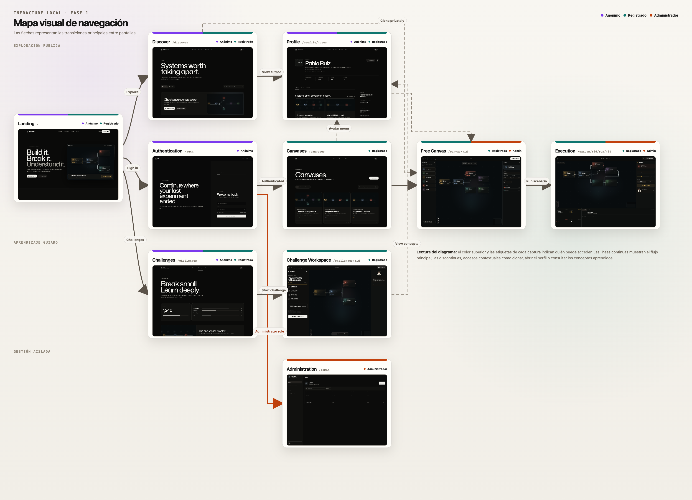
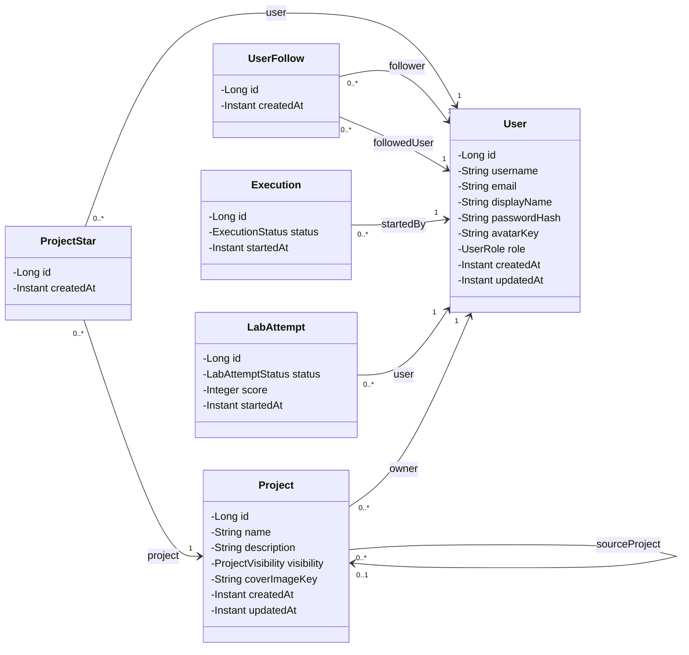
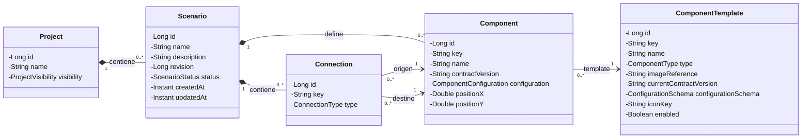
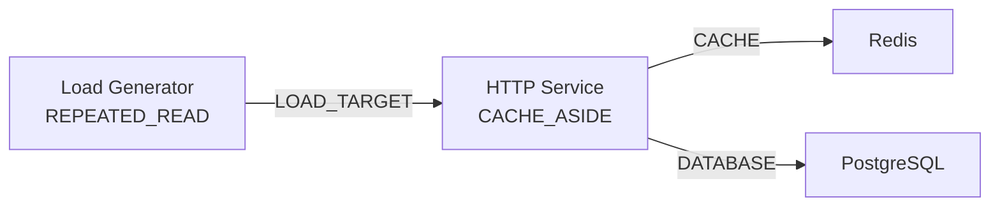
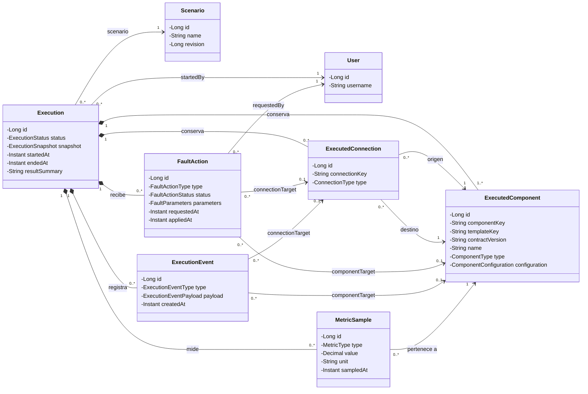
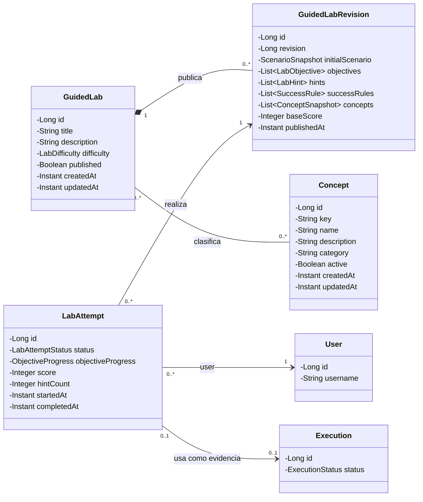

# Análisis

## Pantallas y navegación

La navegación se organizará alrededor de la exploración de proyectos, el diseño libre, la ejecución y los retos guiados.

  

<em>Mapa de las transiciones principales. Los colores y las etiquetas de cada pantalla identifican el tipo de usuario que puede acceder.</em>

| Pantalla | Usuario | Descripción | Páginas accesibles |
| --- | --- | --- | --- |
| Landing | Anónimo, registrado | Presenta Infracture y el ciclo Build / Break / Understand. | Discover, Canvases, Challenges y Authentication. |
| Discover | Anónimo, registrado | Explora proyectos públicos y plantillas. | Vista previa, perfil del autor y clonación privada tras autenticarse. |
| Canvases | Registrado | Muestra los proyectos propios y permite crear o abrir uno. | Free Canvas, Execution e historial. |
| Free Canvas | Registrado, administrador | Permite construir una topología con el catálogo controlado. | Inspector, validación y Execution. |
| Execution | Registrado, administrador | Muestra estados, eventos, logs, métricas y acciones de fallo. | Lab Mentor, recuperación e historial. |
| Challenges | Anónimo, registrado | Lista los laboratorios guiados y sus conceptos. | Challenge Workspace. |
| Challenge Workspace | Registrado | Permite resolver un reto sobre una topología preparada y muestra los conceptos explorados al completarlo. | Perfil, evidencia y Lab Mentor. |
| Authentication | Anónimo | Permite el registro y el inicio de sesión local. | Canvases y perfil tras autenticarse. |
| Profile | Anónimo, registrado | Muestra datos públicos, proyectos publicados, seguimiento y conceptos explorados en laboratorios completados. | Discover, proyectos y Challenges. |
| Administration | Administrador | Gestiona usuarios, catálogo y retos. | Secciones internas de administración. |

## Entidades

El modelo se divide en cuatro diagramas de clases para conservar la legibilidad de los atributos y las cardinalidades. La flecha parte de la entidad que conserva la referencia y apunta hacia la entidad referenciada. Los tipos terminados en `Role`, `Visibility`, `Status` o `Type` se implementarán como enumeraciones, mientras que `JSON` representa una estructura controlada y validada por el backend.

### Usuario y relaciones principales

Un usuario puede poseer varios proyectos, iniciar varias ejecuciones, realizar varios intentos de laboratorio, marcar proyectos y seguir a otros usuarios.

Cada proyecto es privado por defecto. Un proyecto clonado conserva una referencia opcional a su proyecto de origen. `ProjectStar` impide que un usuario marque dos veces el mismo proyecto mediante una restricción única sobre usuario y proyecto. `UserFollow` impide seguimientos duplicados y que un usuario se siga a sí mismo. Los conceptos explorados tampoco se almacenan directamente en `User`: se obtienen a partir de sus intentos completados y de los conceptos asociados a esos laboratorios.

### Proyectos, escenarios y catálogo controlado

Un escenario puede guardarse vacío o incompleto, por lo que admite cero componentes y conexiones. Antes de ejecutarlo deberá superar la validación y contener al menos un componente. Las coordenadas pertenecen al componente porque conservan su posición en el canvas. La topología actual se obtiene de `Component` y `Connection`.

`Scenario` controla la consistencia de todo su grafo. Las claves de componentes y conexiones son estables y únicas dentro del escenario. Los dos extremos de una conexión deben pertenecer a ese mismo escenario y, al eliminar un componente, también se eliminan sus conexiones. Cada cambio incrementa `revision`: si dos pestañas intentan guardar sobre la misma revisión, la segunda deberá recargar o resolver el conflicto en lugar de sobrescribir silenciosamente la primera. Al pulsar `Run`, el backend validará y ejecutará una copia exacta de una revisión concreta.

Las seis opciones iniciales son tipos de plantilla reutilizables, no un máximo de seis nodos. Un mismo `ComponentTemplate` puede originar varias instancias de `Component` dentro de un escenario, siempre dentro de los límites locales configurados. Al añadirlo, el componente conserva la versión concreta del contrato que recibió de la plantilla.

### Contratos iniciales del catálogo controlado

Cada plantilla define un contrato funcional conocido por el backend: comportamiento, configuración segura, conexiones compatibles, comprobación de salud y datos observables. El usuario arrastrará componentes ya preparados y solo modificará parámetros expuestos mediante formularios validados; no introducirá imágenes, comandos, puertos, credenciales ni variables de entorno arbitrarias.

La propuesta técnica completa del catálogo, los perfiles, la validación, la generación de carga y el ciclo de vida de las ejecuciones se desarrolla en [`docs/EXECUTION_ARCHITECTURE.md`](EXECUTION_ARCHITECTURE.md).

| Plantilla | Comportamiento previsto | Configuración permitida al usuario | Conexiones compatibles | Evidencias principales |
| --- | --- | --- | --- | --- |
| HTTP Service | Recibir peticiones HTTP y ejecutar un comportamiento reproducible que pueda utilizar caché, base de datos o mensajería. | Nombre, perfil de comportamiento y parámetros acotados del perfil. | Recibe tráfico de Load Generator u otro HTTP Service; puede depender de HTTP Service, PostgreSQL, Redis y RabbitMQ. | Estado de salud, peticiones, errores, latencia de respuesta y consumo del contenedor. |
| Worker | Consumir tareas de una cola y procesarlas con un comportamiento controlado. | Nombre, cola seleccionada, perfil de procesamiento y política de reintento acotada. | Consume de RabbitMQ y puede utilizar PostgreSQL o Redis. | Estado, tareas procesadas o fallidas, tiempo de procesamiento y consumo del contenedor. |
| Load Generator | Generar carga HTTP limitada y reproducible contra un servicio del escenario. | Destino, peticiones por segundo, duración y concurrencia dentro de límites globales. | Se conecta únicamente a un HTTP Service compatible. | Peticiones enviadas y completadas, errores y distribución de latencia. |
| PostgreSQL | Proporcionar persistencia relacional a los servicios del escenario. | Nombre lógico y conjunto de datos inicial elegido entre perfiles permitidos. | Acepta conexiones de HTTP Service y Worker. | Disponibilidad, conexiones activas y consumo del contenedor. |
| Redis | Proporcionar caché o almacenamiento temporal de clave-valor. | Nombre lógico y política elegida entre configuraciones seguras. | Acepta conexiones de HTTP Service y Worker. | Disponibilidad, memoria, claves y aciertos o fallos de caché cuando estén disponibles. |
| RabbitMQ | Gestionar la publicación, acumulación y consumo de tareas. | Nombre lógico y topología de cola elegida entre perfiles controlados. | Recibe mensajes de HTTP Service y entrega trabajo a Worker. | Disponibilidad, mensajes en cola y tasas de publicación y consumo. |

#### Perfiles, capacidades y validación

No se programará cada escenario de forma independiente. Las plantillas ofrecerán perfiles reutilizables. Por ejemplo, un HTTP Service podrá responder sin dependencias, utilizar PostgreSQL, aplicar el patrón de caché `cache-aside`, publicar tareas en RabbitMQ o invocar otro servicio. Cada perfil declarará las dependencias que necesita y las capacidades públicas que ofrece.

El Load Generator solo generará peticiones contra una capacidad HTTP compatible; no conocerá Redis, PostgreSQL, RabbitMQ ni Worker. Por ejemplo, un perfil de lecturas repetidas podrá apuntar a un HTTP Service configurado con `CACHE_ASIDE`. El servicio, y no el generador, consultará Redis y recurrirá a PostgreSQL cuando sea necesario.

Antes de permitir la ejecución mediante `Run`, `ScenarioValidator` comprobará la compatibilidad de los tipos de conexión, los requisitos del perfil, sus cardinalidades y las capacidades requeridas por la carga. Un escenario podrá guardarse incompleto, pero los errores bloquearán la ejecución. Las situaciones deliberadamente experimentales que sigan siendo ejecutables producirán advertencias; por ejemplo, RabbitMQ con productores pero sin Worker podrá acumular mensajes en un canvas libre.

La validación estática no garantiza que los procesos arranquen correctamente. Tras crear los contenedores, el motor esperará sus comprobaciones de salud antes de iniciar la carga. El validador previo a la ejecución y el algoritmo de impacto de fallos utilizarán el mismo grafo, pero tendrán responsabilidades distintas: el primero decidirá si el escenario cumple sus contratos y el segundo calculará los dependientes potencialmente afectados.

El generador repetirá operaciones permitidas —fijas, ponderadas o encadenadas— hasta alcanzar su duración, recibir una orden de parada o llegar al límite máximo de seguridad.

Después de validar, el backend traducirá el grafo a nombres de red, variables y credenciales generadas internamente, creará una red Docker aislada y configurará Toxiproxy cuando una conexión admita latencia controlada. La carga se detendrá antes de desmontar los demás componentes y la limpieza eliminará los contenedores, los proxies y la red.

El administrador podrá mantener los metadatos, formularios y disponibilidad de las plantillas. La lógica ejecutable se identificará mediante una versión de contrato y se resolverá en el backend. La configuración, los objetivos y las reglas se representarán con tipos de dominio validados, aunque algunos se persistan como `jsonb`; no se compartirán mapas JSON sin contrato entre módulos. Protocolo, puerto, obligatoriedad y demás detalles técnicos de una conexión se derivarán del conector autorizado, sin admitir texto libre del usuario. Una plantilla deshabilitada no podrá añadirse a nuevos diseños; los escenarios anteriores seguirán siendo consultables y solo podrán volver a ejecutarse si su versión de contrato continúa habilitada para ejecución.

La incorporación de un nuevo perfil ejecutable deberá respetar el contrato controlado y ser validada por el backend; nunca se traducirá texto libre del usuario en comandos Docker. El diseño inicial situaba su comprobación mediante un prototipo vertical al comienzo de Fase 2. La preparación actual la sitúa en el bloque P06 de Fase 3, antes de completar el motor, con HTTP Service y carga; los fallos controlados quedan para funcionalidad posterior.

### Ejecución y observabilidad

Cada ejecución guarda un `snapshot` inmutable de la revisión validada. A partir de él crea sus propios `ExecutedComponent` y `ExecutedConnection`, que conservan la identidad y los datos utilizados durante el experimento. Por ello, editar o eliminar después un `Component` o una `Connection` del canvas no altera el historial.

`FaultAction` registra una petición de parada, reinicio, pausa, reanudación o latencia. Una acción afecta a un componente ejecutado o a una conexión ejecutada, nunca a ambos, y diferencia entre lo solicitado y lo aplicado realmente. Los eventos pueden pertenecer a la ejecución completa o señalar uno de esos objetivos; las métricas pertenecen al componente ejecutado que las produjo.

### Laboratorios, intentos y conceptos

`GuidedLab` conserva la identidad editorial del laboratorio y su clasificación actual. Cada publicación crea una `GuidedLabRevision` inmutable con el escenario inicial, objetivos, pistas, reglas, puntuación y una copia de los conceptos de esa edición. `LabAttempt` queda unido a esa revisión exacta, por lo que editar después el laboratorio o un concepto no cambia lo que realizó ni acreditó el alumno.

Los conceptos visibles en el perfil se calculan reuniendo, sin duplicados, los asociados a las revisiones de los intentos completados. Un intento puede existir brevemente sin ejecución mientras se prepara el entorno, pero, para completarse, debe disponer de exactamente una ejecución como evidencia. Repetir el laboratorio crea otro intento.

`ProjectStar` y `UserFollow` se modelarán como entidades asociativas explícitas con identificador y fecha de creación. Esta decisión permite expresar restricciones únicas, conservar cuándo se creó cada relación y ampliar sus metadatos sin modificar posteriormente una relación `@ManyToMany` directa.

## Permisos de los usuarios

| Acción | Usuario anónimo | Usuario registrado | Administrador |
| --- | :---: | :---: | :---: |
| Consultar información y proyectos públicos | Sí | Sí | Sí |
| Registrarse e iniciar sesión | Sí | — | — |
| Crear y modificar proyectos propios | No | Sí | Sí |
| Consultar o modificar proyectos privados ajenos | No | No | Sí |
| Ejecutar escenarios propios | No | Sí | Sí |
| Aplicar fallos a ejecuciones propias | No | Sí | Sí |
| Consultar historial propio | No | Sí | Sí |
| Seguir perfiles y marcar proyectos públicos | No | Sí | Sí |
| Realizar laboratorios y guardar el progreso | No | Sí | Sí |
| Gestionar usuarios, catálogo, laboratorios y conceptos | No | No | Sí |

## Imágenes

Se permitirá subir imágenes desde el navegador para:

- el avatar de un usuario;
- el icono de una plantilla de componente administrada.

**Portadas acordadas el 2 de octubre de 2026:** la propuesta inicial de subir una portada se sustituyó por una miniatura automática del grafo del escenario elegido. Se actualiza al guardar ese escenario; el propietario puede elegir otro. Si no hay grafo, se utiliza el logo. No se permite subir fotografías como portada. Este acuerdo forma parte del alcance previsto de Fase 3, junto con avatar e iconos, sin afirmar que ya esté implementado.

Las imágenes se almacenarán en MinIO ejecutado localmente. La base de datos guardará la clave del objeto y se validarán el tipo y el tamaño antes de aceptarlo. Esta decisión fue [ratificada con el tutor](adr/0001-minio-para-almacenamiento-de-imagenes.md).

## Gráficos

La pantalla de ejecución utilizará gráficos para mostrar información producida por el escenario:

- una gráfica de líneas para CPU y memoria a lo largo del tiempo;
- una línea temporal de estados, eventos y fallos aplicados;
- una gráfica de barras para comparar los componentes afectados por un fallo.

Recharts representará las gráficas de métricas y comparaciones. La línea temporal será un componente React específico de Infracture, porque combina navegación, estados y acciones de dominio que no corresponden a una gráfica estadística convencional.

## Tecnología complementaria

La tecnología complementaria principal será **Server-Sent Events (SSE)**. El backend enviará al navegador cambios de estado, eventos y logs resumidos mientras una ejecución esté activa, evitando que el frontend tenga que consultar continuamente el estado. Las acciones de creación, ejecución y control de fallos seguirán realizándose mediante la API REST.

También se utilizará **React Flow** para el canvas de nodos y conexiones, y una API externa detrás de una interfaz propia para el profesor de IA.

## Algoritmo o consulta avanzada

Se implementará un análisis del impacto de un fallo sobre el grafo de dependencias:

1. Cada componente se representará como un vértice y cada conexión dirigida como una relación de dependencia.
2. Al fallar un componente, se recorrerá el grafo en sentido inverso para encontrar sus dependientes directos y transitivos.
3. Se mostrará la distancia al componente afectado, los elementos potencialmente aislados y una estimación del porcentaje del escenario afectado.
4. El resultado esperado se comparará con los eventos observados durante la ejecución.

La primera versión utilizará una búsqueda en anchura (*Breadth-First Search*) con un conjunto de visitados, con complejidad `O(V + E)`. Se probará con grafos lineales, ramificados, cíclicos y desconectados. Esta funcionalidad relaciona la topología con la evidencia de ejecución y no se limita a operaciones CRUD.
