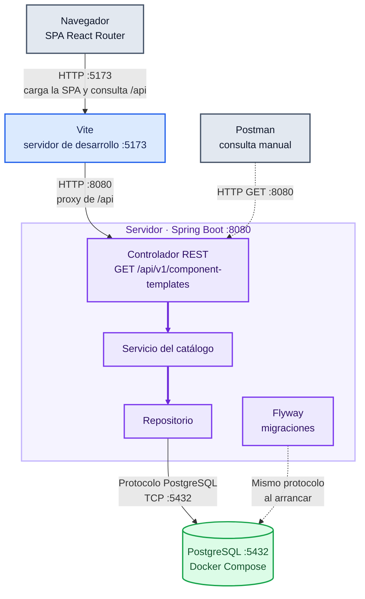
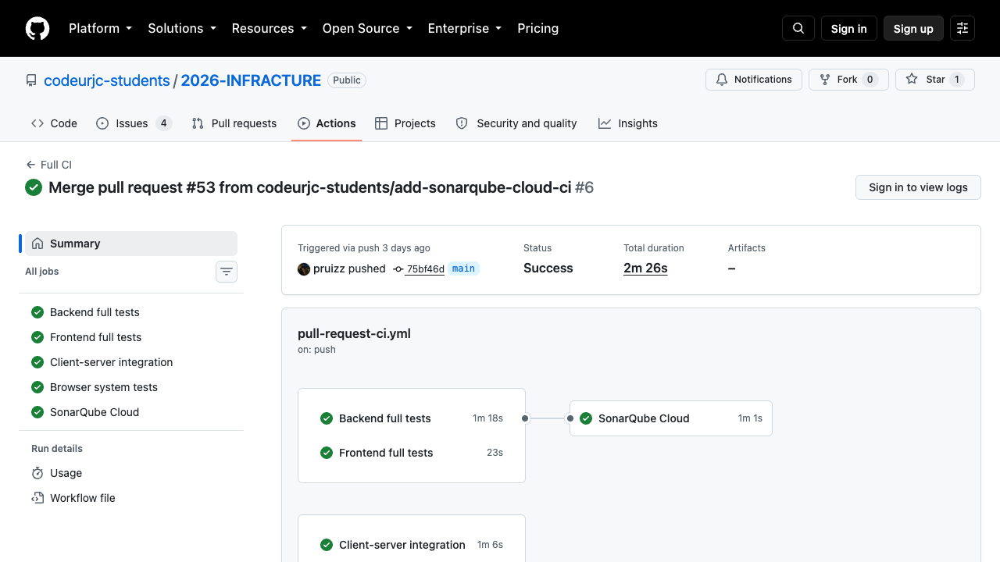
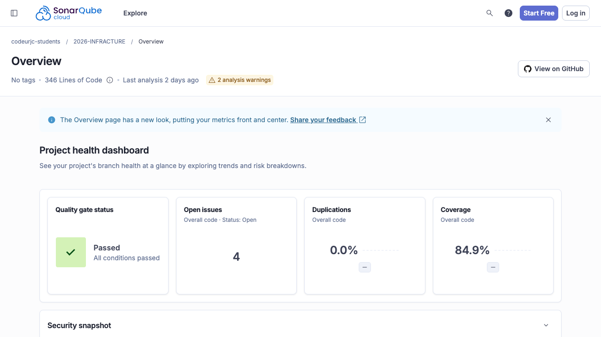
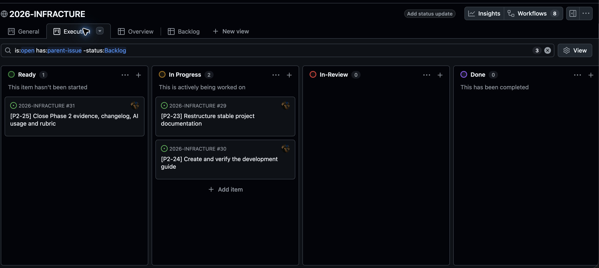

# Guía de desarrollo

Esta guía describe el estado técnico de Infracture Local durante la Fase 2. La aplicación completa definida en la [documentación funcional](detailed-features.md) todavía no es funcional: la vertical disponible permite consultar un catálogo persistido de seis plantillas. Los comandos se ejecutan desde la raíz del repositorio salvo que se indique otro directorio.

## Índice

- [Introducción](#introducción)
- [Tecnologías](#tecnologías)
- [Herramientas](#herramientas)
- [Arquitectura](#arquitectura)
- [Control de calidad](#control-de-calidad)
- [Proceso de desarrollo](#proceso-de-desarrollo)
- [Ejecución y edición del código](#ejecución-y-edición-del-código)
- [Ejecución de pruebas](#ejecución-de-pruebas)
- [Creación de una release](#creación-de-una-release)

## Introducción

Infracture se desarrolla como una aplicación web **SPA**: el navegador carga el cliente React y cambia de vistas sin solicitar una página HTML nueva para cada navegación. El cliente solicita datos mediante HTTP a una API REST de Spring Boot; el servidor conserva los datos en PostgreSQL. Son tres procesos independientes en desarrollo: Vite en `localhost:5173`, Spring Boot en `localhost:8080` y PostgreSQL en `localhost:5432`. Vite reenvía las peticiones `/api` al backend. Docker Compose inicia únicamente PostgreSQL.

| Aspecto | Estado de Fase 2 |
| --- | --- |
| Tipo | SPA cliente y API REST; monolito modular en el servidor. |
| Tecnologías | React, TypeScript, React Router y Vite; Java 25 y Spring Boot; PostgreSQL 18 y Flyway. |
| Herramientas | IDE: Visual Studio Code. Git y GitHub, Maven Wrapper, npm, Docker Compose, OpenAPI y Postman para consultar la API. |
| Control de calidad | JUnit, Mockito, Testcontainers, REST Assured, Vitest, Testing Library, Playwright, JaCoCo, ESLint, TypeScript, SonarQube Cloud y GitHub Actions. |
| Despliegue | Entorno local de desarrollo con PostgreSQL en contenedor y cliente/servidor como procesos locales. No hay todavía una distribución ni release de la aplicación completa. |
| Proceso | Trabajo iterativo por issues, ramas breves, pull requests y controles de CI antes de integrar en `main`. |

## Tecnologías

- [Eclipse Temurin (Java)](https://adoptium.net/) 25.0.4.1 y [Spring Boot](https://spring.io/projects/spring-boot/) implementan la API y las capas de aplicación, dominio y persistencia.
- [PostgreSQL](https://www.postgresql.org/) 18.6 almacena el catálogo; [Flyway](https://documentation.red-gate.com/fd) aplica las migraciones versionadas al arrancar el backend.
- [React](https://react.dev/), [TypeScript](https://www.typescriptlang.org/), [React Router](https://reactrouter.com/) y [Vite](https://vite.dev/) forman el cliente SPA. React Router se configura con `ssr: false`.
- [Docker](https://docs.docker.com/) y [Docker Compose](https://docs.docker.com/compose/) proporcionan el PostgreSQL de desarrollo. El motor Docker también es necesario para los PostgreSQL desechables de las pruebas con Testcontainers.

Las versiones precisas de Java y Node.js requeridas por los scripts están en [`.java-version`](../.java-version) y [`.nvmrc`](../.nvmrc). El contenedor y las credenciales por defecto del entorno local están declarados en [`compose.yaml`](../compose.yaml).

## Herramientas

- [Git](https://git-scm.com/) y [GitHub](https://docs.github.com/) gestionan el código, los issues, las pull requests y el tablero de seguimiento.
- [Maven Wrapper](https://maven.apache.org/wrapper/) ejecuta el build Java sin instalar Maven globalmente. [npm](https://docs.npmjs.com/) instala exactamente las dependencias del lockfile mediante `npm ci`.
- [Node.js](https://nodejs.org/) en la versión indicada por `.nvmrc` ejecuta las herramientas de desarrollo del cliente; [Docker Desktop](https://docs.docker.com/desktop/) proporciona el motor local y `docker compose` levanta la base de datos definida en el repositorio.
- Se ha utilizado [Visual Studio Code](https://code.visualstudio.com/) con [Extension Pack for Java](https://marketplace.visualstudio.com/items?itemName=vscjava.vscode-java-pack) para trabajar con el backend y el soporte integrado de TypeScript para el frontend. La configuración particular del editor permanece fuera del repositorio.
- [Postman](https://www.postman.com/) se ha utilizado para consultar la API REST del servidor. La [colección exportada](api/infracture.postman_collection.json) contiene la única operación implementada actualmente, `GET /api/v1/component-templates`, y define `baseUrl` con el valor local `http://localhost:8080`.

## Arquitectura



En desarrollo, **Vite, Spring Boot y PostgreSQL son procesos independientes**; la SPA React Router se ejecuta en el navegador. El navegador carga la SPA y consulta `/api` por **HTTP** en `:5173`; Vite reenvía `/api` por **HTTP** al backend en `:8080`. Postman consulta directamente la API por HTTP. El repositorio y Flyway acceden a PostgreSQL mediante JDBC, que utiliza el **protocolo de PostgreSQL sobre TCP** en `:5432`. Las flechas discontinuas muestran la consulta manual y las migraciones al arrancar. El backend separa controlador HTTP, servicio de aplicación y repositorio de persistencia en el módulo `catalog`; Flyway crea el esquema y carga las seis plantillas iniciales. No hay en esta fase procesos de ejecución de escenarios, colas ni almacenamiento de imágenes.

La [documentación OpenAPI en HTML](https://raw.githack.com/codeurjc-students/2026-INFRACTURE/main/docs/api/api-docs.html) se publica a partir del [HTML generado](api/api-docs.html), servido mediante raw.githack.com como indica la guía académica. También están disponibles el [contrato YAML](api/api-docs.yaml) y, con el backend en marcha, la [interfaz Swagger local](http://localhost:8080/swagger-ui.html).

## Control de calidad

| Nivel | Herramientas | Comportamiento verificado |
| --- | --- | --- |
| Unitarias del servidor | [JUnit](https://junit.org/junit5/), [Mockito](https://site.mockito.org/), [AssertJ](https://assertj.github.io/doc/) | Delegación de la consulta ordenada del servicio y respuesta vacía. |
| Integración de persistencia | Spring Boot, Flyway, [Testcontainers](https://java.testcontainers.org/) | Migración, datos iniciales y lectura alfabética del repositorio sobre PostgreSQL desechable. |
| Sistema de API | Spring Boot, [REST Assured](https://rest-assured.io/), Testcontainers | `GET /api/v1/component-templates` por HTTP real: estado, tipo, cantidad, orden alfabético y datos. |
| Unitarias del cliente | [Vitest](https://vitest.dev/), [Testing Library](https://testing-library.com/docs/react-testing-library/intro/) | Cliente HTTP, estados de carga, contenido y error, y comportamiento de la página. |
| Integración cliente-servidor | Vitest, backend real, Testcontainers | El cliente recibe el catálogo persistido y lo muestra. |
| Sistema en navegador | [Playwright](https://playwright.dev/), Chromium | La SPA muestra las seis plantillas tras consultar el backend real. |

`./mvnw verify` genera los informes de [JaCoCo](https://www.jacoco.org/jacoco/) en `backend/target/site/jacoco/`; `npm run test:coverage` genera los de Vitest en `frontend/coverage/`. Ambos builds exigen por separado un mínimo del 70 % de líneas cubiertas. [SonarQube Cloud](https://www.sonarsource.com/products/sonarcloud/) analiza código y cobertura desde el CI y espera el resultado del Quality Gate. [ESLint](https://eslint.org/) y [TypeScript](https://www.typescriptlang.org/) comprueban el cliente.

**Resultados comprobados el 25 de septiembre de 2026 desde un clon limpio:** 5 pruebas del servidor, 9 pruebas unitarias del cliente, 1 de integración cliente-servidor y 1 de sistema en Chromium, todas correctas. JaCoCo registró **49/54 líneas (90,74 %)** y Vitest **24/27 líneas (88,88 %)** en sus respectivos ámbitos.

**Tamaño del código:** el [último análisis de `main` en SonarQube Cloud](https://sonarcloud.io/project/overview?id=codeurjc-students_2026-INFRACTURE), realizado el 22 de septiembre de 2026 y consultado el 25, registró [8 clases, 27 funciones y 15 archivos analizados](https://sonarcloud.io/api/measures/component?component=codeurjc-students_2026-INFRACTURE&metricKeys=classes%2Cfiles%2Cfunctions%2Cncloc%2Cncloc_language_distribution&branch=main). La métrica de [clases de Sonar](https://docs.sonarsource.com/sonarqube-server/user-guide/code-metrics/metrics-definition) incluye también interfaces y enumerados. Las líneas de código sin comentarios se distribuyeron así:

| Tecnología | Líneas de código |
| --- | ---: |
| Java | 130 |
| TypeScript | 205 |
| CSS | 11 |
| **Total** | **346** |

La cobertura agregada de SonarQube Cloud era **84,9 %** y el Quality Gate estaba aprobado. Estas cifras corresponden al análisis publicado de `main`, no a los cambios locales de esta guía.



*Captura del [Full CI de `main`](https://github.com/codeurjc-students/2026-INFRACTURE/actions/runs/35792417496), consultado el 25 de septiembre de 2026.*



*Captura del [análisis de SonarQube Cloud](https://sonarcloud.io/project/overview?id=codeurjc-students_2026-INFRACTURE), consultado el 25 de septiembre de 2026.*

## Proceso de desarrollo

El trabajo sigue un proceso iterativo e incremental: cada [issue](https://github.com/codeurjc-students/2026-INFRACTURE/issues) delimita objetivo, alcance, criterios de aceptación y verificación. El [GitHub Project 2026-INFRACTURE](https://github.com/orgs/codeurjc-students/projects/51) permite ver el estado de las tareas. Se trabaja en una rama de nombre corto y descriptivo; cada cambio se revisa mediante una pull request vinculada al issue antes de integrarse en `main`. El [`CHANGELOG.md`](../CHANGELOG.md) recoge los cambios incorporados.



*Vista [Execution del GitHub Project](https://github.com/orgs/codeurjc-students/projects/51/views/4), filtrada por issues abiertos con issue padre; captura del 25 de septiembre de 2026. El enlace muestra el estado actualizado.*

[GitHub Actions](https://docs.github.com/en/actions) ejecuta dos flujos: **Development CI** en los pushes a ramas distintas de `main` (pruebas unitarias de servidor y cliente, lint, tipos y build) y **Full CI** en pull requests a `main` y pushes a `main` (suite completa de servidor, cobertura, integración cliente-servidor, sistema en Chromium y SonarQube Cloud). Los informes de fallos se adjuntan como artefactos. El repositorio protege `main` con los cuatro checks del CI completo antes de integrar.

Al 25 de septiembre de 2026, `main` acumulaba **53 commits** y se habían creado **al menos 23 ramas de trabajo** durante la Fase 2.

## Ejecución y edición del código

### Requisitos y clonación

Se necesita Git, Docker con el motor iniciado, Java y Node.js en las versiones fijadas arriba, npm y un navegador. El servidor usa `localhost:8080`, la SPA `localhost:5173` y PostgreSQL `localhost:5432`; estos puertos deben estar libres. Los scripts de prueba de integración también usan `localhost:8081`.

```bash
git clone https://github.com/codeurjc-students/2026-INFRACTURE.git
cd 2026-INFRACTURE
```

Comprueba las versiones antes de instalar dependencias:

```bash
java -version
node --version
docker info
```

### Base de datos, backend y frontend

Desde la raíz, instala las dependencias del cliente. La configuración existente ya apunta al backend local; si se necesita otro destino, copia `frontend/.env.example` a `frontend/.env` (ignorado por Git) y cambia `VITE_API_BASE_URL` en esa copia. No introduzcas credenciales de producción en archivos versionados.

```bash
cd frontend
npm ci
cd ..
docker compose up -d --wait
```

En una terminal, arranca el backend:

```bash
cd backend
./mvnw spring-boot:run
```

En otra terminal, desde la raíz del repositorio, arranca el cliente:

```bash
cd frontend
npm run dev
```

Abre <http://localhost:5173> y comprueba la lista de seis plantillas. La salud del backend está en <http://localhost:8080/actuator/health>.

Como alternativa, tras `npm ci`, [`scripts/start-dev.sh`](../scripts/start-dev.sh) coordina los tres procesos desde la raíz y los detiene al recibir `Ctrl+C`:

```bash
./scripts/start-dev.sh
```

### Uso de herramientas

Abre la carpeta del repositorio en Visual Studio Code. Para editar Java con autocompletado y diagnósticos, instala desde la vista **Extensiones** el [Extension Pack for Java](https://marketplace.visualstudio.com/items?itemName=vscjava.vscode-java-pack); incluye soporte para Java, Maven, pruebas y depuración. Opcionalmente, instala también el [Spring Boot Extension Pack](https://marketplace.visualstudio.com/items?itemName=vmware.vscode-boot-dev-pack) para editar la configuración de Spring y ver la aplicación en el panel de Spring Boot. VS Code ya incluye soporte para TypeScript.

Desde la terminal integrada, ejecuta `docker compose` en la raíz, Maven Wrapper en `backend/` y npm en `frontend/`, como se muestra arriba.

Para interactuar con la API, mantén PostgreSQL y el backend en marcha e importa en Postman la [colección del proyecto](api/infracture.postman_collection.json). Abre **Get Component Templates** y pulsa **Send**: la petición `GET {{baseUrl}}/api/v1/component-templates` debe responder `200 OK` con las seis plantillas. La colección ya define `baseUrl` como `http://localhost:8080`. Es la única operación REST implementada actualmente.

Al terminar el arranque manual, detén cliente y backend con `Ctrl+C`. Desde la raíz, detén PostgreSQL sin borrar sus datos:

```bash
docker compose down
```

### Compilación del frontend

Desde `frontend/`, tras `npm ci`, comprueba que la aplicación se puede compilar para producción:

```bash
npm run build
```

### OpenAPI

Con PostgreSQL en marcha, genera de nuevo YAML y HTML a partir de los controladores reales:

```bash
cd backend
./mvnw verify -Popenapi
```

El resultado se guarda en `docs/api/`. Revisa los cambios generados antes de integrarlos.

## Ejecución de pruebas

Docker debe estar activo para las pruebas que usan Testcontainers. Las pruebas del servidor crean su propio PostgreSQL desechable; no necesitan que `compose.yaml` esté levantado. Desde `backend/`:

```bash
./mvnw verify
```

Para ejecutar solo las pruebas unitarias del servicio de catálogo:

```bash
./mvnw -Dtest=ComponentTemplateServiceTests test
```

Desde `frontend/`, tras `npm ci`, ejecuta las comprobaciones estáticas y las pruebas:

```bash
npm run lint
npm run typecheck
npm test
npm run test:coverage
```

Desde la raíz, para probar el cliente contra el backend real con PostgreSQL desechable:

```bash
./scripts/test-client-server-integration.sh
```

Para la prueba de sistema en Chromium, instala el navegador una vez y ejecuta Playwright desde `frontend/`. Playwright arranca la aplicación mediante `scripts/start-dev.sh` y necesita libres los puertos de desarrollo:

```bash
npx playwright install chromium
npm run test:system
```

Los informes HTML de cobertura quedan en `backend/target/site/jacoco/index.html` y `frontend/coverage/index.html`; los resultados de Playwright quedan en `frontend/playwright-report/`.

## Creación de una release

Todavía no se ha creado ninguna release de Infracture Local. El desarrollo se ha iniciado, pero la aplicación completa aún no es funcional; este apartado se completará cuando se publique la primera release.
