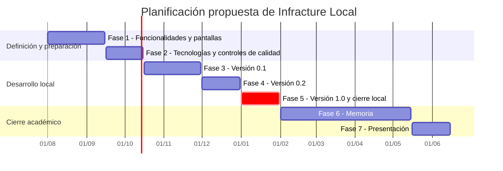

# Metodología

El trabajo se desarrollará con una metodología iterativa e incremental. Cada iteración incluirá la definición de tareas, el desarrollo, las pruebas, la revisión y la documentación. Se utilizarán ramas de trabajo y revisiones mediante *pull requests* para mantener `main` en un estado estable.

La Fase 1 corresponde a las secciones académicas enlazadas desde el README: definen la funcionalidad general y detallada, el estado del arte, las pantallas y el análisis. La Fase 2 configurará las tecnologías, las herramientas de desarrollo y los controles de calidad periódicos. Las Fases 3, 4 y 5 desarrollarán la aplicación de forma incremental y publicarán una versión al final de cada fase. La Fase 6 se dedicará a la memoria y la Fase 7 a la preparación de la presentación.

## Fases

| Fase | Descripción | Resultado previsto |
| --- | --- | --- |
| 1 | Definición de funcionalidades | Funcionalidades, estado del arte, pantallas, análisis y la documentación de Fase 1. |
| 2 | Configuración de tecnologías y herramientas | Repositorio preparado, pruebas iniciales y controles de calidad periódicos. |
| 3 | Desarrollo iterativo e incremental | Publicación de la versión 0.1 con la funcionalidad básica. |
| 4 | Desarrollo iterativo e incremental | Publicación de la versión 0.2 con la funcionalidad intermedia. |
| 5 | Desarrollo iterativo e incremental | Publicación de la versión 1.0 con la funcionalidad avanzada y cierre de Infracture Local. |
| 6 | Escritura de la memoria | Memoria final del TFG. |
| 7 | Preparación de la presentación | Presentación y defensa del trabajo. |

## Fechas

Las fechas son provisionales y se revisarán con el tutor. El cierre funcional de Infracture Local está previsto para enero, con el fin de poder continuar posteriormente con el segundo TFG.

| Fase | Inicio propuesto | Fin propuesto |
| --- | --- | --- |
| Fase 1 | 01/08/2026 | 15/09/2026 |
| Fase 2 | 16/09/2026 | 15/10/2026 |
| Fase 3 | 16/10/2026 | 30/11/2026 |
| Fase 4 | 01/12/2026 | 31/12/2026 |
| Fase 5 | 01/01/2027 | 31/01/2027 |
| Fase 6 | 01/02/2027 | 15/05/2027 |
| Fase 7 | 16/05/2027 | 15/06/2027 |

## Diagrama de Gantt

